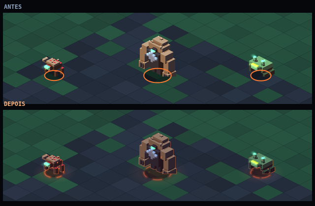
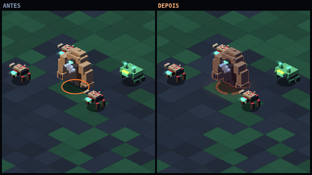

# A marca do elite — repaginação visual

> Mudança **apenas visual**. Nenhuma regra de simulação foi tocada: elite continua
> sendo a mesma propriedade de spawn, com a mesma vida e o mesmo dano de contato.
> O que muda é o que o jogador vê quando um deles está na tela.

## O que havia

Duas coisas, e as duas trabalhavam contra o jogo:

1. **Um véu laranja chapado sobre o corpo** (`rgba(255,122,47,0.35)`). O Voxelyn é
   volume facetado — cada bicho tem topo claro, lateral esquerda média e lateral
   direita escura. Uma cor só por cima disso apaga exatamente as três faces que
   contam o volume: o elite virava a própria silhueta pintada de laranja, _menos_
   legível que o bicho comum, não mais. E laranja é a cor reservada do fogo
   (Art Bible §6): um elite ao lado de uma explosão lia como "pegando fogo", e um
   bicho comum sob o clarão de uma explosão lia como elite.
2. **Uma elipse lisa de 1 px nos pés.** Círculo perfeito, parado, do mesmo laranja
   — leitura de interface, um marcador de seleção de jogo de estratégia colado
   embaixo da criatura. Marcava a célula e não dizia mais nada sobre o que estava
   em pé nela. Pior: o recuo de voxel (`voxel-fallback.ts`) desenhava a mesma marca
   **tracejada** — dois desenhos diferentes para o mesmo estado, escolhidos por um
   detalhe que o jogador não controla (se o atlas já tinha carregado).

## O que entra

A premissa: um elite não é um bicho comum com um adesivo — é um bicho que
sobreviveu a alguma coisa. Quatro camadas, todas em `elite-mark.ts`, dividindo
**um relógio só** (`eliteBreath`), e é essa unidade que faz as quatro lerem como
um corpo em vez de quatro efeitos empilhados:

| Camada                                                 | O que conta                                                                                                                                                                                                                                                      |
| ------------------------------------------------------ | ---------------------------------------------------------------------------------------------------------------------------------------------------------------------------------------------------------------------------------------------------------------- |
| **Corpo carbonizado** (`eliteTint`)                    | O tint deixa de clarear e passa a **escurecer**: carvão com sangue seco no fundo da respiração, brasa viva no alto. Contra os irmãos da mesma leva, o elite é o vulto mais escuro e mais quente da tela — contraste de valor funciona a qualquer distância.      |
| **Contorno aceso** (`SpriteBank.drawEntityRim`)        | A silhueta carimbada 1 px de atlas para os lados e para **baixo**, nunca para cima. Fechar o contorno devolveria o brilho de "unidade selecionada"; deixando o topo no escuro, a mesma passada vira **luz vinda de baixo** — do chão que está queimando sob ele. |
| **Chão estragado** (`drawEliteGround`)                 | Poça de fuligem que come a luz do piso, luz de brasa **aditiva** por cima dela e um anel **partido** girando devagar. Círculo fechado é ícone; anel partido é coisa queimando. O raio é o mesmo do anel antigo: a marca continua medindo a célula ocupada.       |
| **Brasas subindo** (`drawEliteFront` + metade de trás) | O único movimento vertical da marca, metade atrás e metade na frente do corpo — é o que separa "isto está aceso agora" de "isto tem textura quente pintada".                                                                                                     |

## Regras que a marca respeita

- **Legibilidade de perigo (§1).** A luz aditiva no chão aparece mesmo com o corpo
  atrás de uma coluna: o elite se anuncia antes de estar em alcance.
- **Contraste de valor (§6).** O corpo escurece, mas a fuligem escurece o chão
  junto — a criatura continua ≥ 2 passos acima do piso sob ela.
- **Cor reservada.** A brasa mora no vermelho quente _abaixo_ do `#ff7a2f`; o
  laranja puro continua sendo só da explosão.
- **Silhueta (§5).** Nada é desenhado por cima do corpo além das brasas da frente,
  que são pontos de 2–4 px.
- **Menos movimento.** Com `prefers-reduced-motion` a respiração para no meio, o
  anel para de girar e as brasas congelam espalhadas: continua havendo elite na
  tela, só não há pulso.
- **Co-op.** Tudo deriva do relógio e do ID da criatura — nada sorteado por quadro.

## Onde mexer

- `packages/voxelyn-survival/src/client/elite-mark.ts` — a marca inteira (dono único).
- `packages/voxelyn-survival/src/client/sprites.ts` — `drawEntityRim`.
- `packages/voxelyn-survival/src/client/render.ts` — chão antes do corpo, contorno
  colado no corpo, brasas da frente depois.
- `packages/voxelyn-survival/src/client/elite-mark.test.ts` — o que não pode regredir.
