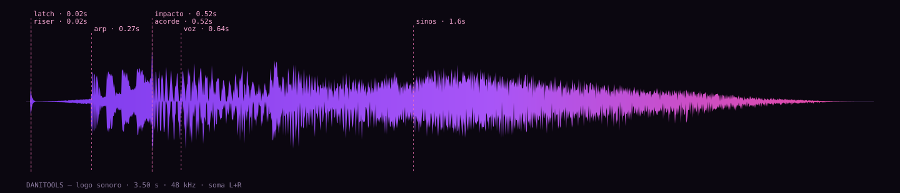

# DANITOOLS — logo sonoro

A assinatura sonora do estúdio. Uma peça de 3,5 s que fala a marca em voz alta e
cai em três segundos de neon.



Ouça primeiro `danitools-sound-logo.mp3`. Depois leia o resto, se quiser.

## O kit

| Arquivo | Duração | Loudness | O que é |
|---|---:|---:|---|
| `danitools-sound-logo.*` | 3,50 s | −14 LUFS | **A assinatura.** Abertura e encerramento de vídeo, trailer, vitrine de loja. |
| `danitools-sound-logo-short.*` | 2,60 s | −14 LUFS | **Bumper.** Começa no impacto, sem anacruse. Splash de app, vinheta de live, transição. |
| `danitools-sound-logo-tag.*` | 2,40 s | −16 LUFS | **Só a locução** com a cauda, sem música. Para deitar sobre trilha que já existe. |
| `danitools-sound-logo-ptbr.*` | 3,40 s | −14 LUFS | A mesma assinatura com a pronúncia aportuguesada, para peça em pt-BR. |

Cada uma sai em três formatos: **`.wav`** (48 kHz / 24 bits — o mestre, use este
para editar), **`.mp3`** (320 kbps, para quem só quer o arquivo) e **`.ogg`**
(Vorbis q7, para web e PWA — é o formato que o resto do repositório já serve).

`stems/` traz a assinatura aberta em seis faixas **antes da masterização**:
`anacruse`, `impacto`, `acorde`, `voz`, `sinos` e `caudas`. Servem para reequilibrar
a peça contra uma trilha específica sem precisar rodar nada — tirar os sinos, deixar
só a voz e o impacto, abaixar o acorde sob uma narração. Em FLAC, sem perda.

`sound-logo-manifest.json` tem a proveniência inteira: cada nota em Hz, cada
frequência de filtro, cada medição, e o comando exato que gerou cada arquivo.

## Como ela soa, em ordem

| t | Evento | O que acontece |
|---:|---|---|
| 0,02 s | **estalo** | Um encaixe curto. É o *tools* da marca — uma ferramenta travando na posição. |
| 0,02 s | **riser** | Ruído varrendo de 320 Hz a 7,4 kHz. Puxa a peça para o impacto. |
| 0,27 s | **arpejo** | Quatro notas de chiptune (Si3–Mi4–Sol♯4–Si4) em fusas, duty 0,25. São os blocos empilhando. |
| 0,52 s | **impacto** | Sub caindo de 180 Hz para Mi1, estalo em 3,1 kHz e uma quadrada em oitavas. O tempo 0 da grade. |
| 0,52 s | **acorde** | Mi maior com nona. Cinco vozes desafinadas por nota, com o corte abrindo de 420 Hz a 5,4 kHz. |
| 0,64 s | **"DANITOOLS"** | A marca. Quatro camadas de voz sobre o acorde, que abaixa 4,5 dB para deixá-la passar. |
| 1,60 s | **sinos** | Seis sinos subindo até Si6, com eco de semicolcheia pontuada. O letreiro de neon acendendo. |

## Por que soa assim

O logotipo do estúdio é um rosto em pixel art, de boné com degradê roxo→magenta,
e existe também numa versão de letreiro de neon. A peça traduz cada uma dessas
coisas em som, e não por metáfora solta — cada elemento visual virou uma decisão
de síntese específica:

- **voxel / pixel** → o arpejo é um pulso de duty 0,25 preso à grade de fusas, e a
  voz carrega uma camada de *bitcrush* de 8 bits a 11 kHz. A quantização é audível
  de propósito: a marca é feita de blocos.
- **degradê roxo → magenta** → cinco serras desafinadas em 15 cents por nota, com o
  corte do filtro abrindo de 420 Hz a 5,4 kHz ao longo de 1,15 s. Um degradê é uma
  cor só que muda de largura — é exatamente o que um filtro abrindo sobre uma
  supersaw faz com o timbre.
- **letreiro de neon** → sinos aditivos inarmônicos e uma placa de reverb clara
  (*damping* 0,13) com eco pontuado. Neon não tem ataque: acende e fica brilhando.
- **as ferramentas** → o estalo em passa-banda, na abertura e no ataque do impacto.

## A palavra é a marca

Um logo sonoro em que ninguém entende o nome não é um logo sonoro. Por isso a
única coisa medida como critério de aprovação, e não como curiosidade, é a
**margem da voz sobre a música** na janela exata da palavra:

| Banda | Voz | Música | Margem |
|---|---:|---:|---:|
| 1–2 kHz | −25,6 dB | −31,1 dB | **+5,5 dB** |
| 2–4 kHz | −25,6 dB | −36,1 dB | **+10,4 dB** |
| 4–8 kHz | −29,1 dB | −42,1 dB | **+13,0 dB** |
| 200–800 Hz | −22,5 dB | −22,0 dB | −0,5 dB |
| banda larga | −18,1 dB | −17,0 dB | −1,1 dB |

De 1 a 8 kHz — onde mora a inteligibilidade da fala — a voz manda com folga
crescente. As duas margens negativas são o projeto, não um defeito: no médio-grave
e em banda larga quem tem que mandar é o corpo do acorde e o sub, e a voz foi
**cortada de propósito** nessa região (−4 dB em 280 Hz) justamente para não
disputar ali. O `audio-logo.test.mjs` falha se qualquer margem de 1 a 8 kHz cair
abaixo de +3 dB.

## Números da entrega

Todas as versões saem calibradas por medição ITU-R BS.1770-4, não por ouvido:

| | assinatura | bumper | tag | pt-BR |
|---|---:|---:|---:|---:|
| Loudness integrada | −14,0 LUFS | −14,0 LUFS | −16,0 LUFS | −14,0 LUFS |
| Máxima *momentary* (400 ms) | −11,9 LUFS | −12,2 LUFS | −14,4 LUFS | −11,8 LUFS |
| Máxima *short-term* (3 s) | −14,3 LUFS | — | — | −14,4 LUFS |
| Pico inter-amostra | −2,9 dBTP | −1,8 dBTP | −3,6 dBTP | −2,6 dBTP |
| Correlação estéreo | 0,97 | 0,96 | 0,92 | 0,97 |

−14 LUFS é o nível para o qual YouTube, Spotify e Instagram normalizam: subida
direto, sem a plataforma mexer. O teto de −1 dBTP deixa margem para o codec, que
pode gerar picos acima do que o WAV mostra. A correlação alta é deliberada:
**a peça soma para mono sem perder nada** (o teste mede menos de 1,5 dB de perda),
porque metade do público vai ouvir isso no alto-falante de um celular.

As duas linhas de máxima são janelas diferentes da mesma norma e **não são
intercambiáveis**: a EBU R128 define *momentary* sobre 400 ms e *short-term* sobre
3 s. O bumper e a tag têm menos de três segundos, então não cabe uma única janela
short-term neles — o traço é literal, e o manifesto traz `null`, não um número
tirado de uma janela curta demais.

## Nada disso é sample

Não há um único arquivo de áudio de origem externa aqui. Nenhum sample, nenhuma
biblioteca, nenhum plugin, nenhum áudio gerado por IA. Cada forma de onda é
calculada por `scripts/audio-logo/`, em Node puro.

O render é **determinístico dentro de uma mesma build do Node/V8**: não há relógio
nem estado global no caminho e todo ruído vem de um PRNG semeado, então rodar de
novo produz os mesmos bytes. A garantia não atravessa versões de motor — a síntese
usa `Math.sin`, `Math.exp`, `Math.tanh` e `**`, que o ECMAScript deixa a cargo da
implementação, e uma build de V8 diferente pode divergir no último bit. Por isso a
promessa é conferível em vez de escrita: o manifesto traz o SHA-256 de cada arquivo
e `pnpm audio-logo:verify` recalcula os mestres e compara, sem escrever nada. O
mesmo teste roda em `pnpm audio-logo:test`.

A garantia forte é dos **WAV**, que saem deste código. MP3, OGG e FLAC passam pelo
`ffmpeg`, com `-fflags +bitexact` — sem essa flag o multiplexador Ogg sorteia o
número de série do fluxo a cada execução, e re-renderizar o kit sujava o
repositório com 48 bytes diferentes por arquivo sem que uma única amostra de áudio
tivesse mudado. Com ela, as duas execuções seguidas saem idênticas nos quatro
formatos. Entre builds diferentes de `ffmpeg` os bytes ainda podem mudar, então os
hashes desses três formatos valem como integridade, não como garantia de
reprodução.

A única exceção declarada é a **voz**, que veio do sintetizador de formantes
`espeak-ng` — chamado uma única vez, com o comando que está no manifesto, para
gerar as tomadas versionadas em `scripts/audio-logo/takes/`. Não é a gravação de
uma pessoa: é síntese, e o timbre robótico dela foi tratado como característica da
marca, não como problema a esconder.

O código, o raciocínio e as medições estão em
[`scripts/audio-logo/`](../../../scripts/audio-logo/README.md).

## Refazer

```sh
pnpm audio-logo            # renderiza o kit inteiro em docs/audio/danitools/
pnpm audio-logo:verify     # confere os mestres contra os hashes do manifesto
pnpm audio-logo:test       # afere o medidor e valida as entregas
```

Mudar o timbre é mudar um número: a tonalidade está em `CHORD`, a grade de tempo em
`TIMELINE`, o equilíbrio da voz nos ganhos de `buildVoice`. Som sintetizado tem
parâmetro, não forma de onda.
