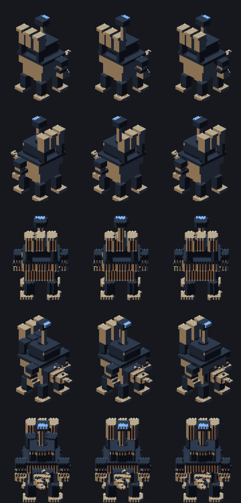
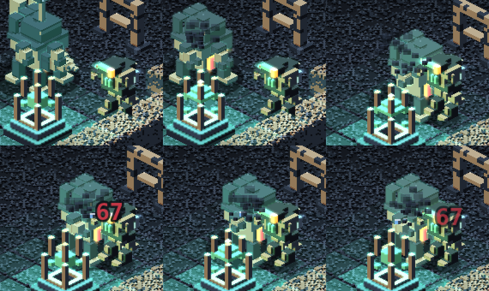
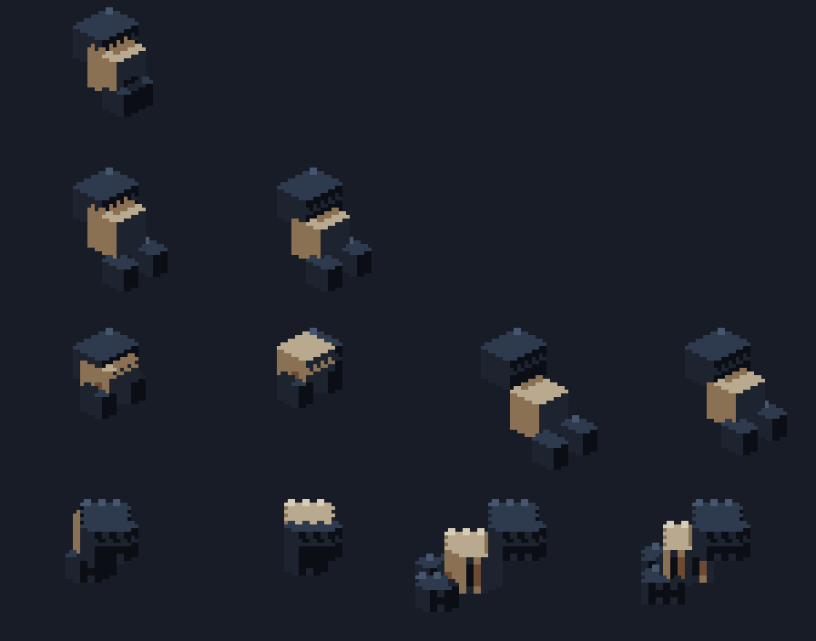
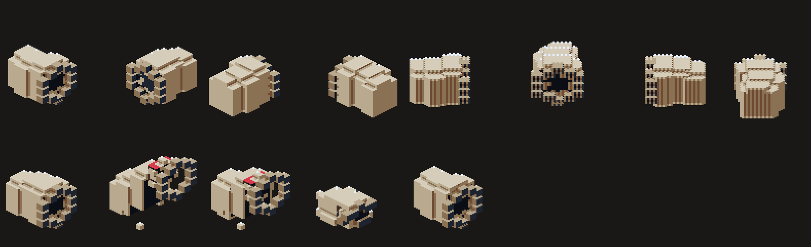
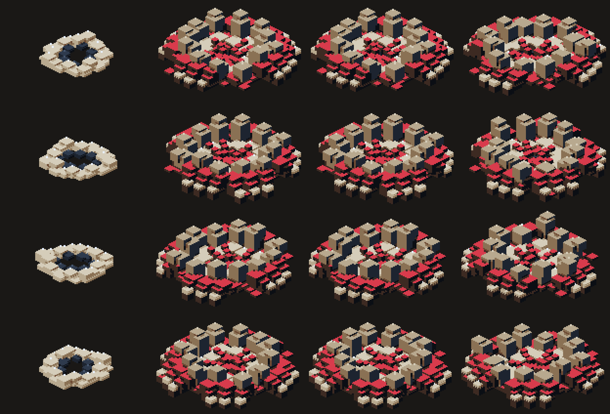
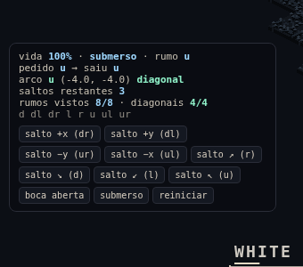

# Voxelyn Survival — Chefes por estrato e ocupação

## O problema

Os chefes eram decididos pelo **número do setor**: Bispo no 2, Guardião no 3,
qualquer que fosse a geologia. Uma Catedral Prismática terminava no mesmo Guardião de
basalto, e o Bispo aparecia em mapas onde o micélio era um enxerto plantado à força
só para a luta dele existir.

## A regra nova — `bossForBiome` (`src/bosses.ts`)

```ts
bossForBiome({ stratum, occupation, depth });
```

Prioridade:

1. **Uma ocupação forte substitui o chefe do estrato.**
2. **Sem ocupação dominante, entra o chefe natural do estrato.**

| Categoria | Mapa                  | Chefe               | Status           |
| --------- | --------------------- | ------------------- | ---------------- |
| Ocupação  | Contaminação Micelial | Bispo               | **implementado** |
| Ocupação  | Cicatriz Aurix        | Diamandis           | **implementado** |
| Estrato   | Galerias de Basalto   | Guardião            | **implementado** |
| Estrato   | Catedral Prismática   | Arquicantor         | **implementado** |
| Estrato   | Aquífero Negro        | Leviatã do Lençol   | **implementado** |
| Estrato   | Fenda Sulfurosa       | Pulmão-Matriz       | **implementado** |
| Estrato   | Fornalha Abissal      | Coração da Fornalha | **implementado** |
| Estrato   | Sumidouros de Sílica  | Devorador Branco    | **implementado** |
| Estrato   | Cripta Glacial        | Rainha da Geada     | **implementado** |
| Estrato   | Estrato Ferrífero     | Magnetarca          | **implementado** |

**A tabela está completa**: os dez chefes conceituais têm corpo, e o fallback no
Guardião — que sustentou a seleção enquanto a lista era parcial — não responde mais
por nenhuma linha. Ele continua no código porque `BossId` é um espaço aberto: um chefe
novo entra na tabela antes de ganhar corpo, e até lá a câmara dele não pode ficar
vazia. O teste _"a tabela está COMPLETA"_ é o que impede o fallback de voltar a
responder em silêncio.

### Um chefe por run

- **Setor 1 nunca tem chefe** — é onde a run ensina. E o poço dele **sempre revela
  pelo menos um Eco**, mesmo sem ressonância acumulada (fallback determinístico pela
  seed): um poço calado na primeira descida ensinaria que o poço não oferece nada.
- **Setores do meio não têm chefe obrigatório** — três chefes fragmentariam toda
  descida. A identidade deles é a fauna de assinatura.
- **O chefe final é escolhido pelo mapa final da linhagem.** A linhagem hídrica
  termina em Aquífero + Matriz Micelial → Bispo; as intrusões sorteadas (um setor
  final `none` pode ganhar micélio, Aurix ou rocha suturada, 18% cada) trazem o
  Bispo, o Diamandis ou a Cerzideira.
- A câmara de chefe continua carimbada pelo worldgen em todo setor (moldura por
  estrato incluída); só o setor final a ocupa.
- `bossesDown` continua por setor: chefe abatido não repovoa.
- O bolso micelial do Bispo poupa o anel do pedestal (`PEDESTAL_KEEPOUT`): o fosso
  de água/brasa do objetivo é funcional e é mais antigo que a colônia — exceto o 3x3
  do próprio chefe, que nasce sempre sobre tapete.

### Por que o micélio é uma ocupação forte

A regra de seleção não é só arrumação de tabela: a lore do Bispo (§2 de
`voxelyn-survival-bosses.md`) a torna **necessária**. Ele era o órgão que fechava as
feridas do Veio; o micélio fora de controle é a cicatrização dele falhando contra a
escala industrial da Aurix. Um mapa profundamente ocupado pelo micélio não é um mapa
onde o Bispo por acaso mora — é o **rastro do colapso dele**, e por isso ele é o dono
daquele encontro em qualquer estrato. O antigo "chefe obrigatório do setor 2" invertia
a causalidade: plantava o fungo para justificar o chefe, em vez de deixar o chefe
explicar o fungo.

## Bispo — Supernova como resposta primária

Ver `docs/bosses/voxelyn-survival-bosses.md` (atualizado, §2 lore e §3 mecânica).
Resumo do que mudou:

- **Saiu do ramo genérico de gosma.** O Bispo não compartilha mais o cuspe do
  Spitter — um chefe do chão responde com o chão.
- **Supernova em luta normal**: jogador dentro do raio + recarga pronta (300 ticks)
  → telégrafo radial de 1,5 s. Dano 360°, fungo replantado **somente no release**.
- **Gatilho ferido corrigido**: era "nenhum fungo detectável em 14 tiles", e uma
  célula isolada atrás de uma parede bloqueava o ataque para sempre. Agora: ferido e
  fora do fungo ele recua; se não **pisa** em fungo dentro de
  `BISHOP_NOVA_SEEK_TICKS` (4 s), a Supernova sai.
- Segundo ataque temático futuro (candidato): **Erupção Litúrgica** — o cajado marca
  três células fúngicas próximas ao jogador e, após um windup curto, raízes explodem
  nesses pontos. Continua sendo um chefe do chão, não um Spitter gigante.

## Guardião — Salva Litoclasta (pedras, não gosma)

O release do ranged dele criava um projétil `spit` com biofluido — visual e
mecanicamente, o chefe das Galerias de Basalto estava cuspindo. Agora:

- **Leque de três pedras**: central com interceptação da posição prevista (sem
  homing, como a pedra do Britador), laterais com ±`GUARDIAN_FAN_SPREAD` (~22°).
  Três corredores legíveis.
- `kind: 'rock'`, **sem biofluido**, **sem stun** (o stun de pedra virou flag
  `stuns` do projétil e é exclusivo do arremesso único do Britador — três pedras
  encadeando atordoamento seria stun-lock).
- Velocidade **6** (< 7 do cuspe), hitbox visível (raio 0,42), colide com parede
  sólida e quebra frágil pela classe cinética que já existe.
- **Segunda fase (< 50% de vida)**: alterna leque (negar espaço) com **rajada** de
  três pedras em sequência (`GUARDIAN_VOLLEY_INTERVAL_TICKS`), com correção de mira
  entre disparos (perseguir movimento). A rajada re-arma o release da própria ação,
  então os relógios hasheados acompanham sozinhos.
- Tudo o mais fica: atravessar/destruir paredes, investida, cerco da arena,
  invocação, guarda do Núcleo.

## `BossRuntime` — o estado do encontro

Os seis campos `guardian*` do topo do estado (`guardianAwake`, `guardianSummoned`,
`guardianPath`, `guardianPathAt`, `arenaClosed`, `arenaBarrierCells`) viraram um
objeto só, `state.bossRuntime`:

```ts
type BossRuntime = {
  awake: boolean;
  phasesFired: number; // bitmask; BOSS_PHASE_SUMMON é a matilha do Guardião
  path: number[]; // derivado: não entra no hash nem no snapshot
  pathAt: number;
  arenaClosed: boolean;
  arenaBarrierCells: number[];
};
```

Três decisões dentro disso:

- **Um objeto, não um por chefe.** A run tem UM encontro de chefe (o setor final).
  No dia em que tiver dois, isto vira um mapa por `entityId` e todo consumidor já lê
  de um lugar só — em vez de seis campos globais para desembaraçar.
- **`phasesFired` é bitmask, não um booleano por fase.** O Guardião tem uma fase de
  uma vez (a matilha); o Diamandis terá o colapso do reator. Cada chefe novo somaria
  mais um campo ao estado autoritativo, que é hasheado e reenviado a cada resync.
- **`emptyBossRuntime()` é fábrica, não literal compartilhado.** `path` e
  `arenaBarrierCells` são mutáveis: um objeto congelado no módulo faria a descida
  herdar a rota do setor anterior e, pior, duas salas de co-op escreverem no mesmo
  array.

No wire, `WorldFlags.guardianAwake` virou `bossAwake` e o evento `guardian_awake`
virou `boss_awake` — os dois nomes mentiam sobre metade das runs desde
`bossForBiome`. `PROTOCOL_VERSION` 15, `SIMULATION_VERSION` 24. (A _voz_ de áudio
continua se chamando `guardianAwake`: ela é o nome de um som, não de um chefe.)

## Diamandis — a máquina que parou de executar a tarefa

O chefe da ocupação Aurix. A regra que rege as três armas: **nenhuma é militar**. São
ferramentas industriais aplicadas com indiferença — e é isso que separa o encontro de
"um robô grande atira em você". O Diamandis não está lutando, está **trabalhando**, e
o jogador está no caminho da obra.

**Corpo.** 880 de vida, velocidade 1,5, raio **0,9**. Visualmente ele é dez vezes um
Prospector; mecanicamente uma hitbox gigante transformaria toda parede em gaiola e
todo tiro em acerto garantido — o tamanho mora no sprite e no estrago, nunca no raio.
Ele entra em `crushesWalls` (abre caminho) e em `isStoneEnemy` (corrente machuca, não
paralisa: chefe paralisável é chefe que morre num stun-lock).

**As três faixas, sem sobreposição** — e a ordem de leitura da IA é a mesma:

| Distância | Ferramenta              | O que ela faz                                                                  |
| --------- | ----------------------- | ------------------------------------------------------------------------------ |
| 9–20      | **Broca de avanço**     | fixa o rumo, 1,8 s parado, atravessa a arena abrindo um corredor de 3 células  |
| 4–13      | **Salva de demolição**  | 3 cargas marcadas no chão no início do telégrafo, implodem onde foram marcadas |
| ≤ 16      | **Feixe de prospecção** | varre a linha inofensivo por 2 s, depois a mesma linha com potência            |

A primeira versão tinha a broca começando em 5 e a demolição cobrindo 0–13: como a
broca é checada primeiro, ela vencia em toda distância útil e a salva **nunca saía**.
Faixa que só existe no comentário não é faixa.

**A broca é a única ação telegrafada do jogo que não exige linha de visão.** Exigir
anularia a mecânica: o Corcel precisa de visada porque a investida dele se perde numa
parede, e a do Diamandis a _come_. Ela existe justamente para a cobertura deixar de
valer. O que a mantém justa é o 1,8 s parado antes de sair — e, ao contrário do
Corcel, **bater na pedra não encerra a ação**: a pedra é que acaba.

Quem decide o que cai é `canRip`, a mesma regra do Britador: rocha e frágil vão,
**minério e cristal ficam de pé**. A passagem dele expõe veio que estava emparedado —
o estrago do chefe vira a mina do jogador, e a sala fica permanentemente alterada.

**A salva não persegue.** As marcas nascem sobre a posição do alvo no instante do
telégrafo e congelam ali (`bossRuntime.blastCells`, hasheado). Sair do círculo é a
resposta inteira do golpe, e ela só existe porque o círculo fica onde nasceu. As
laterais abrem **perpendicularmente**, não para trás: recuar em linha reta já é o
reflexo de todo mundo, e um golpe que só pune o reflexo não ensina nada.

**O feixe é duas metades.** `beam_line` carrega `powered` para o cliente distinguir a
varredura (inofensiva) da passagem com potência — sem o campo, as duas seriam
desenhadas iguais e a única informação que importa ("agora queima") não chegaria. Com
potência ele aplica a tabela de materiais que já existe: `igniteCell` seca fungo e
acende gás, `meltIce` derrete, o minério energiza pelas aberturas coladas nele.
Nenhuma reação nova — o feixe é mais um cliente do sistema, como o rastro do Corcel.
Para na primeira parede nos dois modos: um levantamento que atravessa rocha não é um
levantamento, e um feixe que queima do outro lado do muro é dano sem sinal.

**Colapso do reator (< 50%)**, uma vez, via `BOSS_PHASE_REACTOR`:

- o reator **vaza**: um _anel_ de brasa nasce em volta dele (anel e não disco — o
  centro fica pisável para a luta não virar "fique longe e espere"), e ele continua
  deixando brasa sob os rastos enquanto perfura;
- um sistema **desliga**: o feixe morre — é o primeiro a cair quando a alimentação
  entra em colapso, e é o que faz a segunda fase ser _outra luta_ em vez da mesma com
  números piores;
- os outros **operam acima do limite**: broca e demolição recarregam a 65%.

"Cadência irregular por sorteio" seria dano sem sinal, que é o que o jogo proíbe.
Cadência maior com uma arma a menos é a mesma sensação, legível e ensinável.

**Ele guarda o Núcleo.** `guardsTheCore` (Guardião + Diamandis) dorme até ser notado
e, acordado, nunca mais perde o alvo: os dois têm golpes de alcance maior que o
próprio aggro, e sem isso ficavam mirando de um raio em que nunca decidiam nada.

### Documentos do Diamandis

| Gatilho                           | Documento                                                                                                                                         | ID           |
| --------------------------------- | ------------------------------------------------------------------------------------------------------------------------------------------------- | ------------ |
| Primeiro abate                    | Propaganda: _"Uma máquina. Quatrocentas funções. Nenhum trabalhador abaixo da superfície."_                                                       | `AX-PUB-010` |
| **Ver a broca abrir um corredor** | Raio mínimo de operação: o ativo não cabe nos túneis que deveria escavar → _"os túneis serão adaptados ao ativo"_                                 | `AX-ENG-029` |
| Abate **+** ver o corredor        | Incidente 41: ele recebeu o desligamento, **acusou o recebimento**, parou 9 s e continuou — em azimute que não consta de contrato                 | `AX-INC-041` |
| Abate **+** corredor **+** Núcleo | Não classificado: os corredores dele formam arcos **concêntricos** ao redor do sinal. Ele não escavava em direção à fonte — escavava **ao redor** | `AX-UNK-059` |

`DISCOVERY_DIAMANDIS_CORRIDOR` (bit 16) é a única testemunha do jogo que **não** exige
linha de visão, e por um motivo estreito: a parede entre os dois é exatamente a coisa
que está sendo removida, e quem está do outro lado dela é quem mais precisa entender
o que aconteceu.

`AX-UNK-059` fecha com o gancho do Guardião (`AX-UNK-051`): dois sistemas de contenção,
e _um deles nós construímos_. A pergunta que nenhum documento aprovado formula é se o
Diamandis falhou em alcançar o objetivo — ou entendeu antes da companhia que ele não
devia ser alcançado.

### Os Coveiros — a escolha que fecha o encontro

Não são minions do chefe e não estão ajudando o jogador. Continuam executando o
trabalho para o qual foram deixados ali: recolher sucata de equipamento abatido. O
Diamandis só ainda não está abatido.

Cada arma dele mora num **módulo** preso à carcaça. Conforme a vida cai, o módulo
daquela arma **se solta** — em ordem fixa e ensinável (78% → broca, 55% → torre,
30% → scanner), do maior alcance para o menor, então o cerco vai _fechando_: perder
a broca cedo significa que a luta termina de perto, que é onde o corpo dele cobra
caro. Soltar **não** é perder: a arma continua funcionando enquanto ninguém arranca.

Um Coveiro que enxergue um módulo solto **larga o jogador** e vai buscar a peça —
2 s de eletroímã engatando, telegrafados. No arranque o chefe perde aquela arma na
hora, e o Coveiro vira um _carregador_ rumo à saída.

| Você faz                   | A luta                                               | A recompensa                                             |
| -------------------------- | ---------------------------------------------------- | -------------------------------------------------------- |
| **Deixa trabalhar**        | mais fácil: cada módulo arrancado é uma arma a menos | vai embora com a peça, se você não interceptar           |
| **Mata antes do arranque** | mais longa: o chefe mantém as três armas             | garantida — o módulo continua na carcaça e paga no abate |
| **Mata o carregador**      | já sem aquela arma                                   | recuperada: a peça cai e é sua                           |

O abate paga `DIAMANDIS_MODULE_ORE` (16) por módulo ainda preso. Os dois lados são
legítimos, e é isso que faz disso uma decisão em vez de uma armadilha.

**"Fora de alcance" é uma distância, não uma porta.** O critério óbvio era "saiu do
mapa" e estava errado: o carregador não come minério (recurso do jogador, mesma
regra da broca), então um veio no caminho o encalhava — medido na seed 404, ele
parava em x=85 de um mapa de 96 e ficava ali pelo resto da run. Com uma porta como
critério, _deixar trabalhar_ virava _espere, ele empaca_, e o preço de não
interceptar nunca chegava a ser cobrado. A distância (24 tiles da carcaça) diz a
coisa certa — a peça se perde quando sai da luta — e a borda continua valendo para
quem escapa de verdade.

Quem sai do mapa **não conta como abate**: creditar um kill que o jogador não fez
faria o registro do bestiário dizer que ele resolveu um problema que na verdade
escapou.

Dois Coveiros nunca disputam a mesma peça (`claimableModule` checa quem já engatou):
sem isso, os três de uma galeria ferrífera convergiam todos para o mesmo módulo e
dois ficavam parados em cima do chefe sem nada para fazer.

### Documentos dos Coveiros

| Gatilho                                | Documento                                                                                                                                                                                        | ID           |
| -------------------------------------- | ------------------------------------------------------------------------------------------------------------------------------------------------------------------------------------------------ | ------------ |
| **Ver um módulo ser arrancado**        | Não classificado: o procedimento de recolhimento foi escrito para equipamento **abatido**, e não tem passo que verifique se o ativo ainda opera — _"um Prospector é equipamento da mesma frota"_ | `AX-UNK-060` |
| Coveiro abatido **+** ver o arranque   | Aquisições: recuperar o Diamandis custa mais que o programa inteiro → _abandonar o corpo, enviar unidades menores._ O item 3 foi aprovado e nunca cancelado                                      | `AX-PRC-026` |
| Diamandis abatido **+** ver o arranque | Executivo: reclassificação para _"instalação móvel de recuperação economicamente inviável"_ — a máquina em operação vira parte do mapa, por contabilidade                                        | `AX-EXE-048` |

`AX-PRC-026` é de onde os Coveiros vêm, e `AX-UNK-060` é o que eles são. A piada
contábil de `AX-EXE-048` fecha: a reclassificação não o desativa, não o recupera e
não o interrompe — ela apenas o remove do balanço.

### O corpo composto e o frenesi (`SIMULATION_VERSION` 61)

Até aqui o Diamandis era **um sprite**, inteiro do primeiro ao último ponto de vida,
e o Coveiro saía da carcaça de mãos vazias: a economia dos módulos existia no toast e
em lugar nenhum do corpo. Agora o corpo concorda com a simulação.

**Um chassi de oito rumos e três peças que existem.** `enemy-diamandis` passou a ser
só o chassi — pernas, barriga, convés, torre e reator — autorado nos oito rumos de
tela (o primeiro ser vivo do jogo em 8 direções; o validador aceita 4 ou 8, e a
histerese de rumo do cliente foi generalizada para N setores em `facing.ts`). Cada
módulo é um atlas próprio, também em oito rumos: `part-diamandis-drill`,
`part-diamandis-rack` (a torre de demolição) e `part-diamandis-mast` (a lente do
scanner). O gerador publica no manifest do chassi os **encaixes** de cada peça por
rumo — `sockets[dir][peça] = {x, y, depth, behind}` — e o cliente monta o corpo em
`diamandis-body.ts`: a peça entra na tela no pé do sprite mais o deslocamento do
encaixe, `depth` (o x + y do modelo rotacionado) ordena as peças **entre si**, e
`behind` diz se ela entra antes ou depois do chassi. Um teste do pacote reconstrói o
modelo inteiro a partir do chassi mais as peças montadas: a soma é o Diamandis
antigo, voxel a voxel.

**Por que `behind` é um campo e não um `depth < 0`.** O rasterizador ordena voxels
por `(x + y)` e **desempata por `z`**; o `depth` do encaixe só reproduz a primeira
metade. Para uma peça montada no alto da máquina o `x + y` é quase nulo — o mastro
fica em −0,40 e o rack em −7,60 — e o sinal do resto decidia o lado. Resultado
medido: em `ur`, `ul` e `u` a torre passava por cima do **mastro**, e em `dr`, `dl` e
`d` por cima do **rack**, nos 24 quadros de cada rumo. Nada do chassi fica acima
deles; nada do chassi podia cobri-los.

Agora quem decide é o gerador, que tem o modelo: encaixes de **coroa** (`crown`)
nunca entram atrás, e um `x + y` empatado em zero vai para trás em vez de para a
frente (era a broca em `r` e `l`). Um teste de conteúdo cobra isso contra a
**verdade do rasterizador** — desenha chassi e peça juntos num só `renderVoxels`,
onde a oclusão sai certa por construção, e exige que o `behind` publicado seja o
melhor dos dois lados, peça a peça e rumo a rumo. De 40 pares (peça × rumo), 31
estavam certos antes e 38 estão certos agora.



Nas linhas `ur`, `ul` e `u` o poste do mastro aparece cortado na primeira coluna e
inteiro na segunda; em `dr` são os montantes do rack. A terceira coluna é o
rasterizador, e a segunda passou a bater com ela.

O resíduo conhecido são os dois braços de frente (`d`): o **ombro** deles mora
dentro do deck, então nenhum lado acerta o ombro e o punho ao mesmo tempo. A
diferença medida é de sombreado nas bordas e não de oclusão — as duas composições
são indistinguíveis a olho —, e o teste registra o par como exceção nomeada em vez
de fingir que não existe.

Os três atlas de peça são **sob demanda** (o mesmo mecanismo dos módulos do
Prospector): são os sprites mais caros do pacote e só quem encontra o chefe paga por
eles. O validador os conta num orçamento próprio (`ON_DEMAND_ATLASES`), e um teste do
cliente confere que as duas listas são a mesma.

Cada peça tem quatro vidas, e cada uma é uma animação do mesmo atlas:

| Estado    | Onde                       | Pose                                                       |
| --------- | -------------------------- | ---------------------------------------------------------- |
| `mounted` | no encaixe do chassi       | segue a animação dele (ataca, treme; a broca gira no giro) |
| `loose`   | no encaixe, mas **solta**  | afunda meio voxel, balança e faísca — o telégrafo          |
| `carried` | no eletroímã de um Coveiro | pendurada pelo topo, balançando                            |
| `floor`   | onde o carregador caiu     | deitada, por menos de um segundo                           |

O Coveiro também publica um encaixe (`sockets[dir].magnet`), e a peça pendurada nele
é a **mesma** que sumiu do chassi: `mood` guarda o módulo, o bit em `modulesLost` diz
que o arranque já aconteceu. A marca de chão da versão anterior foi removida — no
`exposed` ela apontava para onde o chefe _estava_, e agora a peça é a marca, onde quer
que esteja.

**A peça caída vira lasca.** A recompensa continua **imediata e autoritativa** na
simulação (16 de minério no abate do carregador); o que mudou é só o voo. A peça cai
do eletroímã, quica, fica ~650 ms no chão e **estilhaça** em lascas de minério que voam
para o contador de carga. O `ore_gained` do mesmo tick fica retido na peça e sai dela,
não do corpo do Coveiro. Nenhum estado físico de coleta, nenhuma mudança de protocolo.

**O frenesi.** Perder uma peça deixa o chefe **mais perigoso**, não menos — a
compensação que faz "deixar trabalhar" continuar sendo uma escolha:

- dispara **só no arranque** (`ripDiamandisModule`), nunca ao soltar: soltar é o
  telégrafo, arrancar é a consequência;
- é **permanente** para a luta: recuperar a peça devolve minério, não a arma nem o
  regime normal;
- multiplica **todo dano autorado pelo Diamandis** — broca, demolição, feixe (enquanto
  existir) e contato — por `1 + 0,15 × arrancados`, com teto em **1,45**. Nunca escala
  Coveiros nem perigos da arena (a escala entra pela posse da explosão, em
  `applyExplosionDamage`, e pelas três aplicações diretas em `entities.ts`);
- a arma arrancada sai **antes** do frenesi valer: um golpe já liberado no tick do
  arranque mantém o dano original. É um latch (`frenzyRipTick`/`frenzyRipCount`,
  hasheados) — `diamandisFrenzyStacks` desconta os arranques deste tick, e a ordem em
  que as entidades avançam no tick deixa de importar. Testes cobrem as duas ordens;
- o arranque faz o chefe **tropeçar** por 500 ms (`bossRuntime.staggerUntil`, dez
  ticks): ação cancelada, sem andar e sem decidir nada — o espaço para o jogador
  ler o que acabou de acontecer. Não é `stunnedUntil`: ele é de pedra e não se
  atordoa; o tropeço é do corpo e não desenha o indicador de atordoamento.

Cada acúmulo é comunicado sem efeito de tela inteira: `boss_state: 'frenzy'` faz **uma**
varredura do acento na barra monumental; o reator vaza pela carcaça (tint que pulsa
mais rápido a cada peça); o maquinário sobrevivente **acelera** 25 % por peça perdida
(as soltas não — o balanço delas é telégrafo); uma camada de **pressão sonora**
(`DiamandisFrenzyBus`: zumbido que sobe e relé que estala mais rápido) cresce com os
acúmulos e cala com o chefe; e a avaria aparece no corpo — **fumaça** preta em fio pelo
reator com faíscas curtas, e **espasmos**: sacudidas curtas e irregulares em rajadas,
mais frequentes e mais fortes quanto mais peças faltam, o automato velho funcionando
com menos peças do que devia. Com movimento reduzido não há espasmo; tint, fumaça e som
continuam contando a mesma coisa. O arranque em si dá um solavanco de 320 ms no corpo.

**Online.** `WorldFlags` ganhou `bossModules` (opcional, aditivo: servidor antigo não
manda, cliente lê zero) para o espelho remoto desenhar as peças certas — os bits nunca
haviam viajado porque nada os lia.

**Arena.** `arena-diamandis-debug.ts` põe o chassi em cada um dos oito rumos, solta a
próxima peça pela vida (a simulação solta e chama os Coveiros), arranca com um
carregador de verdade, abate o carregador, leva o frenesi ao teto e liga o colapso do
reator, com a leitura exata: estado e portador de cada peça, acúmulos, multiplicador,
estagger restante. Só aparece na arena do Diamandis. Capturas em
`docs/media/diamandis/`.

### O feixe de prospecção, visível (`beam_line` no cliente)

O feixe era o único golpe de linha reta do jogo e o cliente não o desenhava: a
simulação emitia `beam_line` (a varredura a cada quatro ticks no windup, a passagem
com potência no release) e o renderer ignorava o evento. O jogador levava 26 de dano
de uma medição que nunca viu. Agora (`diamandis-beam.ts`) o feixe tem três atos:

| Ato              | Fonte                             | O que se vê                                                                                                                                                                    |
| ---------------- | --------------------------------- | ------------------------------------------------------------------------------------------------------------------------------------------------------------------------------ |
| **Levantamento** | `enemy.action` (windup, 2 s)      | a lente do mastro acende e varre o chão com um fio fino; no chão, uma **linha de medição** tracejada com estacas a cada tile, uma cabeça de leitura correndo e a estaca do fim |
| **Passagem**     | `beam_line` com potência (520 ms) | o fio vira **coluna** — núcleo osso, corpo âmbar, halo de fogo, cintilação —, o chão na linha acende, a sala pisca em claroes ao longo dela, faíscas e lascas no ponto final   |
| **Cicatriz**     | a mesma passagem, por 1,4 s       | um fio quente que some em meio segundo e **brasas** densas do amarelo ao vermelho, apagando uma a uma, com o calor baixo por cima na primeira metade                           |

A linha de medição é **monótona**: azul-elétrico e aberta no começo, fecha o
tracejado e clareia até **travar em âmbar** no último terço (`SURVEY_LOCK_AT`); a
cabeça de leitura vai e volta, e travada corre só para a frente, cada vez mais
rápido. O jogador lê "quanto falta" pela linha, sem número. O alcance é derivado no
cliente pela mesma marcha da simulação (`beamReach`, parando na primeira parede ou na
borda) e conferido contra o `beam_line` de verdade no teste.

A passagem vem do **evento**, não da ação: a simulação encerra a ação do feixe no
próprio release e o chefe já escolhe a próxima ferramenta no tick seguinte — pela
ação, a coluna durava um quadro. Em **frenesi** a borda da coluna puxa do fogo para o
sangue (`beamColors`), a mesma leitura do reator aplicada ao que sai dele. Com
movimento reduzido a cintilação para e a cabeça de leitura anda linear.

Arena: o cenário **feixe de prospecção** põe o Prospector na linha, a seis tiles, e
começa o levantamento pelo `startAction` de verdade (exportado da simulação para
isso); a leitura mostra ato, fração e alcance. Capturas
`09-feixe-…` a `13-feixe-…` em `docs/media/diamandis/`.

### A salva de demolição, arremessada (`demolition-fx.ts`)

As três cargas da salva existiam só como anel no chão: uma marca de interface que não
saía de lugar nenhum, seguida de um clarão com partículas. Agora cada carga é um
**feixe de dinamite** que sai do rack de demolição e é arremessado:

- **Arremesso.** Uma por vez (o rack lança em sequência, três ticks entre cada), em
  **parábola** da mão do rack (o encaixe `rack`, alto no chassi) até a célula marcada,
  tombando no ar; a sombra no chão abre e desbota com a altura. Pousa na metade do
  telegrafo.
- **Estopim.** No chão, com o estopim aceso: pisca devagar e cada vez mais rápido até o
  release — "vai agora" sem número. O anel vermelho de sempre continua dizendo onde e
  quando.
- **Detonação.** Só de explosões **do Diamandis** (decidido pelo dono do evento; o
  módulo explosivo do Prospector e o gás continuam sendo a explosão comum): clarão
  branco, **bola de fogo** que incha além do raio real e sobe, sopros de fogo em
  voxel, **onda de choque** no chão, coluna de fumaça e a **cratera** escura que fica
  por 2,6 s — com mais luz, mais entulho e um solavanco maior que uma explosão comum.

Posição e tempo vêm do **estado** (as células em `blastCells` e o relógio da ação),
como as marcas de chão: quem reconecta no meio do telegrafo vê as cargas no ponto
certo do voo. Com movimento reduzido a dinamite não tomba nem pisca; arco, estopim e
explosão continuam. `markDemolition` passou a ser exportado da simulação para o
cenário da arena (**salva de demolição**) armar a salva pelo caminho de verdade.
Capturas `14-demolicao-…` a `17-demolicao-…` em `docs/media/diamandis/`.

**A forma da explosão vem de ruído de Perlin** (`noise.ts`: Perlin clássico em 2D
com tabela de permutação semeada, `fbm2` em oitavas, `blobRadius` para contornos
fechados). Nenhuma borda da detonação é um círculo: a **onda de choque** ondula
(7% de amplitude, três lóbulos) e arrasta uma saia de poeira rente ao chão rasgada
em nesgas; a **bola de fogo** é um volume irregular (30%) que evolui com a idade,
com um núcleo mais quente deslocado para cima, e se rasga em **línguas** de fogo em
voxel onde o ruído da borda é alto (mais longe e maiores quanto mais alto); a
**fumaça** é uma coluna turbulenta de nove sopros que nascem de baixo para cima e se
deslocam de lado pelo ruído, cada um com contorno ondulado; a **cratera** tem
contorno irregular fixo e terra revirada onde o ruído é alto. Tudo é função da
semente da detonação e da idade dela — o co-op vê a mesma forma, e um teste confere
cada raio. Com movimento reduzido a forma não evolui (tempo zero), só cresce e apaga.
Captura `30-demolicao-sequencia-perlin.png` (dezesseis quadros a 45 ms).

### A broca como MÁQUINA (`SIMULATION_VERSION` 62, `diamandis-drill.ts`, `drill-machine.ts`)

A versão anterior mostrava o avanço como um rasgo de ar: uma onda de proa em lençóis
brancos e filetes em hélice na ponta. Lia como um dash de laser futurista — e o
Diamandis é uma máquina de mineração passando dos limites de operação. O avanço
virou uma **sequência física**, contada em ticks pela simulação e lida pelo cliente
(pose, partículas) e pelo áudio da MESMA curva.

**Na simulação** (`packages/voxelyn-survival-sim/src/diamandis-drill.ts`):

- **Alinhamento.** `startAction` não vira mais o chassi de uma vez: durante o aviso
  ele **gira** até o rumo a `π/12` rad por tick (meia volta em 600 ms) e o rumo
  **trava** quando chega. Cada oitante cruzado é um `boss_state: drill_bearing`
  (um clique do mancal); a chegada é `drill_lock`. Só `facing` muda — a direção da
  ação foi decidida no tick da escolha e não persegue ninguém.
- **Spool-up.** `drillSpinAt(action, tick, impactAt)` é a rotação da broca (0..1)
  pelo relógio da ação: quase parada nos 12 ticks de alinhamento, subindo em curva
  convexa até 0,8 no release, 1,0 no meio da corrida, um pouco abaixo na derrapagem.
  Aceita tick fracionário: o cliente interpola entre ticks para a pose e o som.
- **Corrida com peso.** `drillSpeedProfile(u)`: solavanco (0,25 → 0,35 nos primeiros
  5%), aceleração forte no primeiro terço (smoothstep até 1,0 em 34%), máximo até
  68%, derrapagem até 0,12 no fim. `drillStepAt(k)` distribui os passos de modo que
  a soma seja o **mesmo alcance** de antes (17,25 tiles); o pico chega a 10,3 tiles/s
  (era 7,5 constante). **Correção mínima**: nos seis primeiros ticks o rumo pode
  girar no máximo 0,1 rad (~6°) no total para o alvo escolhido, e depois nada.
- **A ponta fere.** O dano é a **cápsula** de um pouco atrás do centro até a ponta
  (`DIAMANDIS_DRILL_TIP_AHEAD` 1,6 tiles, raio 0,55 + o do alvo), conferida
  **depois** do passo: nunca à frente da ponta desenhada, nunca de lado. Acertar um
  jogador emite `drill_strike` (posição do jogador, `intensity` = fração da
  velocidade).
- **Impacto.** Bater no que a broca não come — minério, cristal, a borda do mapa —
  com velocidade ≥ 20% do máximo é `drill_impact` (`x,y` = célula de contato,
  `dx,dy` = rumo, `intensity` = velocidade). A ferramenta trava (giro cai a 0,15 em
  dois ticks), o corpo **recua** 1,1 tiles em 8 ticks (`drillRecoilStepAt`, um tranco
  que morre) e fica parado 30 ticks (`staggerUntil`). `bossRuntime.drillImpactAt`
  entra no hash. Um canto do corpo que pega em rocha comum na diagonal é aberto na
  hora e o passo sai — só o que ela não come é impacto.
- **Derrapagem.** Passar reto é `drill_skid` no último tick da corrida, com 14 ticks
  parado. As duas recuperações são diferentes de propósito.

**No cliente** (`drill-machine.ts`, substituindo `drill-wake.ts`):

- **Telegrafo sem raio.** Faixa apagada (alfa ≤ 0,46, sem brilho) com **cascalho**
  vibrando com o giro, **rachas finas** crescendo do pé no rumo do corredor e
  **chevrons curtos**. Mostra a faixa inteira sem esconder o chefe.
- **Pose do chassi** (`chassisPoseAt`): senta para trás como mola carregada no spool
  (pitch −0,6, compressão 12%), chacoalha com o quadrado do giro, mergulha o nariz
  no solavanco e na aceleração (pela derivada do perfil), levanta na derrapagem,
  **esmaga** 28% por três compassos no impacto. É uma transformação em volta do pé —
  a rotação segue o rumo **na tela** (para cima/baixo só a compressão fala).
- **Passada hidráulica** (`drillGaitMs`): o quadro do `walk` vem da **distância**
  percorrida (uma passada a cada 1,4 tiles), não do relógio — os pés não deslizam.
- **Giro em oito fases.** O atlas `part-diamandis-drill` tem o `special` com **oito
  poses de rotação** (hélice de duas estrias, um oitavo de volta por pose, uma estria
  de cada material para as oito serem silhuetas diferentes). O cliente escolhe a pose
  pela **fase acumulada** (`drillSpinPhase`, integral da curva a 12 voltas/s no
  máximo): acelerando, as poses passam cada vez mais depressa; no máximo saltam mais
  de meia volta por tick — o chocalho de alta rotação, sem borrão pintado.
- **Rastro.** Duas esteiras de arrasto paralelas (0,55 tile de cada lado) gravadas a
  cada 45 ms, apagando em 24 s; raspagens tortas na derrapagem; a **cicatriz** do
  impacto (sulco escuro, borda clara, fragmentos parados) por 60 s.
- **Poeira e entulho** (partículas): o tipo novo `dust` (ocre, baixo, cresce e
  assenta) nasce atrás do chassi; pedras e entulho saem dos pés para os lados e para
  trás; o impacto solta fragmentos em leque e uma nuvem no ponto de contato. Só as
  **faíscas** da ponta e do mancal (e as do impacto) chegam ao branco.
- **Câmera.** Um impulso por impacto (`impactShake`: parede 5–9, jogador 4,
  derrapagem 2,5) pelo ajuste de tremor do jogador; tremor contínuo baixo na corrida
  crescendo com a velocidade. Com movimento reduzido: sem chacoalho, sem mergulho de
  nariz, sem vibração de cascalho, sem tremor; o resto fica.

**No áudio** (`diamandis-drill-bus.ts`): um leito com motor sob carga (dente de
serra grave + quinta, filtro abrindo com o giro), **uivo** cuja altura sobe de 90 Hz a
1,1 kHz com o quadrado do giro e pulsa mais rápido, **chocalho** só acima de 55% do
giro, **pés** raspando pelo ganho da velocidade, e **doppler** pela velocidade radial
ao ouvinte (±7%). Depois do impacto ou da derrapagem o giro cai com `drillSpinDown`
(engasgando), pela memória dos eventos — o parceiro do co-op ouve o mesmo. Transientes:
`diamandisDrillEngage` (windup), `drill_bearing` → clique do mancal, `drill_lock` →
trava, release → `diamandisDrillLaunch` (subgrave), `drill_impact` → pedra,
`drill_skid` → raspagem sem baque, `drill_strike` → metal (chapa e guincho). Os três
finais são vozes diferentes: quem está sem olhar sabe o que aconteceu.

Cenários da arena: **avanço da broca** (escolhe o rumo com sala; os cenários de rumo
decidem a direção), **broca contra veio** (impacto), **broca errando** (derrapagem).
Capturas `18-broca-…` a `29-broca-…` em `docs/media/diamandis/`.

### O corpo, quando o alvo encosta (`SIMULATION_VERSION` 63)

As três ferramentas são escolhidas por distância, e a quarta faixa é a que não
tem ferramenta nenhuma: **coladinho, ele usa o chassi**. Essa faixa não existia.

O defeito, medido antes de qualquer mudança: com o chefe parado em cima do
Prospector, **zero golpes de contato em 400 ticks** (20 s) e 78 de dano no
total — e a distância estabilizava em **0,03 tile**, oscilando entre 0,03 e 0,05
a cada tick, com o chassi de 0,9 de raio _dentro_ do corpo do alvo. Duas causas
somadas:

- **O feixe comia a faixa do corpo.** Ele cobria `0..16` sem piso e cobrava
  `contactReadyAt` — que é o relógio do **golpe de contato**. Como as
  ferramentas são decididas antes do corpo, cada varredura rearmava o relógio do
  soco, e o soco nunca saía. É o mesmo defeito que a broca já teve contra a
  salva ("faixa que só existe no comentário não é faixa"), agora contra o corpo.
- **Ele perseguia sem distância de parada**, exatamente como o Devorador antes
  de `DEVOURER_STALK_RANGE` — com uma diferença de temperamento: um verme
  espreita em órbita, uma máquina de mineração para e martela.

A correção: o feixe ganha **relógio próprio** (`beamReadyAt`) e **piso**
(`DIAMANDIS_BEAM_MIN_RANGE` = 3, acima dos 1,42 que o corpo alcança), e o chassi
**planta** quando os corpos se encostam em vez de entrar no alvo.

Medido depois, no mesmo cenário: **25 contatos** e **700 de dano** nos mesmos
20 s, com a distância cravada em 1,17 e variação abaixo de 0,02 tile — ele para
e martela. A seis e a doze tiles as três ferramentas continuam saindo (salva,
feixe, broca) e o corpo entra quando o alvo encosta.

### Os braços, e a luta em QUATRO atos (`SIMULATION_VERSION` 64)

O Diamandis tem **dois braços**, um de cada lado, desde o primeiro segundo do
encontro. Ele é um humanoide industrial: ombros nas laterais do deck, na altura
do peito, e nada de manipulador agarrado a uma peça. A broca, a salva e o feixe
são **montagens do chassi** — não são o que as mãos dele seguram.

O que muda com o encontro não é quantos braços ele tem; é **quanto da luta cabe
a eles**. Com as três ferramentas montadas, o trabalho de matar é delas: de
perto ele só empurra com o corpo, e os braços ficam ao lado. Cada ferramenta
arrancada devolve atenção e torque às mãos. Com os três encaixes vazios, o que
sobra de uma escavadeira sem ferramentas é um corpo de três toneladas que só
sabe socar.

| Ferramentas fora | Ainda montadas      | O que ele faz de perto | Golpe    | Velocidade |
| ---------------- | ------------------- | ---------------------- | -------- | ---------- |
| 0                | broca, salva, feixe | esbarrão do corpo      | 28       | 1,50       |
| 1                | salva, feixe        | **soco**               | 34,5     | 1,95       |
| 2                | feixe               | soco mais rápido       | 49,4     | 2,40       |
| 3                | nenhuma             | soco, e só             | **66,7** | **2,85**   |

- **O soco** (`pummel`) só existe a partir do primeiro degrau e divide o relógio
  com o esbarrão — nunca os dois no mesmo tick. Por degrau ele encurta o aviso
  (14 → 11 → 8 ticks), aperta a cadência (20 → 16 → 12) e pesa mais (30 → 38 →
  46, ainda vezes o frenesi). O braço estendido alcança 0,55 tile além dos dois
  corpos, e o alcance é conferido no **release**: sair durante o aviso é a
  resposta inteira do golpe.
- **A velocidade** sobe 30% da base por ferramenta arrancada: sem nada para
  carregar, a escavadeira é só chassi e motor. Contra os 4,6 do Prospector a
  fuga continua existindo nos quatro degraus — o que muda é o preço de errar o
  espaçamento. Não poder fugir seria outro jogo; ter de **merecer** a fuga é
  este.
- **A vida** vai a 1400 (era 880): o quarto ato não existia quando 880 foi
  escolhido.

Um piso obrigatório: o soco do **primeiro** degrau já tem de doer mais que o
esbarrão que ele substitui. Na primeira medição doía menos (20,7 contra 28) — e
arrancar a primeira ferramenta deixava o chefe mais fraco de perto, o contrário
do que arrancar uma ferramenta significa. O piso vale no número cru, e não no
que o frenesi faz com ele: invariante que depende de outro sistema estar ligado
não é invariante.

**O braço, do lado de quem vê** (`part-diamandis-arm`, sob demanda): um atlas
para os dois lados, desenhado no ombro de cada um — `armLeft` e `armRight`,
mesmo `y`, mesmo `z`, `x` oposto. A primeira versão tinha **três**, um por
ferramenta, com o terceiro na frente do corpo e a mão fechada em volta da peça
que operava; lia errado de duas maneiras. Um braço no meio da frente não lê como
braço, e um ombro que nasce onde a ferramenta está montada faz a ferramenta
parecer parte do braço. A cadeia agora é a de um humanoide: ombro, braço,
cotovelo, antebraço e punho fechado — não há garra, porque não há nada para
segurar.

Três poses, e nenhuma delas fala de ferramenta: `idle` o braço **pendurado reto
ao lado do corpo** enquanto a máquina ainda trabalha com o que tem montado,
`special` a **guarda** de quem já perdeu ferramenta e vai bater com as mãos (um
quadro só, segurada — o que se move entre um soco e outro é o chassi), e
`attack` o soco em quatro quadros.

O soco **nunca arma para trás**, e isso é projeção e não gosto: em isométrica o
que anda para trás anda para **dentro** do corpo, e um aviso que esconde o punho
atrás do chassi não é um aviso. A primeira versão armava para trás e o punho
sumia justamente no quadro que o jogador precisa ler. Aqui o braço arma para
**cima e um pouco à frente** — o punho junto do peito, seguível — e o golpe
**desce e sai**: as duas pontas ficam fora da silhueta. O punho é a peça mais
clara da cadeia pelo mesmo motivo. Os dois lados dividem o mesmo relógio de
propósito: braços de uma mesma máquina se movem juntos, e um defasado leria como
avaria. O chassi não mudou de quadro nenhum.





**A batida é um evento separado do golpe.** `boss_attack` é o braço **descendo**,
e ele desce igual quando o soco pega e quando o jogador sai da faixa durante o
aviso — o alcance só é conferido no release. Então o clarão, o estilhaço, o
tremor e o som moram num `boss_state: 'pummel_hit'` que só nasce quando o dano
nasce, com o ponto **no alvo** e o degrau em `intensity`. É a mesma separação que
a broca já fazia com `drill_strike`, e sem ela quem escapa leva a apresentação
inteira de ter apanhado — que é exatamente o contrário do que a esquiva
significa.

**No áudio**: `diamandisPummelRaise` é o servo hidráulico levantando o braço (o
aviso), e `diamandisPummelHit` é a chapa chegando — subgrave de massa mais três
parciais metálicos, escalado pelo degrau, porque o soco do primeiro não pode
soar como o do último. Não é a broca na pedra: ali quem se machuca é a rocha,
aqui quem se machuca também é a máquina.

Cenário da arena: **desarmado: o soco**.

## Devorador Branco — o chão é que decide

O ciclo é um só e nunca muda: **mergulha**, deixa faixa de sílica solta enquanto anda
por baixo, calcula onde o jogador vai estar, **emerge ali**. Submerso ele absorve 88%
do dano; a janela é o tempo em que fica exposto depois de subir.

Ele **atravessa parede** — é o único corpo do jogo que anda por baixo do sólido — e é
por isso que perseguir não é uma resposta a ele. Nem cobertura é. O que sobra é
decidir **onde ele pode sair**.

**As duas matérias são o encontro inteiro.** `SURF_SILT` (sílica solta) é o rastro
dele: onde passou por baixo, o chão cedeu. Calor sobre ela não acende nada — **funde**,
e o que sobra é `SURF_GLASS`. Sobre vidro ele não emerge.

O rastro dele é ao mesmo tempo o aviso de por onde ele anda **e a matéria-prima do
contra-jogo**. Queimar o caminho dele fecha o chão por onde ele viria. E a emergência
revira mais solo em sílica solta — o estrago dele alimenta a própria resposta.

Três regras que sustentam isso:

- **O vidro não volta a ser areia.** Nem o rastro nem a emergência sobrescrevem
  `SURF_GLASS`: o chefe passando por cima não pode desfazer a decisão do jogador,
  senão o contra-jogo se apaga sozinho a cada ciclo.
- **Emergência negada é emergência perdida.** Se o ponto previsto e tudo num raio de
  6 estiverem vitrificados, ele não sobe — volta a andar por baixo e gasta o ciclo.
  Essa recusa é a recompensa inteira de quem transformou a areia em vidro.
- **Redução, não imunidade** (12%, a mesma escolha da couraça do Escoriáceo). Imune
  ensinaria "guarde a munição e espere", que é a ausência de jogo.

**A mira antecipa** (0,9 s de lead): o alvo parado é o único que ela erra, de
propósito — quem lê o rastro e para de correr em linha reta já está jogando contra
ele.

### A janela deixou de ser uma torre

O ciclo dele termina numa abertura: três arcos mirados em sequência e então ele fica
**meio enterrado na própria cratera** por 7,5 s, imóvel e sem areia absorvendo tiro.
Essa parte não mudou, e não pode mudar — é a única janela de dano do encontro.

O que mudou é o que ele **faz** parado. Ele era uma torre: um alvo inofensivo que não
andava, não cobrava contato e não pedia nada de quem o usava além de munição. A única
decisão do encontro era ter guardado o superaquecimento, e essa decisão acontece
_antes_ da janela, não dentro dela.

Agora a mesma janela é uma **boca**, e enquanto ela dura ele engole o setor para
dentro de si: areia, bicho e jogador. A janela deixou de ser um alvo e virou um
**lugar** — e ficar nele passou a custar.

**A sucção é gradual em dois eixos, e é isso que a separa de uma armadilha.**

- **No tempo.** O alcance cresce de zero até 7,5 tiles ao longo de 4,5 s. O primeiro
  segundo da janela é exatamente o que a janela sempre foi (chegue, encoste,
  descarregue); o segundo terço é o aviso; o terço final é a conta. E como a queda do
  arco é mirada no jogador, a janela **sempre** abre com ele em cima do centro: a
  garganta só passa a cobrar quando o alcance chega ao raio dela, cerca de um segundo
  depois. Esse segundo é o tempo de sair de cima do buraco andando.
- **No espaço.** A força a cada distância é fixa — 0,7 tile/s na borda, 7,6 colado na
  garganta — e cruza a velocidade de caminhada (4,6) a **3,47 tiles do centro**. Essa
  é a _linha do sem-volta_, e o jogo a desenha no chão. Fora dela, andar para longe
  resolve. Dentro dela, andar não basta mais.

Nenhum tick arranca mais que um terço de tile: quem se ignora por completo, parado na
borda, ainda leva **2,85 s** até a garganta. Esse tempo é o espaço onde a perícia
cabe.

**As três saídas, e nenhuma é automática:**

| Saída        | Como funciona                                                       | Quando serve                                      |
| ------------ | ------------------------------------------------------------------- | ------------------------------------------------- |
| **Andar**    | A sucção é menor que a caminhada fora da linha do sem-volta         | Do disco inteiro até 3,47 tiles                   |
| **Esquivar** | 2,2 tiles em 0,2 s contra ~1,2 de sucção — devolve o corpo à linha  | Dentro dela, gastando o recurso                   |
| **Vidro**    | Sobre `SURF_GLASS` a sucção cai a 45% e **nunca** vence a caminhada | De qualquer ponto — mas o vidro tem de já existir |

**A garganta é uma regra, não um risco.** Chegar ao centro custa 200 — o dobro da vida
cheia do Prospector. Nenhuma cura e nenhum módulo salvam quem chega lá, e é deliberado:
se fosse um número calculável, o jogador otimizado descobriria que atravessar a boca é
mais barato que reposicionar, e a mecânica viraria um dano a mais. Vale igual para a
fauna — quem arrasta um bando para dentro do raio resolve dois problemas de uma vez, e
essa jogada só existe porque a sucção não pergunta de quem é o corpo.

**O vórtice de areia é o desenho do raio.** A boca engole toda a sílica solta que o
alcance cobre: `SURF_SILT` dentro do disco vira chão limpo, tick a tick. A borda entre
areia e chão limpo diz — sem HUD e sem número — até onde a sucção chega naquele
instante, e como o alcance cresce com o tempo, **a borda que avança pelo chão é o
cronômetro**. Ela toca os pés do jogador no mesmo tick em que a sucção o alcança.

E ela come de verdade: sílica engolida não vitrifica mais. Essa é a pressão que impede
o contra-jogo de ser adiado de graça — quem guardou o rastro do verme "para depois"
descobre que depois ele foi comido. O **vidro não é tocado**, pela regra de sempre.

**A pose é a promessa.** Enquanto a boca está aberta, o atlas troca a silhueta:
uma **cratera dentada rente ao chão** — cinco abas de mandíbula descascadas para fora
e deitadas na areia, carne exposta por baixo delas, um anel de dentes curtos e
desiguais e um vão escuro que afunda. Ela já foi um tronco **erguido**, e a projeção é
que derrubou aquela versão: vista de cima em 2:1, um voxel de altura sobe 4px na tela
e um de raio sobe 2px, então a arcada alta que devia emoldurar o buraco tapava o
buraco inteiro. Boca vista de cima lê por **área de abertura**, não por altura.

E ela **espasma**: seis quadros a 11 fps, com cada aba, cada dente e cada fio de
tecido lendo o quadro pelo seu próprio relógio. A dilatação global não é senoidal — é
uma tabela que pula (1,00 → 0,80 → 1,18 → 0,90 → 1,24 → 0,86). Senoide daria um
pulmão, e pulmão é calmo; isto precisa parecer engasgo.

**A mesma matéria, agora com três alavancas.** Calor sobre sílica solta já negava a
emergência (ele não sobe por vidro) e já esticava o arco (ele não decola de vidro);
agora também dá chão onde a boca não tem o que agarrar. Uma decisão, três pagamentos —
e nenhum deles entregue de graça, porque durante a janela a boca come a areia que
produziria o vidro.

### A Fome — a segunda fase

A vida subiu de 760 para **1500**. Com 760 o encontro cabia em duas janelas (7,5 s de
bolt básico são 420 de dano), e uma luta de duas janelas não tem onde pendurar uma
virada. A metade (750) é uma janela e meia de dano limpo: a Fome abre no fim do
segundo ciclo e a luta ainda pede mais dois inteiros dela.

**A Fome começa na metade da vida, uma vez, sem volta** (`BOSS_PHASE_HUNGER`), e é
lida _de boca aberta_ — a vida cai justamente na janela, e uma escada que só fosse
conferida no fluxo de IA esperaria a janela fechar para anunciar o que a janela causou.

Ela **não muda o ciclo.** Rajada, silêncio e boca continuam na mesma ordem e com os
mesmos tempos, e tudo o que o jogador aprendeu na primeira metade continua verdadeiro.
O que a Fome retira são **duas promessas laterais** que a primeira metade fazia sem
dizer:

- **Que o chão fora do disco é neutro.** Na Fome, cada pouso da rajada deixa a
  cratera aberta: um **sumidouro** (`bossRuntime.sinkholes`) que vive 13 s, puxa com a
  mesma curva da boca em tamanho menor (raio 3,6; 0,5 tile/s na borda, 3,4 no centro)
  e come a areia do próprio disco. O estrato se chama Sumidouros de Sílica e até aqui
  nenhum sumidouro existia — o nome era paisagem.
- **Que o centro fica onde nasceu.** Depois da rampa completa, a boca **anda** para o
  jogador mais perto a 1,2 tile/s. Um quarto da caminhada: quem está à distância
  continua à distância andando para trás; quem está atrás de uma quina continua
  protegido até a quina deixar de estar entre os dois. A cobertura não some — ela passa
  a ter prazo. E só nos 3 s finais da janela, para a linha do sem-volta ser lida parada
  antes de se mover.

**O sumidouro nunca prende sozinho, e há um teste que cobra isso em todo raio.** O
centro dele fica abaixo da caminhada (4,6): ele não existe para matar — não tem
garganta — e sim para **somar**. Dois tiles de atraso na saída de uma cratera enquanto
o arco seguinte cai; um tile a mais para dentro da linha do sem-volta quando a boca
está perto. É uma ladeira, e a resposta a uma ladeira continua sendo andar — só que
andar passou a custar tempo, e tempo é o que a rajada cobra. Sobre vidro ele agarra a
mesma fração que a boca (45%): uma única regra de chão para as duas sucções.

**O que isso faz com o contra-jogo:** três sumidouros comendo areia durante a rajada e
a boca comendo durante a janela significam que, na Fome, o chefe consome o vidro
_antes_ de ele ser feito mais rápido do que na primeira metade. Vitrificar cedo — e
vitrificar onde se vai ficar — deixa de ser a jogada boa para virar a única.

**O desenho é o mesmo em escala menor, com um centro de terreno.** O sumidouro é
desenhado com o mesmo vórtice da boca (`drawSandVortex`), mais ralo, sem a garganta
da boca (não há sentença ali) e sem a linha vermelha (a caminhada vence em todo raio;
uma linha que prometesse o contrário seria mentira). No lugar da garganta ele tem um
**buraco escuro pequeno e uma rampa toroidal de sílica** em volta (`sinkholeRamp`):
a crista clara por fora, a parede escurecendo para dentro, o buraco no fundo — o corte
de um funil de areia visto de cima, com a crista rasgada por Perlin
(`sinkholeCrestShape`, semeada pelo tick de abertura). É um gradiente radial no espaço
do tile, achatado pela projeção. O alcance sai de `sinkholeReach`, a mesma conta que a
simulação usa para puxar. Só o centro e o tick de abertura viajam (`WorldFlags.sinkholes`).

**As nuvens de areia deixaram de ser elipses.** A forma de cada nuvem sai do ruído de
Perlin (`mawCloudShape`, sobre `noise.ts`): um contorno de doze vértices que rasga,
ferve com o tempo e **estica no sentido do fluxo** — a tangente da espiral dos grãos,
não a reta até o centro. É a única coisa que uma mancha no chão pode dizer sobre a
mecânica: uma nuvem redonda diz "estou aqui"; uma alongada na direção da sucção diz
"estou indo para lá". Duas camadas do mesmo contorno (o inteiro, ralo, e um miolo
menor e mais cheio) tiram a borda da nuvem sem um gradiente por quadro. Onde e quão
grande cada nuvem está continua saindo de `mawCloud` — o rolo toroidal não mudou.

**A Fome tem um som só**, `devourerHunger`: um subgrave que desce e não volta (o chão
afundando), placas de sílica estalando em cadência irregular, e uma inspiração longa e
cavernosa — a mesma família da boca abrindo, mais funda, porque o que está abrindo
agora não é uma boca, é o setor. A barra de vida marca a virada pelo mesmo
`phasesFired` que os outros chefes usam; o painel de arena ganhou o cenário `hunger`.

### A linhagem árida mudou de destino

`arid` era `basalto → sílica → fornalha`, e isso tinha uma consequência que só
apareceu quando o Devorador ganhou corpo: **o estrato sedimentar nunca era o último**,
e como só o setor final tem chefe, o dono dos Sumidouros não podia existir. Um chefe
que não spawna não está implementado.

Agora é `basalto → sílica → sílica`, como as outras três linhagens que dobram o seu
estrato no fim (mineral, industrial, crio). Perde-se o segundo acesso à Fornalha (a
térmica mantém o dela); ganha-se o encontro que o estrato sempre prometeu. O terreno
semeado de toda run árida muda — daí o bump e a impressão digital nova em
`tests/impressao-digital-geracao.test.ts`.

### Uma correção de renderização que veio junto

Superfície sem tile no atlas caía em `SURFACE_KIND_INDEX[surf] ?? 0` — o tile de
**chão limpo** — e `draw` devolve `true`, então a cor de recuo nunca rodava. Qualquer
matéria nova ficava literalmente **invisível**, que é o pior defeito possível num jogo
em que o chão é a mecânica. Agora um índice ausente cai na cor, como o comentário do
`SURFACE_FALLBACK` sempre prometeu.

### O corpo em OITO rumos, e a cratera em atlas próprio

O Devorador passou a ter oito rumos, como o chassi do Diamandis e como as peças do
Leviatã. O que destravou isso não foi orçamento novo — foi **um quadro errado**.

Um atlas tem **um** tamanho de quadro para todas as poses. O corpo do verme (cabeça e
colar; o resto são os anéis pendurados no rastro) ocupa **92×114**. A cratera da boca
(`downed`/`burst`) ocupa **148×99** — larga e baixa, porque é um buraco no chão visto
de cima. Com as duas no mesmo atlas, o quadro tinha de caber a cratera: **156×152**, e
os 100 quadros que eram só o verme pagavam a largura dela. Dobrar os rumos custaria
**+13,6 MiB** contra **0,98 MiB** de folga no teto de boot.

Separados, cada um tem o quadro do que ele é:

|                                     | quadro    | rumos | quadros | custo         |
| ----------------------------------- | --------- | ----- | ------- | ------------- |
| `enemy-white-devourer` (corpo)      | 100×122   | **8** | 200     | 9,31 MiB      |
| `part-white-devourer-maw` (cratera) | 156×106   | 4     | 48      | 3,03 MiB      |
| **total**                           |           |       |         | **12,34 MiB** |
| _antes, num atlas só_               | _156×152_ | _4_   | _148_   | _13,57 MiB_   |

Ou seja: os oito rumos saíram **1,23 MiB mais baratos** que os quatro de antes. O boot
caiu de 166.746.272 para 165.453.984 bytes.





**A cratera fica em quatro rumos de propósito.** Em oito ela sozinha custaria +2,9 MiB
e estouraria a folga — e ela é um buraco no chão visto de cima, cujo rumo lê fraco. O
corpo, que o jogador vê andando, atacando e virando, é quem leva os oito.

**A troca de atlas acontece no banco, não no renderer** (`ANIM_ATLAS_OVERRIDE` em
`sprites.ts`). O cliente continua pedindo `downed` e `burst` do `white_devourer` como
sempre pediu; quem sabe que aquele quadro mora noutro lugar é o `SpriteBank`. A âncora
`x` da cratera é a mesma de antes (76), então ela cai no mesmo ponto da tela.

O risco fino da separação é que os dois atlas têm **contagens de rumo diferentes**.
Quem escolhe o quadro lê `directions` do manifest **carregado**, e não do arquétipo —
se algum dia passasse a usar `ARCHETYPE_DIRECTIONS` (agora 8 para o Devorador), a
cratera receberia um rumo que ela não tem e sumiria da tela. Há teste para isso.

Com `directions: 8` no manifest, a histerese de oito setores (`facing.ts`) liga
sozinha: `ARCHETYPE_DIRECTIONS` é derivado do próprio atlas. O visualizador de sprites
(`sprites.html`) ganhou os quatro rumos que faltavam no seletor — sem eles não dava
para inspecionar nem este atlas nem o do Diamandis.

### O cenário de arena dos SALTOS, e o que ele mediu

Os oito rumos só valem se o encontro produzir os oito. Quatro deles — `r`, `d`,
`l`, `u` — são, no espaço do mundo, as **diagonais**; os outros quatro são os
eixos. Se o arco do Devorador nascesse sempre alinhado a um eixo, metade do
atlas novo seria peso morto.

O painel (`arena-devourer-debug.ts`) tem um botão por rumo. Ele **não escreve o
arco**: põe o Prospector naquele rumo em volta do chefe, devolve a areia (o
vidro é o que recusa a emergência), recentra o chefe para o rumo pedido ter sala
pela frente, e manda decidir agora. Quem escolhe a queda continua sendo
`devourerSurfacingSpot`. A leitura mostra **pedido → saiu**, o vetor do arco, e
se ele é ortogonal ou diagonal.

Medido, os oito pedidos numa passagem:

| pedido | saiu  | arco         |              |
| ------ | ----- | ------------ | ------------ |
| dr     | dr    | (9, 0)       | ortogonal    |
| dl     | dl    | (0, 11)      | ortogonal    |
| ur     | ur    | (0, −10)     | ortogonal    |
| ul     | ul    | (−10, 0)     | ortogonal    |
| **r**  | **r** | **(7, −7)**  | **diagonal** |
| **d**  | **d** | **(7, 7)**   | **diagonal** |
| **l**  | **l** | **(−7, 7)**  | **diagonal** |
| **u**  | **u** | **(−4, −4)** | **diagonal** |

**8/8 rumos, 4/4 diagonais** — os quatro quadros novos saem de arcos que não
correm num eixo. O painel acumula essa conta enquanto está aberto, então ela
também aparece numa sessão de jogo normal.



Duas coisas que a primeira versão errava, e que valem ficar escritas porque
qualquer uma faria o painel mentir:

- **Ler o arco cedo demais.** Logo depois do clique o arco em curso ainda é o do
  pedido anterior, e quatro dos oito botões pareciam devolver o rumo errado. Por
  isso o painel guarda o tick do pedido e só conta arco nascido depois dele.
- **Desistir em silêncio.** Se o rumo pedido não tinha sala à frente, o cenário
  não fazia nada e o painel seguia mostrando a resposta anterior — o que parecia
  defeito do chefe e era do cenário. Daí o recentramento e a faixa de distâncias
  até 3 tiles.

E a resposta some rápido: o arco só existe durante a erupção, pouco mais de um
segundo. O painel **guarda** a última resposta até o pedido seguinte, senão nem
quem clica e olha, nem uma captura automatizada, chegam a tempo.

### Os ANÉIS do corpo também em oito rumos

O primeiro passo deu oito rumos à **cabeça** e deixou o anel do corpo
(`part-white-devourer-coil`) nos quatro de antes. O defeito aparece em jogo e não
no JSON: num salto diagonal a cabeça mostra o rumo certo e os **dez anéis**
pendurados no rastro caem no vizinho mais próximo dos quatro autorados — o corpo
**torce** atrás da cabeça. E era em metade dos saltos, porque os quatro rumos que
faltavam (`r`/`d`/`l`/`u`) são exatamente as diagonais do mundo, que é por onde
ele salta (a tabela acima: 4/4 diagonais).

|                            | quadro  | rumos | quadros | custo        |
| -------------------------- | ------- | ----- | ------- | ------------ |
| _antes_                    | _64×58_ | _4_   | _40_    | _0,57 MiB_   |
| `part-white-devourer-coil` | 70×58   | **8** | 80      | **1,24 MiB** |

O boot subiu de 165.453.984 para **166.159.264** bytes — **+705.280**, com
1.612.896 de folga no teto. Barato porque o anel é um quadro minúsculo: dobrar os
rumos de uma peça de 70×58 custa uma fração do que custaria na cabeça.

Três medidas guiaram o quadro novo, e nenhuma foi escolha de gosto:

- **70 de largura, não 64.** Nos quatro rumos novos o anel projeta mais para os
  lados (conteúdo 64 contra os 60 dos rumos antigos) e a validação ainda cobra 2
  px de margem. 66 foi medido e **recusado pelo próprio gerador** (`conteudo
64x52 nao cabe em 66x58 com margem 2`). Um pixel de anel cortado, numa fila de
  dez, lê como um degrau no meio do corpo.
- **A altura não mudou.** O anel desce os mesmos **11 px** abaixo da origem nos
  oito rumos, e esse número é a **linha da areia** que o cliente compartilha com
  a cabeça (`DEVOURER_BELOW_ANCHOR_PX`). Mexer nele desalinharia o corte do
  mergulho.
- **A âncora publicada foi de 30 para 33**, e não para 32 como a conta ingênua
  daria. Há **duas** âncoras aqui: a de rasterização, que `renderVoxels` recebe,
  e a publicada no manifest — e entre uma e outra passa `fitSpriteToMargin`, que
  recentraliza a **união de todos os quadros** dentro do frame. Esse deslocamento
  sai da união, então ele **muda quando se acrescenta rumo**: era `-2` com quatro
  rumos em 64 px, é `-1` com oito em 70 px. Carregar o número antigo põe a fila
  inteira de dez anéis **um pixel fora** da linha da cabeça, em todos os rumos, e
  nada mais reclama — foi o que a primeira versão desta mudança fez.

No cliente **não houve mudança**: `drawLoadedFrame` escolhe entre oito e quatro
setores lendo o `directions` do manifest **carregado**, e a direção de cada anel
já era a tangente contínua do rastro (`spine-trail.ts`), não um rumo
pré-quantizado. Passar o atlas a oito rumos foi o bastante.

As duas provas que fecham isso não repetem números do JSON. Em
`devourer-spine.test.ts`, a do rumo passa pelo **mesmo seletor** que o desenho
usa e cobra que cabeça e anel cheguem à mesma letra nas oito voltas — com o
manifest antigo ela falha em `(1, 1)`, `dl` contra `d`. Em
`tests/devourer-coil.test.ts`, a da âncora **recalcula o deslocamento** a partir
dos quadros crus e cobra a igualdade — com o 32 ela falha.

### O CORDUROY dos rumos de meio passo, e o fim dele

Com os anéis em oito rumos ficou visível uma coisa que já estava lá desde o
Diamandis: nos quatro rumos de meio passo (`r`/`d`/`l`/`u`) os corpos vinham
**listrados** — ripas verticais claras e escuras alternadas. O chassi do
Diamandis lia como um paliçado, e as pernas dele como dois pentes.

**Não era sombra.** Desligando `shadedRamp` inteiro — sem oclusão, sem quina
acesa — as listras continuavam idênticas. Era a forma: o caminho antigo girava o
**modelo** 45° e o re-amostrava na mesma grade, e a grade só aceita 90°. A 45°
todo plano vira escada de um voxel, e o carimbo de cubo então mostra o topo de
uma coluna e só a lateral da vizinha.

A correção está na §2.5 da Art Bible: quem gira passa a ser a **câmera**, e o
desenho vira preenchimento de quadrilátero de face. Girar o modelo por α e girar
a câmera por α dão a mesma imagem — a rotação entra somada dentro do seno e do
cosseno da projeção —, então a grade fica intacta e um plano continua plano.

Vale para os **nove atlas de oito rumos**: chassi, braço, broca, rampa e mastro
do Diamandis; cabeça e anel do Devorador; cauda e asas do Leviatã. Só os quatro
rumos de meio passo mudam de pixel — os de quarto de volta continuam byte a byte
iguais, porque continuam no carimbo de cubo.

Três medidas que fecham a conta:

- **Consistência de paleta.** Antes, cinco dos nove atlas usavam nos rumos de
  meio passo cores que **não aparecem em rumo nenhum** de quarto de volta: tops
  expostos a mais e frestas fundas demais, ambos inventados pela escada. Depois,
  oito dos nove com zero cores fora, e o nono (`part-diamandis-rack`) com a mesma
  uma de antes.
- **Memória.** Boot inalterado em 166.159.264 bytes. PNG total caiu de 3.532.242
  para **3.388.582** — superfície lisa comprime melhor que ruído.
- **Quadros.** Dois precisaram crescer, porque sem a escada o desenho projeta um
  pixel mais para os lados: a âncora do braço foi de 27 para 29, e a rampa foi de
  60 para 62 de largura (âncora 30). Nos dois, âncora de render e âncora
  publicada saem do mesmo objeto, então a peça não sai do lugar na tela.
- **E um precisou ENCOLHER**, pela mesma razão invertida. O quadro da broca foi
  dimensionado quando o meio passo ainda era re-amostrado, e a escada projetava
  mais longe do que a geometria pede: medido no rasterizador de hoje, o conteúdo
  cabe em 102×65 nos oito rumos e em todas as poses. De 128×68 para **104×66**
  (âncora 52,31), o consumo sob demanda caiu de 50.205.168 para **48.174.448** —
  a folga contra o teto foi de 126.480 para **2.157.200 bytes**, dezessete vezes
  maior.

Três defeitos meus no caminho, todos achados por medida e não por leitura:

- **A frente saía no tom mais escuro.** Nesses rumos a única lateral visível fica
  exatamente de frente (screen-x zero), e eu resolvia o empate para o `right` da
  rampa. O funil de minério do Diamandis — a única faixa clara do chassi — virava
  um navy chapado nos quatro rumos.
- **Faces de um voxel sumiam.** Uma face girada mede ~2,8 × 1,4 px e pode não
  conter centro de pixel nenhum. O mastro perdeu o topo de todas as hastes de
  `loot`, e o defeito apareceu como uma cor a menos no manifest (`#ffd166`).
- **A âncora do anel, de novo.** O rasterizador novo mudou o deslocamento do
  `fitSpriteToMargin` de −1 para 0, então a âncora publicada teve de ir de 33
  para 34. É a terceira vez que esse deslocamento muda debaixo de um número
  escrito à mão; `tests/devourer-coil.test.ts` o recalcula em vez de repetir, e
  foi ele que pegou.

O que se perde: os rumos de meio passo ficam mais **lisos**. A textura que a
escada dava era ruído, não informação — mas num corpo sem geometria própria (o
anel é um tubo liso) o resultado limpo lê mais chapado que o listrado. No
Diamandis, que tem geometria de sobra, não há disputa.

### Documentos do Devorador

| Gatilho                     | Documento                                                                                                                                                                                  | ID           |
| --------------------------- | ------------------------------------------------------------------------------------------------------------------------------------------------------------------------------------------ | ------------ |
| Primeiro abate              | Levantamento de massa: 400–600 t contra um estrato inteiro três ordens de grandeza abaixo. _"Engenharia registra que a conta não fecha"_                                                   | `AX-ENG-030` |
| **Vitrificar sílica solta** | Incidente 42: em 61 emergências, nenhuma sobre vidro. _"A superfície que ele deixa ao passar é a mesma que ele precisa para voltar"_                                                       | `AX-INC-042` |
| Abate **+** vitrificar      | Não classificado: ele não atravessa a sílica — **a sílica assume temporariamente a forma dele**. Não estamos matando um organismo, estamos interrompendo um padrão de movimento do estrato | `AX-UNK-061` |

`DISCOVERY_SILICA_VITRIFIED` exige ter **feito**, não ter entendido — a compreensão vem
depois, de ver o verme falhar em subir ali.

## Os seis chefes de estrato

A regra que rege os seis: **nenhum inventa sistema novo**. Cada um opera, em escala de
chefe, a alavanca que a própria geologia já tem. É a mesma regra do bestiário de
assinatura, e vale ainda mais aqui — um chefe que trouxesse mecânica própria seria um
chefe que poderia estar em qualquer mapa.

| Chefe                   | Estrato             | A alavanca                                                                                                             | O contra-jogo                                                                                                   |
| ----------------------- | ------------------- | ---------------------------------------------------------------------------------------------------------------------- | --------------------------------------------------------------------------------------------------------------- |
| **Arquicantor**         | Catedral Prismática | rege: quatro Ressonantes em órbita cardinal, e todo cristal ao alcance descarrega                                      | romper a órbita para abrir ângulo, **e** esvaziar a sala — a Catedral é a luz e o recurso do setor              |
| **Leviatã do Lençol**   | Aquífero Negro      | ancora sobre uma poça profunda e **tampa** o núcleo; a Sondagem Abissal abre e afunda poças; viaja por baixo do lençol | sair do centro marcado, não ficar sobre o corpo quando ele mergulha, e — depois do Dilúvio — eletrificar a água |
| **Pulmão-Matriz**       | Fenda Sulfurosa     | inspira o gás da câmara, expele em outra direção                                                                       | **incendiar a expiração** — a única janela de dano que o jogador abre                                           |
| **Coração da Fornalha** | Fornalha Abissal    | ciclo térmico; setores da arena acendem em sequência                                                                   | estar no lugar certo quando ele esfria                                                                          |
| **Rainha da Geada**     | Cripta Glacial      | a couraça é o gelo em volta; Espectros como extensões                                                                  | derreter o lago — e a água que sobra conduz nos dois sentidos                                                   |
| **Magnetarca**          | Estrato Ferrífero   | polaridade alterna: atrai, depois repele                                                                               | achar a **faixa**, que troca de lado a cada ciclo                                                               |

Notas de desenho que valem registrar:

- **O Arquicantor é o único cuja blindagem é inversa.** Calar a rede o deixa mais
  _frágil_ (`ARCHCANTOR_SILENT_ARMOR` > 1), porque a Catedral era a defesa dele. Nos
  outros a couraça é o bioma intacto; nele, o bioma intacto é a arma. Desde o **Coro
  Cardinal**, a rede tem duas metades — o cristal da nave e as vozes em órbita — e a
  blindagem só abre quando as duas caem. Antes, um mapa pobre de cristal entregava um
  chefe desarmado de graça, sem o jogador entender nada.
- **O Arquicantor rege criaturas, e não só pedra.** Ver §_O Coro Cardinal_ abaixo.
- **Pulmão e Coração são FIXOS** (`speed: 0`). A luta não é contra um corpo, é contra
  a sala — e a ficha de Ativo do Pulmão registra que neutralizá-lo deixou câmaras a
  jusante permanentemente irrespiráveis. Matá-lo não é claramente uma vitória.
- **O Magnetarca não tem posição segura, tem uma faixa.** Atraindo, perto machuca;
  repelindo, longe machuca. O deslocamento usa o passo-a-passo do eletroímã do Coveiro
  — colisão respeitada, sem teleporte — porque a quina no caminho continua sendo o
  contra-jogo geométrico do campo. A faixa é **desenhada** e a inversão é
  **telegrafada** desde a `SIMULATION_VERSION` 81 (ver §_O campo do Magnetarca,
  legível_); e ele é **FIXO**, como o Pulmão e o Coração.
- **Os Espectros da Rainha saem do gelo, não dela.** São extensões do estrato, não
  filhotes, e nascem com vida parcial.
- Todas as blindagens vivem no **único funil de dano**, para que nenhum caminho novo
  (fogo, descarga, explosão) as esqueça.

### O Leviatã do Lençol em duas fases (`SIMULATION_VERSION` 59)

Spec própria: `docs/superpowers/specs/2026-09-05-survival-aquifero-leviata-lencol.md`.

O encontro conta duas histórias. Na **primeira fase** ele não persegue ninguém: é uma
criatura **estacionária** que ocupa uma poça profunda com o corpo aberto por cima —
uma **tampa viva**: `plungeIntoDeepWater` ignora as células profundas que ele cobre
(`leviathanCovers`, derivado da posição, do raio autorado da silhueta e da grade),
enquanto ele está ancorado e durante o mergulho até a cauda sumir. Ele gira devagar
para acompanhar o Prospector, solta duas ou três **Sondagens Abissais** (um canto
grave atravessa o lençol e a pressão rompe o chão sob a posição prevista: dano,
empurrão e uma poça rasa irregular; a segunda sobre a mesma poça **afunda** o centro
e deixa um núcleo profundo com margem rasa, que passa a ser destino), escolhe
deterministicamente uma poça válida, telegrafa, **afunda por segmentos** (cabeça,
asas, tronco, cauda), viaja completamente submerso — a posição só muda quando nada
dele é visível; escondido ele **não é alvo** — e emerge por segmentos no destino.
A poça abandonada volta a ser fatal no tick em que a cauda some.

Abaixo de `DELUGE_HP_FRACTION` vem a virada: a Sondagem em curso é cancelada, ele
mergulha, dutos e poças ressoam, o Dilúvio enche a sala, e quando o nível passa da
cabeça do Prospector ele emerge **inteiro** em `hunting` — nunca mais ancora nem
teleporta. A **segunda fase** é a arraia inteira nadando direto no Prospector, com o
corpo seguindo as curvas da cabeça; a descarga massiva e as duas bolhas protetoras
pertencem a ela.

O corpo é **uma raia, não uma cobra**: o rastro por comprimento de arco ganhou um
coeficiente de rigidez (`TrailConfig.stiffness`, 0,72 no Leviatã, 0 no Devorador,
que não mudou). A cabeça é o vetor, a raiz das asas herda o rumo dela e cada elo só
desvia do anterior até 12° — o corpo vira do tronco para trás, sem serpentear. As
peças do corpo têm **oito rumos** (`part-sheet-leviathan-wings` e
`part-sheet-leviathan-tail`, `dirFromFacing8`): os quatro eixos do mundo e as quatro
diagonais, que na tela são a horizontal e a vertical — um corpo nadando na vertical
com peças só nos eixos empilhava oito quadros `dr` e lia como escada. Os rumos
intermediários são o mesmo modelo voxel girado meio passo e re-rasterizado
(`rotatedVoxels`).

E ele é **largo e do fundo**: pouco mais de quatro tiles de vão, dorso quase preto e
ventre pálido — contra a água escura o que se lê é a orla clara das pontas das asas,
o brilho molhado da borda de ataque, os olhos, os poros e as linhas condutivas — e,
por baixo da lâmina, uma **massa** escura sem borda desenhada sob cada peça, só sobre
água, que persiste enquanto ele afunda: o corpo parece maior do que o que rompe a
superfície.

**A vida** (`LEVIATHAN_HP`, `SIMULATION_VERSION` 60) é 4000 — cinco vezes a de antes.
Medido sem cliente, com o parafuso básico atirando sempre que ele é alvo: com 800 ele
morria em 19 s e o Dilúvio saía aos 13, antes do primeiro mergulho — a primeira fase
nunca acontecia. Com 4000, no mesmo tiro perfeito, o Dilúvio sai aos 61 s depois de
quatro mergulhos e ele morre aos 105 s; um jogador de verdade fica em dois ou três
minutos com a arma básica. É o chefe do último estrato e passa boa parte do tempo fora
de alcance: a vida alta é o preço de ter janelas de dano de verdade.

As posturas são explícitas (`LEVIATHAN_ANCHORED/DIVING/HIDDEN/EMERGING/HUNTING`;
`charging` é derivada). O Aquífero ganhou **bacias** geradas por erosão (margem rasa
garantida por construção, núcleo `SURF_DEEP_WATER` permanente que nunca entra em
`iceHoles`), e a arena karst escava cinco poças ocupáveis. Leviatã e Lampreia
atravessam água profunda; terrestres continuam barrados.

**A água tem nível na tela.** Todo corpo que não nada é cortado na linha d'água do
Dilúvio (acima como é, abaixo azul e apagado, ondulação na linha); o Leviatã nada na
superfície na caçada; e os núcleos profundos do Aquífero têm contorno sempre e, sob o
Dilúvio, uma mancha escura no plano da superfície — o jogador vê o buraco antes de
cair nele.

**As bolhas** têm um contrato de raio único: `bubble.radius` é o raio seguro para o
**centro** do Prospector e `playerProtectedByBubble` é o único predicado — dano,
HUD, som, renderer e testes. O defeito anterior era geométrico: a regra subtraía o
raio do corpo (área segura de 1,01 tile) enquanto o domo desenhava `R·TILE_W` numa
elipse errada, e o jogador morria dentro do desenho. O anel do chão usa a projeção
correta (`R·TILE_W/2·√2`, `R·TILE_H/2·√2`); a casca visual é `bubbleShellRadius`.
Bolhas nascem sobre chão utilizável (nunca sobre água profunda), a distância
caminhável de cada jogador vivo, e viajam por quadro (`BossFrame` no cliente online,
`bossRuntime` por retrato no solo) — a mesma linha do tempo dos corpos.

### A Rainha da Geada e o gelo que RACHA (`SIMULATION_VERSION` 56)

O encontro dela sempre foi sobre o chão, e o chão não fazia nada. Com o ciclo de
rachaduras (ver §_O gelo com MEMÓRIA_ na spec de estratos), a luta passa a
deixar marcas: cada travessia de Prospector desce um degrau da placa — intacto,
fina, fraturado, crítico — e a quarta abre um **buraco de água profunda**, que
mata quem entra e recongela sozinho em ~12 s.

O que muda **no encontro**:

- **A couraça conta qualquer estágio rachado como gelo.** Uma placa trincada
  continua sendo lâmina; exigir gelo intacto faria o jogador remover a armadura
  andando em círculos, sem calor nenhum, e o contra-jogo autorado — **derreter o
  lago** — viraria opcional. Buraco não conta: ali o gelo acabou.
- **O congelamento REPARA a arena.** Ele já criava gelo onde criava; agora
  também restaura placas rachadas para intactas e fecha buracos dentro do
  alcance, emitindo `ice_mend` (o cliente responde com clarão frio e som). Fogo
  vivo continua preservado, como sempre.
- **A Rainha e os Espectros não racham o piso** e **atravessam os buracos**: os
  dois pertencem ao estrato. Se o buraco os prendesse, derreter gelo passaria a
  ser também um jeito de imobilizar o encontro.

O loop da luta, do começo ao fim de um ciclo:

1. a Rainha congela e recompõe a arena;
2. o Prospector desliza (~2,5 tiles de frenagem, ~1,0 com MV-04) e desenha rotas;
3. rotas reutilizadas ficam progressivamente perigosas;
4. ele escolhe: mudar o caminho, usar os estabilizadores, ou derreter a célula
   crítica e aceitar água condutiva;
5. buracos alteram temporariamente a circulação;
6. o próximo congelamento recompõe parte do tabuleiro.

**Não é aumento de dificuldade puro**: o contra-jogo continua sendo derreter o
lago, e o rework acrescenta duas saídas que antes não existiam — trocar de rota
e gastar calor numa célula crítica antes que ela ceda.

### A cadência do congelamento (`SIMULATION_VERSION` 57)

O ciclo acima não fechava a 6 s entre congelamentos: o reparo dela apaga tudo
num raio de 6, e nenhuma rota perto dela chegava ao quarto degrau antes de ser
refeita — o buraco só existia longe do encontro, onde não muda nada. O intervalo
passou para **14 s** (`FROST_QUEEN_FREEZE_COOLDOWN_TICKS = 280`), fixado por duas
contas:

- um laço apertado (raio ~2) leva ~2,7 s por volta e abrir um buraco pede quatro
  passagens pela mesma célula: **~11 s**;
- sobram **~3 s** entre esse buraco abrir e o próximo congelamento poder selá-lo.
  É essa a garantia, e ela é a SOMA das duas parcelas — não "o buraco vive os 12 s
  do recongelamento natural": dentro do raio dela a vida do buraco é o que restar
  da janela; só fora do raio vale o relógio inteiro. Cobrir o laço E o
  recongelamento (~23 s) faria dela um chefe que ataca duas vezes por minuto.

O preço é menos Espectros por minuto (saem dois por congelamento): a cadência
deles vira a de uma fase de chefe, e não a de um spawner. O congelamento também
deixou de emitir o `pulse` genérico — ele não empurra nem machuca, e o cliente
desenhava a frente branca e tocava a voz do pulso do JOGADOR por cima do golpe
dela. Tudo o que o congelamento mostra e toca pendura-se no
`boss_attack { frost_queen, freeze }`:

- **a coroa de estilhaços** (`frost-burst.ts`): lascas brancas em pé, inclinadas
  para fora, abrindo em círculo completo até o raio REAL da habilidade, com um
  disco de geada por baixo e riscos de pó correndo pelo chão para além delas.
  Salta nos primeiros ~30% dos 900 ms e só então apaga — gelo que JÁ se formou
  de uma vez. Semeada pelo evento, para o co-op ver o mesmo leque
  (`docs/media/ice-rework/congelamento-da-rainha.png` e `-2.png`: o salto e o
  apagar);
- **o som** (`frostQueenFreeze`): um saco de gelo quebrado despejado no chão — o
  baque, depois dezenas de estalos que rareiam — e, por cima, sinos de gelo
  pendurados: pares de senos agudos desafinados por poucos cents, inarmônicos
  entre si, com caudas de quase um segundo que sobrevivem ao fim dos cacos. O
  `ice_mend` do mesmo tick cala (seria dois sons para um acontecimento).

### A Nova CONGELA o Prospector (`SIMULATION_VERSION` 58)

A Nova deixou de ser só o lago se refazendo: cada Prospector **dentro do raio
real** da liberação toma uma **dose grande de frio** (45% do medidor de
congelamento, uma por jogador por Nova), pelo mesmo evento autoritativo que
recompõe o gelo — não há um segundo raio "visual". Morto, abatido e slot vazio
não tomam; iframes **não** barram (a esquiva serve para sair do raio antes,
não para atravessar a Nova imune). A conta que fixa a dose: três Novas seguidas
a 14 s congelam por inteiro mesmo com o decaimento correndo entre elas
(`450 − 120 + 450 − 120 + 450 ≥ 1000`). O Espectro é a outra fonte, com uma
dose pequena (12%) por bote que **encosta**.

O que o congelamento faz, e como se sai dele, está na spec
`docs/superpowers/specs/2026-09-04-survival-congelamento-frostwraith.md`. O que
importa para o encontro: a Nova continua **uma** apresentação de chefe (uma
coroa, um som), e o frio no corpo de cada jogador é apresentado por corpo.

### O Coro Cardinal

O encontro começava **vazio**: um corpo lento no meio da nave cantando para cristais que
a geração tinha (ou não tinha) posto por perto. Com sorte de mapa a Catedral respondia
inteira; sem ela o chefe era um alvo parado que não defendia nem o próprio corpo. E os
Ressonantes do setor — que são a fauna _dele_ — agiam exatamente como agiriam sem ele na
sala.

Ao **acordar**, ele chama quatro Ressonantes de verdade (mesmo arquétipo, mesma vida,
mesma morte, mesmo atlas) e os põe em órbita nas quatro direções cardinais, a
`ARCHCANTOR_CHOIR_RADIUS` (2,5) tiles do corpo:

```
                [N]
                 │
          [O] — ARQUI — [L]
                 │
                [S]
```

**A dança.** A cada `ARCHCANTOR_CHOIR_ROTATE_TICKS` (50 ticks / 2,5 s) os quatro avançam
juntos para o posto seguinte, no sentido horário (N → L → S → O → N). Não é teleporte: o
percurso é um **arco** pela circunferência, porque uma reta de norte a leste é uma corda
que passa a 1,77 do centro — quatro cordas simultâneas leem como quatro bichos se
cruzando no meio, e durante a travessia a formação deixaria de cobrir o corpo. O período
é deliberadamente primo com a recarga do canto (110): dois relógios que só às vezes se
encontram fazem cada canto acontecer com outra configuração do coro.

**Por que eles protegem.** Não há redução de dano envolvida. O corpo do guarda está
_literalmente_ na trajetória do tiro mirado no chefe — e isso é melhor que qualquer
número: perfuração continua valendo, ricochete abre jogada, o ângulo passa a ser uma
decisão, e matar uma voz abre uma janela de tiro **visível**, sem ícone de escudo nenhum.

**O canto vira arpejo — e reverbera.** Na execução, as quatro vozes respondem _uma a uma_
— na ordem da órbita (N, L, S, O), a cada `ARCHCANTOR_CHOIR_ANSWER_STEP_TICKS` (3 ticks).
Os cantos alternam duas geometrias: primeiro a **cruz cardinal**, emitida para fora de cada
guarda; depois o **xis diagonal**, cujo raio nasce no ponto médio entre dois guardas
adjacentes. O halo do telegrafo identifica qual desenho vem a seguir, portanto nenhuma
direção é uma segurança permanente. Cada corredor é uma **faixa parabólica**: nasce com
três células de largura (`_LANCE_HALF_WIDTH` 1) e abre pelo quadrado da distância até sete
na ponta (`_LANCE_MAX_HALF_WIDTH` 3). A janela ainda permite reagir perto do coro, mas fica
bem mais apertada onde seria fácil estacionar e atirar. O alcance euclidiano de doze
(`_LANCE_LENGTH`) põe a ponta dos dois desenhos onde o canto termina, e o halo desenha as
duas bordas curvas com a mesma função do dano. Um compasso depois (`_ECHO_TICKS`, 12) cada corredor
cobra **de novo**, na mesma ordem — a descarga é instantânea, e sem o eco o corredor
recém-piscado era o lugar mais seguro da sala; o desenho só troca **depois** do eco, para a
segunda cobrança nunca sair de uma geometria que ninguém anunciou. Derrubar uma voz apaga
seu braço da cruz e também as duas diagonais que dependiam daquele par. Só depois do arpejo
a rede de cristal continua propagando em camadas, com um halo circular reverberando em cada
cristal alcançado.

**Reforço custa a sala.** Um guarda abatido abre uma vaga, e `ARCHCANTOR_CHOIR_RECRUIT_TICKS`
(80 ticks, 4 s) depois a Catedral responde: o **cristal mais próximo do corpo cristaliza**
num Ressonante novo, que corre para o posto — e o cristal **deixa de existir**. Ele era
luz, recurso e nó da rede do canto; o chefe consome a própria nave para manter o acorde, de
dentro para fora (a camada zero da cadeia primeiro). É assim que repor preserva o progresso
em vez de apagá-lo: uma sala sem cristal não repõe ninguém, e quebrar cristal continua sendo
o contra-jogo — agora pelas duas razões. No último segundo, o cristal escolhido entra num
**brilho de metamorfose** crescente antes de virar corpo; quebrá-lo durante o aviso força a
Catedral a procurar outro cristal. Uma vaga por vez: derrubar os quatro compra
dezesseis segundos de corpo exposto. Um Ressonante _solto_ que entre no raio de atração
(`_ATTRACT_RADIUS`, 8) também ocupa a vaga, sem custar cristal. Todos os Ressonantes têm
afinidade com a rede: a descarga de cristal regida pelo Arquicantor atravessa guardas,
solistas e vozes recém-cristalizadas sem feri-los; jogador e outras criaturas continuam
recebendo o choque normalmente.

**O Solista.** Com os quatro postos ocupados, quem chega é _expulso_ por uma das
diagonais. E com o acorde cheio a Catedral **continua respondendo**: a cada **volta
completa** da dança um cristal cristaliza numa voz que não cabe, e ela é cuspida na diagonal
(teto de `ARCHCANTOR_SOLOIST_CAP`, 2). É o que fecha a saída fácil do encontro: quem
descobriu o lugar seguro contra o desenho da vez ganha um problema que anda exatamente por
ali. Ele deixa de operar a regra da Catedral e passa a se mover como um **bispo de xadrez**:
só diagonal, comprometido com a diagonal escolhida até bater em alguma coisa ou até o
relógio (`_RETARGET_TICKS`) permitir trocar. O compromisso é o bicho inteiro — um solista
que corrigisse o rumo a cada tick seria um perseguidor comum com animação torta, e a
resposta a ele deixaria de ser geométrica. Chegando perto, ele solta uma descarga curta
telegrafada e **recua** por outra diagonal.

**Som.** Cada posição cardinal tem uma nota — fundamental, terça _menor_, quinta e nona —,
e a nota sai da **posição**, não de quem está nela. É isso que faz um coro incompleto soar
incompleto: a voz que falta simplesmente não emite, e o buraco no acorde é o buraco na
órbita. A dança confirma o movimento com um arpejo curtíssimo; o solista usa o mesmo
material sonoro _errado_ (trítono, ritmo quebrado). Quando a última fonte cai, entra o cue
de silêncio que já existia.

**Estado.** Quatro campos em `BossRuntime` (`choir`, `choirRotation`, `choirRotateAt`,
`choirRecruitAt`) e um papel na entidade (`RESONANT_WILD` / `RESONANT_CHOIR` /
`RESONANT_SOLOIST`, em `mood`) — todos no hash autoritativo, o papel inclusive, porque ele
decide o próximo tick de qualquer inimigo com postura. A posição desejada é **derivada** —
corpo + raio + assento + rotação — e não sincronizada: guardar quatro coordenadas seria
guardar números que já se sabem calcular, com quatro formas novas de discordar deles.
Assumir um papel **cancela a ação em voo** (com `action_end`): um Ressonante promovido no
meio do próprio pulso não pode soltá-lo como guarda. Matar o regente **dissolve a
regência**, não o coro: os guardas voltam a ser Ressonantes soltos.

### Os arcos de entendimento

Cada um dos seis entrou com a **ficha de Ativo** (a classificação corporativa, aberta
no primeiro abate). O miolo do arco abre por uma **Descoberta** que marca o instante
em que o jogador entende a alavanca — nunca por repetição: um chefe aparece no máximo
uma vez por run, e uma grade de abates transformaria a revelação em farm.

| Chefe               | A Descoberta exige                                         | Incidente    | Não classificado (abate + Descoberta)                                                                |
| ------------------- | ---------------------------------------------------------- | ------------ | ---------------------------------------------------------------------------------------------------- |
| Arquicantor         | bater nele com a **Catedral em silêncio**                  | `AX-INC-043` | `AX-UNK-062` — alguns cristais respondem _antes_ do pulso; ele não emite o sinal, **rege**           |
| Leviatã             | **atordoá-lo** eletrificando a lâmina                      | `AX-INC-044` | `AX-UNK-063` — as sete medições não discordam: cada uma mediu uma parte, ao mesmo tempo              |
| Pulmão-Matriz       | **acender a expiração** e queimar a coluna de volta        | `AX-INC-045` | `AX-UNK-064` — nos setores em que ele caiu, a ventilação nunca voltou                                |
| Coração da Fornalha | acertar na **janela fria**                                 | `AX-INC-046` | `AX-UNK-065` — o magma não aquece a formação; a emissão aquece o magma                               |
| Rainha da Geada     | **derreter o lago** e bater sem a couraça                  | `AX-INC-047` | `AX-UNK-066` — ela não reproduz uma pessoa, reproduz um organograma                                  |
| Magnetarca          | ficar na **faixa** (dentro do campo, fora das duas bordas) | `AX-INC-048` | `AX-UNK-067` — o campo antecede a mina; a operação foi construída sobre um cabo que ela não instalou |

Duas notas de implementação:

- **Cinco das seis marcam no funil de dano ou no golpe**, no instante em que se sabe
  que o dano entrou inteiro (ou que a alavanca cobrou). A do Magnetarca é a única que
  marca uma **ausência** de dano — porque ali o entendimento é exatamente não ter sido
  cobrado.
- A do Leviatã só é alcançável na **segunda fase**: na primeira ele está ancorado
  sobre a poça e viaja por baixo do lençol, e o que se aprende ali é sair do centro
  marcado da Sondagem Abissal. Ela mora nos **três** caminhos de atordoamento por
  descarga (`run.ts`), e
  não num deles: o contra-jogo é "eletrificar a água", não "eletrificar a água com
  aquele módulo específico".

### A linhagem basáltica

Com a tabela completa apareceu o mesmo problema que a linhagem árida já tinha tido,
agora com o chefe original do jogo: **o Guardião é o dono das Galerias de Basalto, e o
basalto era o setor 1 de todas as linhagens e o final de nenhuma.** Ele tinha deixado
de poder existir.

Entrou `basaltic`: basalto do topo ao fundo, o mapa histórico como linhagem inteira. E
ela não é monótona por ser um estrato só — as intrusões de ocupação continuam
sorteando micélio, Aurix e rocha suturada do setor 2 em diante, então ela termina no
**Guardião, no Bispo, no Diamandis ou na Cerzideira** conforme o que tomou conta do fundo. É a única linhagem em que os
chefes de ocupação e o de estrato disputam a mesma câmara.

Custo: uma linhagem a mais remapeia **toda seed** (o sorteio é `% LINEAGE_ORDER.length`).

### O Magnetarca — a anomalia que parte a linhagem industrial (`SIMULATION_VERSION` 81)

O mesmo defeito da árida e da basáltica, pela terceira vez e mais escondido que as
duas: **o Magnetarca era o dono do Estrato Ferrífero, e o Ferrífero era um estrato
inteiramente coberto pela Cicatriz Aurix.** Ocupação forte substitui o chefe do estrato
— é a primeira linha da regra —, então todas as posições de chefe que a linhagem
oferecia pertenciam ao Diamandis. O que sobrava para o Magnetarca era sobra mesmo: o
sétimo setor de G-04 quando o sorteio de intrusão o deixasse limpo, ou um Núcleo
intermediário que cedesse o posto por repetição.

Medido sobre a seleção pura, 3.000 seeds por geração:

| Geração     | Antes  | Depois |
| ----------- | ------ | ------ |
| G-00 / G-01 | **0%** | 6,5%   |
| G-02        | **0%** | 6,4%   |
| G-03        | 14,0%  | 9,0%   |
| G-04        | 8,9%   | 11,3%  |

Zero por cento em três das cinco gerações — inclusive a de fábrica, que é a que a
maioria das runs usa. Ele não era "raro", era **inalcançável**, e a tabela dizia o
contrário. Os outros donos de estrato ficam todos em ~6,5% nas runs curtas e ~11,5% em
G-04; o Magnetarca agora está exatamente ali.

A correção não é um número de sorteio, é a lore dele. `AX-UNK-067` registra que **o
campo antecede a mina** — a operação foi construída sobre um cabo que ela não instalou.
Onde o veio está magnetizado, a Aurix **não conseguiu trabalhar**: as posições 3 e 4 da
linhagem industrial deixaram de ser Cicatriz Aurix e passaram a ser veio ferrífero
**sem ocupação** — o trecho que a linha de extração teve de contornar, e que ela só
retoma na quinta, já do outro lado. As duas ficam juntas porque são os dois fundos
possíveis das runs curtas (G-00/G-01 acabam no 3, G-02 no 4).

O que mais mudou junto: o **Diamandis** aparecia em 32% das runs de G-02 e passa a 21%
— ele era, de longe, o chefe mais visto do jogo, e boa parte disso vinha de ele ocupar
sozinho um estrato inteiro. As intrusões Aurix continuam trazendo ele em qualquer
linhagem; o que acabou foi o monopólio.

Custo: o terreno das seeds industriais muda nos setores 3 e 4 (a ocupação que saiu
levava as estruturas dela junto). A impressão digital da geração acompanha, e replays
de 80 nessas seeds não batem.

### O campo do Magnetarca, legível (`SIMULATION_VERSION` 81, `PROTOCOL_VERSION` 42)

O segundo relato sobre ele foi mais curto que o primeiro: _"não faço ideia de como
funciona a luta dele"_. Estava certo, e dá para ler a causa no código antigo.

O encontro inteiro era um campo invisível. O corpo não anda (`MAGNETARCH_SPEED` era
1,8 e **nunca foi usado** — `magnetarchStep` sai do fluxo comum antes da perseguição),
não telegrafa e não tem golpe com forma: o que existia era um deslocamento contínuo do
Prospector e um dano a cada segundo. A polaridade vinha do **relógio global da run**
(`floor(tick / ciclo) % 2`), então a fase em que o jogador entrava na câmara era
sorteada pelo tempo de jogo — às vezes meio segundo antes de uma inversão que ele não
tinha como prever — e a troca acontecia **entre dois quadros**, sem aviso. A regra do
encontro está escrita há muito tempo ("há uma faixa, e ela troca de lado"), e nada na
tela a dizia.

Quatro mudanças, e as quatro servem à mesma frase:

- **O relógio é do encontro.** `bossRuntime.magnetFlipAt` é autoritativo e hasheado. O
  campo **dorme** até alguém entrar nele, acorda sempre em **atração** com um ciclo
  inteiro pela frente e se apresenta com `boss_awake` — o encontro passa a ter começo.
- **A inversão tem instante.** Os últimos 30 ticks (1,5 s) de cada ciclo são uma
  **folga silenciosa**: o campo não puxa e não cobra, e emite `boss_state: 'invert'`.
  A folga é real, e não um enfeite — ela é do tamanho de atravessar a faixa inteira (6
  tiles a 4,6 tiles/s) partindo de qualquer uma das duas bordas.
- **O campo aparece no chão** (`drawMagnetField`, `magnet-filings.ts`). A **faixa**
  preenchida entre os dois anéis (a única coisa constante da luta, e por isso a única
  preenchida); a **borda que cobra agora** quente e grossa, a outra apagada; a
  **limalha** atravessando o campo no sentido da polaridade — é ela que diz para que
  lado o campo empurra sem uma palavra de HUD, e é ela que congela na folga; e a
  **borda do campo**, fina, para "fora do campo" ser um lugar. Nada disso é
  transmitido: sai de `magnetField`, a mesma função que a simulação usa para cobrar, e
  por isso o anel desenhado não pode discordar do anel que machuca.
- **O som deixou de chegar tarde.** `magnetarchFlip` (o relé) e a voz da polaridade
  saíam no mesmo tick: quando o relé soava, a polaridade nova já estava cobrando. Agora
  o relé é o **primeiro** tick da folga e a voz da polaridade é o fim dela.

E `MAGNETARCH_SPEED` foi a zero. Ele já não andava; agora a ficha diz isso — e a
imobilidade é o que sustenta o resto, porque a faixa só é legível como **lugar** com os
dois anéis onde nasceram. Ele é o terceiro chefe fixo, com o Pulmão e o Coração, e pelo
mesmo motivo dos dois: a luta não é contra um corpo, é contra a sala.

### O ciclo do ferro (`SIMULATION_VERSION` 82, `PROTOCOL_VERSION` 43)

O campo já era legível. O que ele ainda não era é **decidível**: depois de aprender
onde ficar, o encontro não pedia mais nada — você resolvia a distância e repetia o
passo contra o campo enquanto atirava. E havia uma promessa aberta desde a lore: o
campo dele move **material ferroso**, o estrato inteiro é minério e sucata, e a única
coisa que o campo movia era o Prospector.

O ciclo do ferro é a mesma regra do campo aplicada à matéria — nenhum sistema novo:

| Polaridade   | O que o campo faz com o ferro              | O que o jogador decide                                     |
| ------------ | ------------------------------------------ | ---------------------------------------------------------- |
| **Atração**  | **recolhe** as massas cravadas na arena    | sair das rotas de recolhimento — e colher o que preparou   |
| **Repulsão** | **arremessa** as massas de volta para fora | sair dos corredores — e escolher em qual massa gastar tiro |

Entre uma e outra a massa fica cravada onde parou, e cravada ela é **alvo**. Três tiros
do disparo básico a fraturam. Uma massa fraturada não sobrevive ao recolhimento: ela se
despedaça contra os anéis, cobra **96** do próprio chefe e deixa o **núcleo exposto**
por 3 s — o campo para de cobrar e o dano entra a **1,6×**.

Quatro decisões que sustentam o resto:

- **A arma básica tem de fraturar.** O contra-jogo característico do encontro não pode
  morar num módulo. Três tiros cabem no telégrafo do recolhimento (26 ticks contra os
  10 que os três levam), então a escolha é real: dá tempo, mas custa a janela de mira.
- **O material é finito e não repovoa.** A massa que se despedaça acabou. Uma luta
  curta com material infinito seria farm; com material finito ela vira uma conta —
  quantas você prepara antes de ele cair.
- **A hora de sabotar é enquanto a massa está lá fora** — incluindo durante o telégrafo
  do recolhimento, que é o último instante para decidir. A massa recolhida inteira é
  **reincorporada** (`SHARD_HELD`): some dentro do corpo, não é alvo e sai de novo no
  próximo arremesso. E a que sai **de dentro** do corpo tem telégrafo próprio
  (`SHARD_LAUNCH`): a rota é desenhada igual, mas ela não é alvo enquanto está ali —
  três blocos de ferro em cima do chefe comeriam todo tiro mirado nele e se fraturariam
  sozinhos, e a decisão "gastar tiro na massa ou no chefe" deixaria de ser tomada por
  alguém.
- **A massa em voo não pode ser abatida.** Derrubá-la no ar transformaria o pedido
  ("prepare a próxima") em reflexo ("derrube esta").
- **Nada disto é sólido.** Uma massa cravada não escreve célula, não fecha rota e não
  tampa objetivo. A câmara gerada continua atravessável em qualquer combinação, por
  construção — e há um teste que impede alguém de trocar isso por um bloco sólido.

A faixa continua protegendo do **campo**, e nunca prometeu proteger do **ferro**: as
rotas das massas têm marcação própria no chão, que enche conforme o prazo corre. É a
decisão que faltava — _"estou na faixa, mas aquela peça vai passar por aqui"_.

#### A duração, medida antes de distribuir novidade

A pergunta certa veio antes do código: 8,5 s por polaridade davam 17 s para um ciclo
completo, e o disparo básico contra 720 de vida dava ~13 s teóricos. Medindo o encontro
de verdade (bot imortal, mira perfeita, parado na faixa), o número real era **14,7 s e
uma única inversão** — o ciclo de ida e volta do ferro **não chegava a fechar uma vez**.
Na primeira versão do protótipo o chefe morria aos 19,8 s, meio segundo antes de a
primeira massa fraturada alcançá-lo.

Para comparação, a mesma medição nos outros chefes: Guardião 9,8 s · Bispo 14,4 s ·
Pulmão 14,2 s · Arquicantor 18,8 s · Rainha 27,1 s · Diamandis 36,3 s · Fornalha
37,8 s · Cerzideira 61,7 s · Devorador 66,8 s. O Magnetarca estava no piso da lista
carregando a mecânica mais elaborada dos donos de estrato.

> **As tabelas abaixo foram refeitas.** A primeira leva foi medida sobre três defeitos
> que inflavam os números: a sabotagem não valia durante o telégrafo (os 26 ticks
> anunciados como janela eram justamente os ticks intocáveis), o estilhaço amplificava
> a si mesmo (três retornos cobravam 460,8 em vez de 288) e a morte do chefe podia ser
> desfeita pelo passo das massas. Corrigidos os três, **a conclusão sobre a polaridade
> mudou** — ver abaixo.

**A vida**, medida na polaridade de 6 s:

| Vida     | Ignorando  | Sabotando  | 1º estilhaço        | Sem material no fim |
| -------- | ---------- | ---------- | ------------------- | ------------------- |
| 900      | 19,8 s     | 14,7 s     | 14,2 s (4% de vida) | 0,5 s               |
| 1050     | 22,3 s     | 18,5 s     | 14,2 s (18%)        | 4,3 s               |
| **1200** | **26,6 s** | **21,2 s** | **14,2 s (28%)**    | **7,0 s**           |
| 1400     | 30,1 s     | 26,3 s     | 14,2 s (38%)        | 12,1 s              |

1.200 equilibra as três colunas: saber a luta vale 20% do tempo dela, o pagamento chega
com 28% de vida pela frente (janela, e não golpe de misericórdia) e o trecho final sem
material fica em 7 s — uma conclusão, e não um vazio. Em 1.400 esse trecho dobra.

**A polaridade**, medida com vida 1.200:

| Polaridade | Sabotando  | 1º estilhaço         | Sem material no fim |
| ---------- | ---------- | -------------------- | ------------------- |
| 8,5 s      | 20,9 s     | 19,2 s (12% de vida) | 1,8 s               |
| 7,0 s      | 20,8 s     | 16,2 s (22%)         | 4,5 s               |
| **6,0 s**  | **21,2 s** | **14,2 s (28%)**     | **7,0 s**           |
| 5,0 s      | 19,9 s     | 12,2 s (38%)         | 7,8 s               |

Com a janela de sabotagem funcionando, **5 s deixou de ser o ponto ruim que a primeira
medição indicava** — ele era ruim porque a janela real era menor do que se acreditava.
Hoje a faixa de 7 a 5 segundos inteira funciona, e o que muda dentro dela é a troca
entre _pagamento cedo_ e _cauda sem ferro_. Seis segundos é uma **escolha** dentro
dessa faixa, não um ótimo isolado: em 5 s a folga da inversão (30 ticks) passaria a
ocupar 30% de cada polaridade e a luta de base perde ritmo antes de o ferro compensar;
em 7 s o pagamento volta para os 16 s. O desempate é de playtest, não de bot — falta
saber quantas massas alguém prepara enquanto esquiva de verdade.

De quebra, 6 s responde ao outro defeito do encontro — _"você resolve a distância e
repete o movimento"_: a faixa troca de lado **42% mais vezes** que antes.

#### A câmara não entregava o encontro desenhado

Antes de qualquer leitura sobre ritmo, um defeito de distribuição: **a maioria das
câmaras nascia sem o estoque completo de ferro.**

`claimMagnetShards` tentava três ângulos **fixos** (0°, 120°, 240°) com quatro raios
cada, e desistia da massa quando o rumo inteiro estava bloqueado — sem nunca procurar
outro ângulo. Medido nas 24 câmaras do benchmark:

| Massas que nasciam | Câmaras |
| ------------------ | ------- |
| 1                  | 4       |
| 2                  | 15      |
| 3                  | 5       |

Média de **2,04 de 3**. Na seed 216 nascia **uma** massa, consumida no recolhimento de
abertura aos 2,05 s: a partida inteira passava sem um único arremesso de ferro, e os
34,8 s de "campo sem material" daquela captura eram isto — não um problema de reposição.

A regra nova não tem ângulo preferido: enumera o chão elegível da faixa (célula aberta,
dentro do anel, com linha de visão para o corpo — que é a rota do recolhimento) e
escolhe por **afastamento máximo**, a primeira pela menor célula e cada seguinte a mais
longe da mais próxima já escolhida. Adapta-se à câmara, continua pura e não consome a
RNG da run. As 24 câmaras passaram a entregar **3 de 3**, e o teste cobra a invariante
correta — não "sempre três", mas "tudo o que o chão permite".

#### O bot mortal: o que muda quando o agente erra

O bot anterior era imortal e de mira perfeita — media o **teto** do encontro. Este morre,
erra a mira (σ 0,08 rad) e reage com **250 ms** de atraso, lendo só o que a tela mostra e
agindo só por `PlayerCommand`. Vinte e quatro câmaras reais (G-04 setor 7), doze abertas
e doze apertadas, três estratégias sobre as mesmas seeds e com a **mesma sequência de
erro de mira** (`packages/voxelyn-survival-sim/tools/magnetarch-bot.mjs`).

Com o estoque completo:

| Estratégia        | Desfechos   | Tempo      | Vida restante | Fraturadas | Janela | dps na janela | Cauda sem massa | Dano tomado |
| ----------------- | ----------- | ---------- | ------------- | ---------- | ------ | ------------- | --------------- | ----------- |
| **Ignorar**       | 24 vitórias | 38,7 s     | 56/100        | 1,1        | 3,2 s  | 1,94×         | **0,0 s**       | 45          |
| **Uma por ciclo** | 24 vitórias | **33,7 s** | 71/100        | 2,6        | 6,2 s  | 2,46×         | 1,0 s           | 29          |
| **Todas**         | 24 vitórias | 33,8 s     | **76/100**    | 2,7        | 6,0 s  | 2,53×         | 4,1 s           | 24          |

> **Duas rodadas anteriores deste bot foram retratadas.** A primeira dizia que sabotar
> era _dominado_ (+8,5 s) — defeito do harness, que escolhia massa sem **linha de visão**
> e insistia em ferro atrás de rocha (218 a 249 ticks por partida atirando em pedra).
> Também eram falsas duas medições: "aproveita 41% da janela" contava **gatilho
> pressionado**, e "15/16 vitórias" juntava morte com estouro de tempo. A segunda rodada
> já corrigia isso, mas rodava sobre o estoque incompleto acima — ela media 1,5 massa
> fraturada "de 3" quando a média disponível era 2,04.

O que os números sustentam:

- **Preparar compensa, e mais do que antes.** O caminho sabotado é mais rápido
  (33,7 s contra 38,7 s) e termina com mais vida (71–76 contra 56). O agente fratura
  **2,6 de 3**.
- **O encontro ganhou dentes.** Com uma massa em campo ele terminava com 77 de vida
  ignorando; com três, termina com **56**, e o dano do ferro sobe de 17 para **40**. A
  pior partida do lote acaba com **10/100**. Três corredores por ciclo é outra luta.
- **A cauda quase sumiu:** 0,0 s ignorando e 1,0 s sabotando uma por ciclo, contra os
  1,7 e 6,9 s medidos com o estoque quebrado. **Ela não era um problema de reposição —
  era a câmara não entregando o material.** "Todas" ainda gasta o estoque cedo e paga
  4,1 s de média; e a variação por câmara continua existindo (até 13,0 s numa delas).
- **A janela rendeu 2,46–2,53× o dps normal** — ver a ressalva de leitura acima.

**Limites deste bot, que valem mais que os números:** ele segue regras fixas, começa
dentro da faixa com linha de visão (não tem busca de rota, e medir a travessia até a
câmara seria medir o harness), não usa módulos nem esquiva ofensiva, não faz kite e não
aprende. Vinte e quatro vitórias em vinte e quatro dizem que **este agente** lê os
avisos — não que os avisos sejam generosos para gente de verdade. São cenários simulados,
para achar situações impraticáveis e comparar estratégias entre si; não estabelecem piso
nenhum.

#### As capturas: o encontro rodando, não cenas montadas

Três vídeos saem do **mesmo** benchmark — mesma vida, mesma arena, mesmos parâmetros —,
reproduzidos no renderer de verdade:

```
pnpm --filter @voxelyn/survival-sim build
node packages/voxelyn-survival-sim/tools/magnetarch-bot.mjs --runs=24 --captures --out=/tmp/caps
pnpm --filter @voxelyn/survival build
node packages/voxelyn-survival/scripts/capture-magnetarch-bench.mjs /tmp/caps /tmp/videos
```

O que garante que o vídeo mostre a partida que foi medida é `createMagnetarchBench`, na
simulação: o bot (em Node) e o rig (`bench.html`, no navegador) montam o estado inicial
pela **mesma função**, e a simulação é determinística — mesmo estado mais mesma sequência
de comandos dá a mesma partida. O rig não decide nada: ele reproduz o log de comandos que
o bot gravou, com `stepRun` a 20 Hz, `LocalPlayout` e `SurvivalRenderer`. A ficha da
partida (seed, câmara, estratégia, desfecho, cauda) fica na tela — um vídeo de benchmark
sem ela é um vídeo bonito que não prova nada.

As escolhidas pelo próprio lote, mais uma conferência nomeada da seed 216:

| Cena                                     | Seed | Câmara   | Desfecho              | Vida       | Cauda      |
| ---------------------------------------- | ---- | -------- | --------------------- | ---------- | ---------- |
| Vitória mirando no chefe (tempo mediano) | 146  | apertada | vitória em 37,1 s     | 82/100     | 0,0 s      |
| Vitória sabotando (cauda mais longa)     | 452  | apertada | vitória em 41,7 s     | 82/100     | **13,0 s** |
| Pior caso do lote                        | 981  | aberta   | vitória em 52,6 s     | **10/100** | 0,0 s      |
| Seed 216, sabotando (o antes/depois)     | 216  | apertada | vitória em **26,6 s** | 84/100     | 0,0 s      |

A seed 216 é a comparação que fechou o diagnóstico. Com uma massa: vitória em 39,9 s e
**34,8 s** sem material, sem nunca ver um arremesso. Com as três: ignorando o ferro,
41,8 s e **zero** tempo sem material; sabotando, **26,6 s** com 84 de vida — 36% mais
rápido que ignorar, na mesma câmara.

Não houve morte nem timeout em nenhuma das 24 partidas, então a terceira cena é a que
chegou mais perto: 10 de 100, ignorando o ferro.

#### O que a medição diz sobre a segunda fase

Com três massas finitas, o protótipo entrega **um** pagamento grande e não um laço: o
jogador racha as três e elas se despedaçam juntas no recolhimento seguinte. Na
configuração escolhida isso acontece aos 14,2 s, com o chefe a 28% de vida, e o
encontro segue por mais **7,0 s sem nenhum material em campo**.

Sete segundos de conclusão é defensável — consumir as três massas e terminar acertando
o núcleo exposto é um fecho, não um vazio. O que decide se a **recomposição da limalha**
resolve um problema real é essa última coluna, e ela é o número a vigiar: em 1.400 de
vida ela já vai a 12,1 s.

Com o estoque de abertura corrigido, o bot mortal mede **0,0 a 4,1 s** de média nessa
coluna (era 1,7 a 8,3 s com a câmara entregando 2,04 massas). O trecho longo que
justificava a reposição era, em boa parte, a câmara não entregando o material. O que
sobra é variação por câmara — uma delas ainda chega a 13,0 s —, e é essa variação, e não
a média, que decidiria os aglomerados.

Se o playtest mostrar que o trecho final cansa, a recomposição entra **ao terminar o
primeiro descompasso** e repondo **uma massa por vez** — o jogador vê a consequência da
própria sabotagem criando o próximo problema. O comportamento de add (limalha que se
desloca e muda o ponto de origem do recolhimento) vem depois disso, e não junto.

O limiar de vida para uma segunda etapa **não está fixado**. O primeiro estilhaço é o
acontecimento coerente para orientar a transformação — ele já é o momento em que o
encontro muda de mão —, e onde ele cai depende da polaridade escolhida (28% em 6 s, 38%
em 5 s, 12% em 8,5 s). Fixar uma porcentagem antes de escolher a polaridade seria fixar
o efeito antes da causa.

#### As massas em atlas (`CONTENT_VERSION` 42, `fx-magnet-shard`)

O playtest da seed 216 parou antes de começar, e o relato foi curto: **os ferros não
aparecem**. Ele estava certo, e o defeito era meu.

As massas eram desenhadas à mão no cliente — um hexágono de cor chapada — e o corpo saía
de `z * MAGNETARCH_SHARD_RADIUS * 5.2`. Nesta isometria um raio de R tiles projeta em
`R * TILE_W/2 * raiz(2)`, ou seja **22,6 px por tile**: uma massa de raio 0,7 mede 15,8 px
de semi-eixo, e `0,7 * 5,2 = 3,6`. O desenho estava a **23% do tamanho real**.

Isso não é um erro de acabamento. `MAGNETARCH_SHARD_RADIUS` é o raio em que o tiro
acerta a massa e em que ela atropela o jogador: a coisa que o contra-jogo inteiro do
encontro pede que se acerte estava sendo desenhada como um cascalho no meio de um corpo
de colisão quatro vezes maior. O jogador mirava no que via e o tiro passava por cima.

O conserto tem duas metades, e a segunda é a que o autor do jogo pediu:

1. **O tamanho passou a sair da projeção**, a mesma conta do vórtice do Devorador, com a
   raiz que já estava documentada lá — sem ela o corpo sai a 71% do raio que anuncia.
2. **A aparência foi autorada em atlas**, no pipeline de conteúdo, em vez de desenhada
   em `canvas`. `fx-magnet-shard`: oito quadros de 84x76, um rumo, dois estados.

O que o atlas resolve além do tamanho é a **matéria**. Chapada e cinza, a massa lia como
entulho de cenário num chão de rocha cinza-azulada — nada dizia "isto é alvo". O corpo
agora é minério quente (`ferrite`, rampa nova em `voxel.mjs`: latão no topo, ferrugem e
carvão nas laterais) salpicado de `rust` claro, sobre uma base de magnetita. A separação
do chão é de **matiz e de valor** ao mesmo tempo, que é o que faz ela sobreviver à
distância, à limalha do campo por cima e à escala de cinza.

E os dois estados são **animações distintas**, não uma tinta aplicada por cima:

| Estado    | Anim      | O que diz                                                                       |
| --------- | --------- | ------------------------------------------------------------------------------- |
| Íntegra   | `idle`    | três faíscas `electric` (frias) orbitando: o campo do chefe segurando o minério |
| Fraturada | `special` | o corpo **abre**, a fenda acende em `lamp` (quente) e solta limalha             |

A fenda é geometria e não um risco pintado: o estado sobrevive à silhueta, como a classe
dos cofres sobrevive à escala de cinza. Quem gastou os três tiros precisa ver, do outro
lado da câmara, que não precisa gastar o quarto — é a segunda das três perguntas do
playtest.

O atlas chega **sob demanda**, com o grupo `magnetarch`, e não no boot. Não é preferência:
o orçamento de memória de vídeo do boot está a menos de 300 KiB do teto, e o comentário
que fixou esse teto em `validate.mjs` diz o que fazer com o próximo peso — paga-se com
carregamento sob demanda, nunca com teto maior. Este é o primeiro peso que veio depois
daquela frase. O pedido sai quando o corpo do chefe entra na cena, e não quando a
primeira massa é arremessada: o download tem de caber na travessia da câmara, ou a massa
em que o jogador aprende a mecânica sairia no recuo chapado.

Três formas foram descartadas antes desta, e valem como registro do que **não** lê:

- **Caixas concêntricas empilhadas** — zigurate. Leitura de construção, no objeto que
  precisa ler como pedra arrancada de um veio.
- **Elipsóide com ruído no raio, célula a célula** — falha nos dois sentidos conforme a
  intensidade: fraco vira terraço, forte vira coral. Perto do topo o campo quadrático
  muda depressa, então a mesma perturbação vale meio degrau no equador e três no alto.
- **Magnetita salpicada (ou em faixa) sobre corpo claro** — mancha escura em pedra lê
  como **buraco**, e faixa horizontal lê como andar de prédio. O que dá textura de
  minério é o contrário: salpico claro sobre corpo escuro.

O que ficou é um **mapa de altura** com três domos, rugosidade dada em degraus (±0,8
célula) e nenhuma célula solta ou enterrada — por construção não há vão interno, que é
a falha que só aparece depois de assado.

Duas correções vieram da captura no jogo, e nenhuma das duas aparecia no atlas isolado:

- **A massa saía por baixo das paredes.** Ela era desenhada entre as _marcas de chão_,
  junto das rotas, e marca de chão é pintura no piso: tudo o que tem volume é desenhado
  depois. Uma massa cravada ao pé de um paredão aparecia cortada na base — 1/3 do corpo,
  e do outro lado da câmara ninguém reconhecia o alvo. O corpo passou para a **fila de
  profundidade**, como os Ecos do Poço, e as rotas e o rastro ficaram onde estavam.
- **A fratura virou uma bola de luz.** A parede da fenda acendia em `lamp`, cuja rampa
  topa no branco quente e tem as três cores emissivas: com o halo do cliente por cima, o
  corpo de pedra sumia dentro do brilho. Em `fire` (brasa/chama) o miolo acende sem
  apagar o que acendeu — uma fratura tem de continuar sendo uma pedra rachada, ou o
  estado deixa de ser um estado _dela_.

#### A câmara central (`SIMULATION_VERSION` 85, `bossArena`)

O campo tem **treze tiles de raio** e a luta inteira é ler duas bordas
concêntricas e atravessar a faixa entre elas. A câmara, porém, nascia onde o mapa
levasse: o Núcleo caía no ponto mais distante da entrada (`bfsFarthest`), que
costuma ser um **canto**, e o chefe se encostava nele.

Num canto, metade do campo nasce dentro da parede. O anel que o jogador precisa
ler sai cortado, a faixa vira um corredor em vez de um corredor circular, e o
ciclo do ferro perde o chão elegível de que as massas precisam — foi a mesma
escassez que a câmara da seed 216 expôs, e que `claimMagnetShards` só conseguiu
contornar até onde o chão permitia.

E não era ocasional. Medido em dez seeds que entregam o chefe, comparando a mesma
seed com os dois modos — o chão aberto a dez tiles do corpo, de um máximo de 314
células:

| Seed | Câmara natural | Largura | Câmara central | Largura |
| ---- | -------------- | ------- | -------------- | ------- |
| 22   | (83, 90)       | 185     | (48, 48)       | 310     |
| 44   | (90, 92)       | **109** | (48, 48)       | 310     |
| 70   | (91, 88)       | 124     | (48, 48)       | 310     |
| 92   | (90, 91)       | 124     | (48, 48)       | 310     |
| 100  | (90, 92)       | **110** | (48, 48)       | 310     |

O encontro rodava com **35% a 59%** da área que o campo dele alcança. E o canto
era quase sempre o **mesmo**: `bfsFarthest` parte de uma entrada que nasce na
quina superior-esquerda, então o ponto mais distante cai no canto inferior-direito
em oito das dez seeds. Não era variedade — era um viés.

O perfil de geração ganhou `bossArena`. Com `central`, a arena é escavada no
**centro exato do mapa**, com raio `MAGNETARCH_TETHER_RANGE` (9): a escavação abre
**a faixa, e nada além dela** — o que fica fora do anel de retorno continua sendo
o que o mapa já tinha, caverna e não arena. O corpo fica no centro e é o **Núcleo que
se encosta nele**, pela mesma tabela de vizinhança (`BOSS_CORE_OFFSETS`) que a
câmara natural usa na direção oposta: a relação entre objetivo e dono não muda,
só a âncora troca de lado.

Três decisões que sustentam o resto:

- **O centro é exato, não aproximado.** Procurar "o chão aberto mais próximo do
  meio" daria uma câmara quase central, e quase central é a mesma promessa
  quebrada de novo: o campo encostaria na parede de um lado só, que é pior que
  encostar nos dois — o jogador aprende um anel que vale em metade das direções.
- **É o único traço de terreno que sai do CHEFE**, e não do estrato. Por isso ele
  mora em `sectorProfile` e não em `biomeProfile`: o ferrífero continua sendo
  ferrífero quando quem o ocupa é outro, e o Magnetarca leva a câmara central para
  onde quer que ele apareça. É também a razão de `sectorProfile` passar a pedir a
  **profundidade** da run — quem é o dono de um setor depende de quantos setores a
  descida tem (`bossForSector`).
- **Nenhum outro chefe pede isto.** O Arquicantor precisa de espaço e recua a
  rotunda para dentro (`halls: 'radial'`), o que não é a mesma coisa: ele pede
  **margem**, o Magnetarca pede **centro**. Um canto com margem continua sendo um
  canto.

Um defeito estrutural apareceu na primeira versão e está fechado: o anel do
pedestal usa **os mesmos oito vizinhos** de `BOSS_CORE_OFFSETS`, e o anel é
simétrico — com o Núcleo em `chefe + (dx,dy)`, a célula `núcleo + (-dx,-dy)` _é_ o
chefe. Na câmara natural a ordem esconde (o pedestal é carimbado antes de o chefe
existir, e `hasGuardianClearance` recusa depois as células que o anel fechou); na
central o chefe vem primeiro e nascia emparedado. `stampCorePedestal` passou a
receber o ponto cujo 3x3 ele não pode fechar. Quem pegou foi a prova "ninguém
nasce DENTRO da moldura", na seed 92.

##### A cobertura da faixa (`BAND_COVER`)

A primeira versão escavou raio 11 e deixou o disco **vazio**. Ele mediu bem e
jogava mal — a tabela adiante mostra quanto —, e a razão é de desenho: sem nada
para cortar linha, a única decisão que sobra é a distância ao corpo, e a distância
o jogador resolve uma vez.

A faixa ganhou **oito pilares**, e a gramática não foi inventada: **câmara-e-pilar**
é como se escava um veio horizontal de verdade, deixando colunas de rocha para
segurar o teto. O Estrato Ferrífero é exatamente isso.

Duas regras de posição, e as duas são sobre leitura:

- **Pilar, nunca muro.** O campo do Magnetarca não consulta parede nenhuma: ele
  cobra por **distância**. Então cobertura aqui não protege de nada — ela só
  atrapalha o **tiro**, do jogador e da massa. Uma parede longa cortaria a leitura
  dos dois anéis, que é a razão de a câmara ser central; um pilar de dois tiles
  tapa um naco de ângulo e deixa o anel inteiro visível.
- **Alternada.** Quatro colunas nas diagonais a meia faixa (r ≈ 4,9), quatro nos
  eixos mais para fora (r ≈ 6,5), defasadas 45°. Cada rumo encontra uma coluna ou
  outra, nunca as duas em fila — ninguém fica sem linha de tiro, e ninguém ganha
  uma linha que vale a luta toda. São oito e não doze porque em doze a volta pela
  faixa deixa de ser caminhada e vira labirinto, e a faixa é o lugar onde o
  encontro pede que se **ande**.

Medido nas 24 câmaras: **65% da faixa mantém linha de tiro para o corpo** (pior
câmara 61%). Um terço dela está em sombra — e sair da sombra é uma decisão que a
câmara vazia não pedia.

##### O que a mudança custou, medido

O benchmark foi refeito nas 24 câmaras (mesmo agente: 250 ms de reação, sigma
0,08 rad). **As medições anteriores desta página foram tiradas na câmara antiga e
não valem mais** — ficam abaixo só para comparação:

| Estratégia         | Natural (canto)      | Central r=11, vazia | Central r=9, com cobertura |
| ------------------ | -------------------- | ------------------- | -------------------------- |
| Ignorar o ferro    | 41,8 s · vida 56/100 | 36,8 s · vida 88    | **39,3 s · vida 57/100**   |
| Sabotando          | 26,6 s (seed 216)    | 30,4 s · vida 88    | **29,3 s · vida 59/100**   |
| Pior partida       | 10/100 (seed 981)    | 48/100 (seed 146)   | **28/100** (seed 754)      |
| Ganho da sabotagem | 36%                  | 17%                 | **25%**                    |

A coluna do meio é o que a câmara vazia fez, e é ela que justifica a cobertura: a
vida restante subiu de 56–82 para 88, a pior partida do lote saiu de 10/100 para
48/100 e o ganho da sabotagem caiu pela metade — porque mira limpa e permanente é
justamente a moeda que a sabotagem cobrava.

Com os pilares de volta, a dificuldade volta ao patamar da câmara antiga (57 de
vida restante contra os 56 de lá) **sem** devolver o defeito que a centralização
veio consertar: o anel continua inteiro, e a faixa continua sendo um corredor
circular. A cauda sem material cai de 8,5 s para 3,1 s por partida.

Uma não vitória no lote, e ela é do **harness** e não do encontro: seed 539,
estratégia uma-massa-por-ciclo, _timeout_ aos 120 s com o bot em 64 de vida e o
chefe em 403. Aquela câmara tem 65,7% de linha de tiro — exatamente a média —,
então não é uma sala sem ângulo: é o agente, que não reposiciona quando a linha
some, oscilando numa sombra. Um humano dá dois passos para o lado. Fica registrado
porque o playtest pode mostrar que o passo não é tão óbvio quanto parece.

O eixo `apertada`/`aberta` do benchmark **deixou de separar qualquer coisa**: com
a câmara sempre no mesmo lugar, o chão aberto a dez tiles do corpo passou a variar
dentro de um punhado de células em toda a amostra. O relatório do bot passou a imprimir essa faixa e a dizer isso em voz
alta — um corte por extremos sempre produz dois grupos, inclusive quando não há
dois tipos de câmara, e anunciar uma distinção de duas células como eixo de
comparação é pior que não ter eixo nenhum.

**O que isto não decide:** nenhuma constante de balanceamento foi mexida.
`MAGNETARCH_HP` (1.200) e `MAGNETARCH_CYCLE_TICKS` (120) foram escolhidos por
varredura na câmara antiga. Com a cobertura de volta os números caíram perto de
onde estavam — o que é um argumento a favor de deixá-los em paz —, mas a varredura
em si continua sendo de outra sala. Re-tunar é uma decisão separada.

### O objetivo não encosta mais na moldura

`bfsFarthest` procura o ponto mais distante da entrada, e o mais distante costuma ser
um canto — então o pedestal caía a uma célula da borda com alguma frequência. Duas
promessas quebravam ali: o **3x3 livre** em volta do objetivo (onde o corpo do chefe
tem de caber — o Coração da Fornalha tem raio 1,0) e o **anel do pedestal**, que
carrega o sotaque do estrato e é funcional.

`CORE_BORDER_MARGIN = 2` recusa a tentativa, e a geração tenta outra seed derivada. O
número é um teto e não um desejo: tentei 4 primeiro, para o anel de raio 3 também caber
sempre, e a maioria das tentativas passou a ser recusada — a geração inteira desabou.

## A faixa de 30 a 60 segundos (`SIMULATION_VERSION` 87)

Onze chefes, e nenhuma escala em que eles se comparassem. O Guardião caía em **9,1 s**
e o Leviatã pedia **125,3 s**: treze vezes de diferença entre o encontro mais curto e o
mais longo do mesmo jogo, e cada vida tinha sido escolhida por uma medição própria,
contra a luta dela, sem nada do lado de fora para conferir o resultado.

Os dois extremos são o **mesmo defeito visto de dois lados**. Abaixo de 30 s o
contra-jogo não chega a ser exercido — o chefe é resolvido pelo dano que o jogador já
trazia, a fase que o distingue não tem tempo de cobrar nada, e duas runs seguidas
contra ele são a mesma run. Acima de 60 s o encontro passa a se repetir em vez de
progredir: o ciclo que era leitura vira espera, e o custo de errar deixa de ser
proporcional ao tempo já investido.

### O instrumento, antes dos números

`packages/voxelyn-survival-sim/tools/boss-ttk.mjs` mede o **teto** de cada encontro: um
agente imortal, de mira perfeita (com antecipação de tempo de voo), armado **só com o
parafuso básico** e sem nenhuma decisão além de manter a distância de tiro. A cena é a
mesma dos testes de estrato — clareira limpa no meio do mapa, chefe a seis tiles,
`bossRuntime.awake` ligado, fauna fora.

Ninguém joga assim, e é exatamente por isso que ele serve: tudo o que um jogador de
verdade acrescenta — erro de mira, esquiva, recuo, morte — só pode fazer o encontro
**durar mais**. O teto é o piso do encontro, e é o único número comparável entre onze
contra-jogos diferentes. A arma é o parafuso básico e mais nada porque é o único
equipamento que toda run tem: comparar com míssil e Minigun seria comparar builds.

Três concessões ficam registradas, porque são elas que tornam o número discutível:

- **O agente não morre, e a run não termina.** Uma queda em água profunda encerra a run
  inteira, e `stepRun` numa run encerrada não avança o tick — sem restaurar a fase, um
  afogamento apareceria como "chefe eterno", que é o diagnóstico oposto.
- **Ele não pisa no buraco.** A única leitura de terreno que faz é sair da coluna
  marcada da Sondagem e não entrar em água profunda. É o que o telégrafo pede.
- **O tapete do Bispo entra resolvido.** Sobre micélio vivo ele cura 64/s — mais que o
  disparo básico sustentado, por decisão de desenho (`BISHOP_REGEN_PER_TICK`), e nenhum
  valor de vida muda isso. O chão aquece por fora, no mesmo tick em que o micélio
  aparece sob o corpo: é o efeito exato da resposta certa, e o número que sai é o do
  encontro **depois** de resolvido o quebra-cabeça territorial — a única pergunta de
  duração que o Bispo aceita.

### O que mudou

A ordem dentro da faixa é a da descida, e não a do capricho: quem guarda o estrato mais
fundo, ou pede mais do jogador para abrir janela, senta perto do teto; quem ensina,
senta no piso. O alvo de cada um vive em `BOSS_TTK_SECONDS` (`bosses.ts`) — **no
repositório, e não só aqui**, porque foi a falta de um alvo escrito que deixou a lista
abrir treze vezes.

| Chefe               | Vida (antes → depois) | TTK antes | Alvo | TTK depois |
| ------------------- | --------------------- | --------- | ---- | ---------- |
| Guardião            | 420 → **1200**        | 9,1 s     | 30 s | 31,0 s     |
| Bispo               | 260 → **1180**        | 5,2 s     | 30 s | 30,4 s     |
| Pulmão-Matriz       | 700 → **1380**        | 16,1 s    | 35 s | 35,2 s     |
| Arquicantor         | 620 → **1450**        | 19,9 s    | 38 s | 39,5 s     |
| Magnetarca          | 1200 → **1620**       | 30,0 s    | 42 s | 41,8 s     |
| Rainha da Geada     | 640 → **950**         | 24,1 s    | 45 s | 45,1 s     |
| Diamandis           | 1400 → **1700**       | 40,5 s    | 48 s | 48,5 s     |
| Coração da Fornalha | 900 → **950**         | 45,0 s    | 52 s | 52,0 s     |
| Cerzideira          | 900 → **730**         | 67,8 s    | 55 s | 56,8 s     |
| Devorador Branco    | 1500 → **1000**       | 85,7 s    | 58 s | 57,3 s     |
| Leviatã do Lençol   | 4000 → **2000**       | 125,3 s   | 60 s | 59,2 s     |

Duas vidas **desceram**, e as duas pelo mesmo motivo: blindagem faz a vida render muito
mais tempo que em chefe aberto. A Cerzideira tem a teia (`WEB_ARMOR`) e o Devorador
passa a maior parte do encontro enterrado — o que os dez segundos a mais compravam não
era fase nova, era a mesma teia refeita outra vez e o mesmo ciclo de bote mais duas.

O Leviatã perdeu metade da vida e não perdeu nada da estrutura: o Dilúvio continua
caindo no mesmo ponto (`DELUGE_HP_FRACTION` lê fração, e as duas pontas desceram
juntas), a primeira fase continua com mergulhos suficientes para o ciclo ser lido, e a
segunda continua sendo a metade que persegue. Os 4000 de antes vinham de uma correção
legítima — com 800 ele cruzava o limiar do Dilúvio **antes do primeiro mergulho** — que
multiplicou a vida por cinco sem uma faixa contra a qual conferir o resultado.

### O ferro acompanhou o Magnetarca

Subir a vida sozinha tem um custo registrado na própria varredura que fixou 1.200: a
coluna **"sem material no fim"**. Vida maior com o mesmo estoque de massas alonga o
trecho final sem ferro, e esse trecho é o único pedaço da luta sem decisão nenhuma —
em 1.400 ele já dobrava para 12,1 s.

Por isso `MAGNETARCH_SHARDS` foi de três para **quatro** no mesmo movimento. A quarta
massa devolve ao fim da luta o material que a vida nova consumiria e mantém o ferro
respondendo por perto de um quarto do dano total, que era a proporção que a varredura
aprovou. O piso continua sendo o chão: `claimMagnetShards` entrega o que a câmara
permitir, nunca um número prometido.

O **bot mortal** (o outro instrumento, o que erra a mira e morre) diz que o encontro
continua de pé com os dois números novos — oito câmaras reais de G-04, três estratégias
sobre as mesmas seeds:

| Estratégia          | Desfechos  | Tempo  | Vida restante | Fraturadas | Cauda sem massa |
| ------------------- | ---------- | ------ | ------------- | ---------- | --------------- |
| Ignorando o ferro   | 8 vitórias | 56,1 s | 100/100       | 0,4        | 0,0 s           |
| Uma massa por ciclo | 8 vitórias | 45,7 s | 92/100        | 3,1        | 0,0 s           |
| Todas               | 8 vitórias | 46,5 s | 92/100        | 3,5        | 3,2 s           |

Nenhuma não vitória. Saber a luta continua valendo ~19% do tempo dela, e a cauda sem
material ficou onde estava (3,2 s na estratégia que gasta tudo, contra os 3,1 s medidos
na câmara central com três massas e 1.200 de vida) — que era exatamente o que a quarta
massa tinha de proteger.

### O que a medição deixou em aberto

- **A Rainha tem a maior dispersão da lista**, e é do terreno: enquanto há gelo em volta
  entra 22% do golpe, e ela recongela a placa a cada 14 s. A mediana fica em 45 s, mas a
  pior câmara da amostra chegou a 79 s — e é a câmara em que o gelo nunca sai, ou seja,
  a partida em que o jogador não derreteu nada. É por isso que ela fica no meio da faixa
  e não perto do teto: o que a empurraria para os 60 s medidos seria sorte de terreno, e
  não desenho.
- **`GUARDIAN_HP` não era lido por ninguém.** A ficha do arquétipo trazia um `420`
  escrito à mão — a única vida de chefe fora de `constants.ts` —, então a constante
  existia e mudá-la não mudava nada no jogo. Agora a ficha lê a constante.
- **Nada disto é playtest.** São cenários simulados com um agente que segue regras
  fixas. O que a faixa garante é que os onze encontros passaram a ser comparáveis entre
  si; se 30 e 60 são os dois números certos, quem responde é gente jogando.

## Ordem recomendada de desenvolvimento (restante)

1. ~~Gatilho da Supernova + remover cuspe do Bispo~~ ✔
2. ~~Salva Litoclasta do Guardião~~ ✔
3. ~~`bossForBiome()` sem dependência de setor~~ ✔
4. ~~Generalizar o estado específico do Guardião num `bossRuntime`~~ ✔
5. ~~**Diamandis** (Cicatriz Aurix) — broca, demolição, feixe, colapso do reator e a
   economia dos Coveiros~~ ✔
6. ~~**Devorador Branco** (Sumidouros de Sílica)~~ ✔ e ~~os seis chefes de estrato
   restantes~~ ✔
7. Documentos de chefe desbloqueados por **entendimento do encontro** (primeiro
   encontro → classificação corporativa; presenciar o golpe principal → relatório
   técnico; primeira derrota → incidente; condição especial → ordem executiva;
   descoberta composta → não classificado), junto de cada chefe — não numa etapa
   posterior.

## A barra de vida do dono do setor

A apresentação do encontro na HUD — a barra monumental do rodapé, o ritual de
entrada, o eco da ferida, a cura, a fase e a morte, e como o chefe ativo é
resolvido no solo, no online e no replay — vive em
[`voxelyn-survival-boss-health-bar.md`](./voxelyn-survival-boss-health-bar.md).
