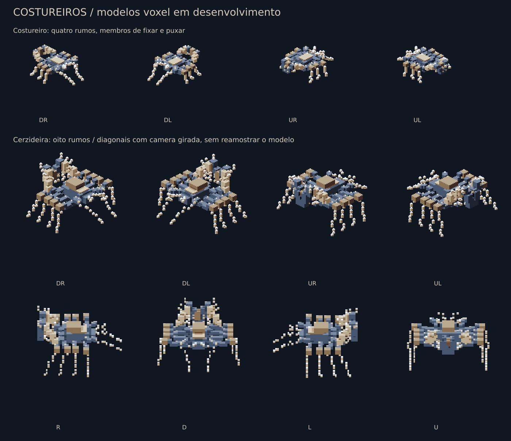
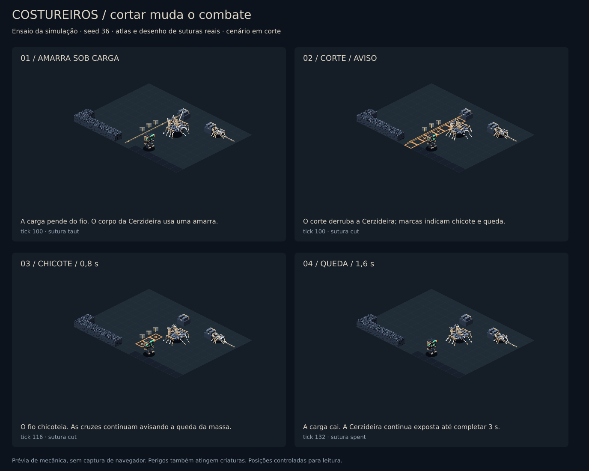
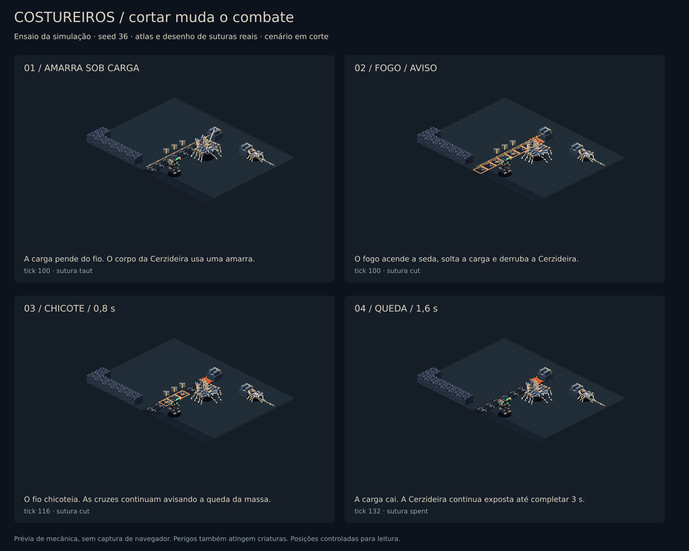

# Colônia dos Costureiros

Ocupação do Veio. Os Costureiros fixam seda mineral nas fraturas do estrato e usam essa rede para fechar passagens e sustentar cargas. A Cerzideira usa a obra como meio de locomoção. O jogador pode cortar a infraestrutura, dirigir os perigos contra criaturas e recuperar as cargas.

## Conteúdo entregue

- Costureiro: 108 quadros em quatro rumos; prepara o ponto, costura e fecha uma passagem.
- Cerzideira: 240 quadros em **oito rumos autorados**, sem espelhamento; sete animações (inclusive a queda, `downed`), com atlas de faces para iluminação. As diagonais usam `renderVoxels` com câmera girada sobre o modelo original, sem reamostragem da grade voxel. Um teste compara as diagonais assadas com a projeção direta do modelo.
- Âncora de sutura, âncora rachada, rocha costurada e seda mineral; portal da ocupação, registros de criaturas, dois documentos do Codex e textos em português/inglês.
- Sons procedurais de tração, chicote e queda; eventos próprios de preparação, golpe e vulnerabilidade do boss.



## Receitas de geração do setor

| Receita               | Estado inicial                                   | Intervenção e desafio                                                                                                                                                            |
| --------------------- | ------------------------------------------------ | -------------------------------------------------------------------------------------------------------------------------------------------------------------------------------- |
| Costura de fechamento | Fio frouxo entre duas paredes existentes         | O Costureiro precisa de três passadas. Depois de tensionado, há 1,2 s de aviso antes de formar rocha costurada. Corpos vivos preservam um vão. Tiros básicos reabrem a passagem. |
| Carga suspensa        | Fio tensionado sustentando três células de carga | Cortar inicia os avisos de chicote e queda. As cargas marcadas contam para o objetivo opcional.                                                                                  |

A ocupação pode invadir as sete linhagens existentes a partir do setor 2. Usa os resultados 88–99 da rolagem de ocupação, preservando os intervalos de micélio e Aurix. O boss override respeita a regra atual de um boss por run, no setor terminal acessível à geração do Prospector.

Cada setor recebe até 12 suturas. A receita substitui apenas material de paredes existentes por âncoras: não abre nem fecha rotas na geração. Os fios têm 3–10 células, não se sobrepõem, evitam água profunda, a entrada, o Núcleo e as paredes estruturais reservadas da arena. Os primeiros candidatos favorecem o entorno do boss. Operários ocupam vagas do orçamento de fauna existente.

## Regras de combate

| Ação                                         | Resultado                                                                                         |
| -------------------------------------------- | ------------------------------------------------------------------------------------------------- |
| Cortar fio frouxo                            | Interrompe o trabalho sem chicote ou queda.                                                       |
| Cortar fio tensionado                        | Aviso no chão; chicote após 16 ticks (0,8 s), causando 18 de dano.                                |
| Soltar carga suspensa                        | Cruz no chão; queda após 32 ticks (1,6 s), causando 34 de dano.                                   |
| Atirar na âncora                             | Primeiro impacto racha; segundo rompe. Destruição por outras fontes também solta a sutura.        |
| Incendiar a faixa do fio                     | Chama ou impacto térmico acende a seda mineral e solta a sutura, preservando os avisos.           |
| Ser atravessado por uma puxada da Cerzideira | Um impacto de 20 por jogador em cada puxada. Esquivar evita também dano tardio na mesma passagem. |
| Matar o operário                             | Interrompe a costura pendente; a obra já concluída permanece.                                     |
| Cortar o suporte carregado pela Cerzideira   | Cancela a puxada, derruba o corpo e o expõe por 60 ticks (3 s).                                   |
| Puxada encalhar num obstáculo                | Algo fechou a faixa depois da escolha: a amarra se solta e ela cai por 30 ticks (1,5 s).          |

Chicote e queda atingem Prospectores e criaturas. Colisão do tiro usa o segmento percorrido, incluindo disparos paralelos ao fio e à amarra diagonal da Cerzideira. O corte não consome carga adicional de módulo.

A Cerzideira resiste a impactos enquanto sustentada (0,55× dano). Derrubada, recebe 1,5× dano e cai na pose própria (pernas cedendo, abdômen no chão). Continua atacável sem amarras. Pode refazer uma sutura gasta se as duas âncoras sobreviverem, mas só 160 ticks (8 s) depois de ela ter sido gasta; nesse intervalo puxa por outra amarra tensionada ou caça o jogador de perto. A ordem de decisão é puxar, depois costurar, depois caçar. Abaixo de metade da vida, anuncia a segunda fase e reduz o preparo das puxadas de 24 para 16 ticks. A escolha do destino considera a faixa atravessada pelo jogador e a distância até outro apoio, e exige que o corpo inteiro (raio 0,72) caiba na rota, não apenas a linha de visão.

Durante o preparo a puxada desenha no chão a faixa com a largura do corpo, do abdômen até o ponto de chegada, enchendo conforme o tempo passa; a âncora carregada e a amarra pulsam em âmbar, para que o apoio a cortar se distinga das outras suturas. A animação de preparo é a costura (`special`); o golpe (`attack`) começa junto do arranque.

**Objetivo opcional:** recuperar as cargas marcadas, normalmente três, rende 24 de minério à equipe. O HUD mostra a quantidade realmente gerada. A recompensa é paga uma vez por setor; refazer a sutura e revisitar o setor na subida não repete o pagamento.



A imagem é um ensaio da simulação com posições controladas e paredes em corte. Usa os atlas e o desenhador de suturas do jogo; não é uma captura do navegador.



Nesta prévia, o corte começa pela ignição de uma célula de seda mineral gerada no setor. A simulação produz os mesmos avisos de chicote e queda.

## Prévia jogável e reprodução

Baixe e extraia [costureiros-preview.zip](../media/costureiros/costureiros-preview.zip). Abra `index.html`, selecione **A Cerzideira** e inicie a arena. WASD move, mouse mira/dispara e espaço esquiva. O painel **Suturas · inspeção** permite pausar, examinar uma amarra, cortar, romper âncoras, avançar 0,4 s e testar a segunda fase. Esses controles ficam apenas em `arena.html`.

A arena usa **seed 36, setor 7, G-04**, com o mesmo gerador, simulação e renderer do jogo. Para revisar no ambiente normal do projeto, inicie o cliente Vite e abra `/arena.html`.

Com as dependências instaladas, a partir da raiz:

```sh
node packages/voxelyn-survival-content/tools/generate.mjs enemy-stitcher enemy-seamstress terrain-blocks surface-tiles world-props
node packages/voxelyn-survival-content/tools/preview-stitchers.mjs docs/media/costureiros
node packages/voxelyn-survival/scripts/preview-costureiros-simulation.mjs
node packages/voxelyn-survival/scripts/preview-costureiros-simulation.mjs docs/media/costureiros --fire
node packages/voxelyn-survival/scripts/export-costureiros-preview.mjs
```

## Integração e validação

O estado de suturas, seus prazos e a máscara de recompensas entram no hash autoritativo, snapshots, resync e estados de apresentação solo/co-op. A sutura desenhada acompanha o tick do corpo, em vez do snapshot mais recente recebido. O snapshot MCP expõe geometria, fase, prazos e objetivo.

Versões: protocolo 39, simulação 76, conteúdo 40. O encontro com a Cerzideira foi refeito depois deste documento; as regras atuais da câmara estão em [docs/media/cerzideira-rework/README.md](../media/cerzideira-rework/README.md). Cliente e servidor precisam ser atualizados juntos. IDs de terreno/superfície e índices de archetypes foram acrescentados ao fim das listas existentes.

Os atlas novos carregam sob demanda. Ao trocar de encontro, o cliente libera os atlas opcionais e mapas de faces do boss anterior, incluindo pedidos ainda em andamento. Os limites existentes de 160 MiB no boot e 48 MiB sob demanda foram mantidos; o validador mede o conjunto comum mais o maior encontro residente.

Cobertura específica: geração sem alterar conectividade inicial; materiais em duas etapas; avisos antes do dano; fogo e tiros; dano em criaturas; interrupção do operário; queda/vulnerabilidade/fase da Cerzideira; pagamento único; cópia/hash; snapshot e reconexão; apresentação temporal; descarte de atlas; oito direções e diagonais assadas; preservação das âncoras na arena.

**Limite da revisão:** o navegador deste ambiente bloqueou a abertura do arquivo local. O pacote jogável foi compilado e as prévias de atlas/simulação foram conferidas, mas a interação visual no navegador e o balanceamento com jogadores ainda precisam de playtest.
