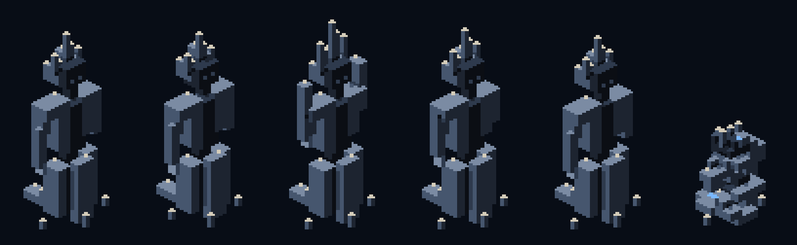

# Sixteen days, and the floor started keeping score

**2026-09-04** · build notes · PRs #154 to #200 · 179 commits

The last zip I handed out was sixteen days old by this morning. Sixteen days is nothing.
Sixteen days is also, apparently, forty seven pull requests, a soundtrack, a boss that eats
the room, an ice sheet that remembers where you walked, and a second game that has nothing
to do with mining.

So this is not a normal devlog. Normally I write one post about one problem and I go deep
on it. This one is a build note, and it has to cover a lot of ground, so I am going to move
fast and stop for the parts I actually care about.

Let me start with the part that is not mine.

## Clevo wrote the music

Voxelyn Survival has had procedural music for months. Eight themes, one per stratum,
synthesised at runtime. They were fine. They were exactly as good as free music that a
programmer wrote in a text editor can be, which is to say they filled silence and they never
once made anybody feel anything.

Then **Clevo ([@clevoclevoclevo](https://instagram.com/clevoclevoclevo))** wrote three
tracks for the game, and I have been playing my own build differently ever since.

There is the run theme, which plays in every stratum. There is the title theme, which now
opens over the dispatch terminal and goes quiet under the veil when a descent begins. And
there is a third one, written for the Diamandis encounter, which takes over the moment he
wakes up and stands, and hands the run theme back when he falls.

The engineering around them is a contract, and I want to write the contract down because it
is the reason the music does not fight the game:

- **Lossless, end to end.** The run and menu tracks ship as FLAC. There is a test that fails
  the build if somebody swaps in an mp3. The Diamandis track is mp3 on purpose, because the
  master only exists as mp3 and re-wrapping a lossy file in FLAC gives you back nothing and
  costs ten times the precache.
- **The stereo image is untouched.** Clevo mixed with the sides occupied and roughly the
  inner 40% of the field left free for the game's own sounds. So the audio path does not sum
  to mono, does not pan it, does not filter it. Two bass layers coexist because he put them
  there.
- **Sound effects still win.** Same ceiling as the procedural music, same ducking. Under a
  boss telegraph the track drops to -30 LUFS and gets out of the way.

That last one is where I got it wrong the first time. I shipped the track at -30 LUFS
resting, sixteen decibels under the studio ident, and I told myself the mixing was
conservative. It was not conservative, it was inaudible. The masters were sitting at -15.0
and -17.1 LUFS with true peak almost on the ceiling. Nothing was wrong with the files. The
gain chain was strangling them.

The fix is a pair of numbers that only work together. The music ceiling goes up 9.0 dB and
the ducking goes 9.1 dB deeper:

| state | gain | result |
| --- | --- | --- |
| resting | 0.366 × 1.74 | -21.0 LUFS |
| under a telegraph | × 0.35 | -30.1 LUFS |

For the 40 milliseconds a telegraph is speaking, the mix is bit for bit what it was before.
Between telegraphs, the music is finally music. I gave up static headroom in silence, which
nobody was using, and kept headroom in the only instant where it protects anybody. Clevo's
calibration trims did not move a single decimal, because the trims normalise the two tracks
against each other and the ceiling is what sets absolute level.

Play this build with headphones. That sentence is now in the terminal footer for a reason.

## The game opens like a game now

It used to be: black screen, then the menu, sometime. There was no first frame, only an
absence of one.

Now there is a sequence. The developer identity comes up first, the DaniTools mark, with the
studio's sound logo over it. Then real loading, with a progress bar that is measuring
something instead of pretending. Then the terminal, with the title theme already playing.

Two decisions in there I would defend in a fight.

The identity is **the developer's mark, not Aurix Dynamics**. Aurix is the fictional company
inside the game. It employs the Prospector, it signs the dispatch order, it stamps the key
art. Putting its logo on the first screen would tell a player that Aurix made this game.

And the mark **waits for the sound, but only if the sound actually plays**. There is an
event that stretches the identity phase to the last chord. It never shortens the phase, it
ignores audio that arrives too late, and it has a 5.2 second cap so a wrong file can never
trap somebody on a black screen. Where the browser refuses to play audio without a gesture,
the sting returns null, the identity stays short and silent, and nothing is held. Holding a
black screen for the length of an audio file nobody heard is the same lie as a fake progress
bar.

The key art at the top of this post is also new, and it is rendered from the game's own
systems: the real 96x96 worldgen, the canonical voxel models, the art bible palette. Only the
projection changed. The game camera is a fixed 2:1 isometric, which is right for gameplay and
wrong for a poster, so the splash uses a perspective voxel tracer with real normals, shadows,
ambient occlusion and volumetric scattering. Same matter, different lens.

## The ice remembers where you walked

Here is a confession. The Glacial Crypt has had an ice floor since it existed, and that floor
did nothing. It had a glide inertia of 0.82, which sounds like a number until you measure it:
letting go of the stick slid you about 0.7 of a cell, less than the width of your own body.
There was an upgrade in the tree that reduced that nothing by a further quarter. The ice was a
floor that changed colour.

Now the floor keeps a record of you.

**Inertia got real.** Glide goes from 0.82 to 0.915, which is about 2.5 tiles of braking.
Reversing crosses zero in roughly 0.4 seconds and completes in 1.7. The gyroscopic stabiliser
upgrade stopped multiplying and started interpolating toward a stabilised value, so it cuts
your slide by 60% without turning the lake into dry ground, and it buys you no protection at
all from the thing below.

**The cracking cycle.** Four new surfaces, appended, nothing renumbered: cracked, fractured,
critical, deep water.

Every Prospector crossing takes a cell down one step. The fourth opens the hole. It counts
*entry* into the cell, so standing still does not progress it, leaving and coming back does,
sliding counts, dodging counts. Every cell along a movement segment gets processed, so moving
fast does not let you skip a step. At most one step per Prospector per movement step. In co-op
it resolves in slot order, so both clients agree.

**The hole kills.** Entering deep water kills at full health, through invulnerability frames,
with no revivable body. It conducts like water, projectiles pass over it, the Queen and the
Wraiths cross it, ordinary ground enemies will not end a move in it. It refreezes as whole ice
after 12 seconds, and that clock lives in authoritative state and enters the hash.

**And the loop closes.** Heat melts any stage back to shallow water. Shallow water refreezes as
an intact plate, which erases the memory of every crossing. The Queen's freeze repairs cracks
and seals holes inside her radius while preserving live fire, and her armour counts any cracked
stage as ice, so melting the lake is still the only counterplay. That last sentence is the whole
design: the ice is a resource both of you are spending.

The fall has 820 milliseconds of presentation of its own, height loss, sinking under a mask,
fragments, ripple. No tombstone, no red ring, and the result screen waits for it.

I paid for the new art without raising the budget. The atlas PNGs now use the default deflate
strategy instead of Z_RLE, and the whole pack dropped from 8.9 MiB to 3.2 MiB.

## Frostbite: the cold accumulates, and then you are a statue

The other half of the ice work is a per-player freeze meter, and it is the mechanic I most want
people to go and get hit by.

The Queen's Nova doses 45% to every Prospector inside its real radius. Invulnerability frames do
not block it. The Frost Wraith's lunge doses 12% on contact, and that lunge now actually resolves
contact, which it never did before. The meter decays at 1 percentage point per second after a two
second grace, so three Novas inside fourteen seconds will freeze you even with decay running
between them.

At full, **frostbite**. The chassis locks. Speed and inertia go to zero. No facing, no dodge, no
interact, no ability, no shot. Damage still lands.

The way out is the part I like. The fire trigger gets intercepted before any weapon exists and
becomes thermal cycles at a fixed cadence, five per second, identical whether you are carrying
the bolt, the return disc or the Minigun. Those cycles produce real heat and melt 66 per cycle.
One layer of shell is 330, so with a cold weapon you break out in about a second. Overheating
suspends the process without losing progress.

So the answer to being frozen is: hold the trigger. Your gun is the heater. If you came into the
fight already overheated, you wait, and the Queen gets a free window.

It clears on death, on being downed, on revive, on reset and on descent. It is in the hash, in the
viewer, in the partner snapshot and in the MCP surface. There are localised hints the first three
times it happens to you, because a mechanic that locks your controls needs to explain itself before
it becomes a bug report.

## The Frost Wraith is fog until it is not

The Wraith got a proper reskin, and it is a two-state creature now. Hidden, it is fog: lobes, loose
voxels, suspended crystals, cyan glow, condensation streaks. Exposed, it is a frost manawyrm in a
96 pixel frame, with a materialisation pose of its own and five voices, and a whisper sampled from
its state so you can hear roughly where it is before you can see it.

## The Frost Queen got a cadence, a crown and a sound

Her freeze used to come every 6 seconds. Combined with the new cracking cycle, that meant her repair
inside a 6 tile radius erased every route near her before you could reach the fourth step. The hole
only existed far away from the fight, which is the opposite of interesting.

The interval is now 14 seconds, and that number is not vibes. A tight loop needs about 11 seconds to
open a hole, and natural refreeze takes 12. Fourteen guarantees you can open the hole and have at
least 3 seconds of it. It deliberately does *not* guarantee covering the loop and the refreeze
together, which would need about 23. The guarantee is the sum, not each instalment, and the docs and
the test now say so out loud.

The crown is white shards standing up and tilting outward, opening in a full circle to the ability's
*real* radius, with a frost disc and dust streaks along the floor. Pure geometry, seeded from the
event, so both players in co-op see the same fan.

And the sound is a bag of ice emptied onto concrete: the thud, then dozens of cracks thinning out,
plus hanging ice bells, pairs of high sines detuned by a few cents, inharmonic, with tails just
under a second. She also shatters on death now.

## The White Devourer stopped being a tower and became a mouth

This one is my favourite change in the build.

The Devourer's vulnerable window used to be a stationary, harmless target. He did not move, did not
charge contact, had no sand absorbing shots. Walking up to him was free, and the only real decision
in the encounter (having saved your overheat) happened *before* the window instead of inside it.

Now that same window is a maw. He stays still and stays unarmoured, so everything the opening
promised is still true. But while it lasts, he swallows the sector into himself.

The suction is gradual on two axes, and that is what separates it from a trap. **In time**, the reach
grows from zero to 7.5 tiles over 4.5 seconds. Since the arc's landing is aimed at you, the window
always opens with you on top of the centre, so the throat only starts charging about a second later.
**In space**, the force at each distance is fixed, 0.7 tiles per second at the rim and 7.6 at the
throat, and it crosses walking speed at 3.47 tiles. That is the point of no return, and the game draws
it on the floor.

There are three ways out and none of them are automatic: walk (outside the line), dodge (2.2 tiles in
0.2 seconds puts you back on the line), and glass (suction drops to 45% over glass and never beats
walking). Walls stop the drag too. The throat charges 200, which is double a full health bar, and it
charges fauna the same way, so dragging a pack in solves two problems at once.

The sand vortex is not decoration, it is the drawing of the radius, made out of the stratum's own
matter. The mouth eats the loose silica the reach covers, and the border between sand and clean floor
tells you exactly how far the suction goes right now.

I got the vortex wrong twice, publicly, and the fix taught me something. A playtester said "the vortex
looks bad, nothing flies toward the centre, particles just circle". They were right and it was
measurable: with the path fixing two full turns, between 89% and 96% of every grain's step was orbit.
I had calibrated the number to read as rotation, which is the wrong reading, because the mechanic says
it swallows. The path is now a constant pitch spiral where every step is 56% radial and 44% tangential
at every radius, because the angle is a property of the curve and not of the speed you traverse it at.

Also the ring was lying. A circle of radius R in this isometric becomes an ellipse whose horizontal
extreme sits at R times root two, and the code was omitting the root, so the ring was drawn at 71% of
the radius that actually grabs you. A ring that promises a different radius than the one that grabs you
is worse than no ring.

He also has a brood now, and the brood dies with the mother.

## The Archcantor sings with four voices

The Archcantor encounter used to start empty. A slow body in the middle of the nave singing to crystals
that the generator may or may not have put nearby. With map luck the whole Cathedral answered. Without
it, he was a stationary target.

Now four Resonants orbit him as a Cardinal Choir, and three things close the exits that playtesting
found:

**Replacement costs the room.** An open slot is answered 80 ticks later by the crystal nearest the body,
which crystallises into a new Resonant and stops existing. He consumes his own nave to hold the chord,
innermost layer first. With no crystal in reach, the slot stays empty. That is how replacement preserves
your progress instead of erasing it, and it is why breaking crystal is counterplay for two reasons at once.

**A full turn spits out a soloist.** With the chord full, each turn of the dance crystallises a voice that
does not fit and throws it out on the diagonal, capped at two. The diagonals were the safe answer to the
cross, and now they are exactly where the soloist comes from.

**The corridors reverberate.** Twelve tiles by three, and each one charges twice: the response, then the
echo a beat later. Without the echo, a corridor that had just flashed was the safest place in the room.

## Every boss has a sound signature now

Nine identities: mass, machine, friction, tuned crystal, abyssal whale, breathing, boiler, tensioned ice,
magnetism. Each ability uses its boss's identity to say three separate things: windup, execution,
consequence. About 65 new voices, with a strict priority policy. Lethal windup and phase change sit at 10.
Execution and vulnerability at 9. Offscreen movement at 7 to 8. Vocalisation at 5 to 6. Texture at 2 to 4.

A playtester asked me to "lower the bit rate to make it scarier", and they were onto something. The recipes
are clean, and clean sounds like a synthesiser. So there is a crumple chain now, light saturation, 8 bit
mid-tread quantisation, low pass at 5.4 kHz, and it applies **only** to boss voices and boss beds. The rest
of the bank stays clean, because the generic telegraph has to stay legible.

Diamandis speaks. His lines are robotic phonemes, and the same table that picks the voice line raises a
subtitle on the HUD at the same instant. His awakening no longer shows the generic "the Guardian has
awoken", because he introduces himself.

And the boss arena finally has sound at all. It was the one mode running the real render and input engine
in silence.

## The Minigun

A tier 3 module with 300 rounds that *replaces* your main fire while it has ammunition. Not a bolt modifier,
which is why it does not share the shot with anything.

The state machine (idle, spinning up, firing, spinning down, overheated) is pure arithmetic, and everything
in it is an integer. Rotation in thousandths, rate of fire in thousandths of a shot per tick, accumulator in
thousandths. A `spin += 0.05` per tick would accumulate float error, and two peers disagreeing on the third
decimal would cross the operational threshold on different ticks. That divergence shows up to a player as
"my partner fired and I did not".

The compatibility matrix is drawn instead of written. With the Minigun mounted, the six coupled modules
disappear from the metal. They are still installed with their charges intact, they just do not apply to her
bullets. When round 300 leaves, the Driver comes back and all six reappear on their own. The body of the bot
tells you the rule without a line of HUD.

Audio is three identities and no voice per bullet. The motor is a continuous bed whose pitch follows the
authoritative RPM. The burst is one voice per four tick window that schedules three transients inside itself,
so five voices a second instead of sixteen. And the burst never reaches telegraph priority, because the
strongest weapon in the game is not allowed to silence the warning that prevents an unfair death.

## You can watch your runs back

Two of them, actually.

The server now stores the canonical log next to every solo leaderboard entry, along with the tuning and depth
config it was verified under, and every row with a replay available gets a play button. It opens an isolated
tool that re-simulates the run through the same deterministic engine and draws every tick, with play, pause,
scrubbing and restart.

And then the obvious gap: the ranking only accepts runs that extracted, so the run where you *died* never goes
anywhere, and that is exactly the one you want to see again. Those now live on your device, the last eight, with
a 1 MB cap and pruning by age. The Log panel gets the same play button. It does not claim to be authoritative,
because nothing about it was verified by any server, and the banner says so.

## The ranking is one book per depth

Two changes that are really one change: the leaderboard was comparing things that are not comparable, and
sorting by a grade that is not the score.

**The score is Cores extracted first, then time, and nothing else.** Ore is out. It was a tiebreak, but a
tiebreak is also a criterion, and it was a question the scoreboard asked that the briefing never did. Stars
stopped ordering anything. A two Core run outside the target time did twice the work of a three star single Core
run, and sorting by the grade punished going deeper. Stars are still how you read a run. They are just not its
position.

**And there is one book per sector count.** A three sector descent and a seven sector descent are not the same
exam. In the same book they do not compare skill, they compare authorisation, and authorisation is something you
buy.

## The terminal is a form again

In phone landscape the authorisation column did not fit. DESCEND plus three secondary buttons, and the Weekly
Challenge, the last one and the only one with a deadline, fell off the screen. The fix is not a smaller column,
it is a different form.

The requisition is a mode selector now: free descent, online co-op, training op, weekly challenge (that last one
only when the server announces a contract). The authorisation column keeps the generation stamp and a single
DESCEND, which runs whichever row is ticked and says which one in its subline. Four descents, one stamp, and the
column never grows again.

Then I audited all five sheets against a real server, with ore in the profile, descents in the log, a simulated
ranking, and windows at 320x568, 667x375, 390x844, 844x390, 1280x800 and 1920x1080. It found plenty. Five rail
labels colliding into "DISPATCHLOG". The menu header painting the brand over the document code. "OPERATOR" and
"CORES" overlapping until the name became a single letter. 127 identical locked Aurix files turning into a wall
(they are grouped by clearance level now). A portrait stack in short landscape hiding three of the four cards
behind the stamp with no scroll hint.

## The HUD got denser without losing a line

Small screens used to get the panel scaled down uniformly, which still left the whole panel stacked on top of the
game. Now they also get a tight vertical rhythm: 12 pixel health bar instead of 15, 24 pixel module cards instead
of 30, less air between sections. The sections are the same, in the same order. The rhythm takes space, never a
line of information.

The Purge Cell is a real battery now. The old glyph was a 6x8 rectangle with a bar in it, which at 13 pixels read
like a dimmed letter "i", and a row of them read like a row of nothing.

And co-op notifications got fixed, which was overdue. Both clients receive the same events, and the renderer was
pushing messages without checking the slot, so your partner's module expiring showed up as MODULE SPENT on *your*
screen, along with the Echo they absorbed and the refusals the shaft gave *them*. None of that changes a decision
you can make. Messages now carry a slot when they are a response to a player's action, and stay slotless when they
are an announcement from the world, and the client only raises the personal ones for the local player.

## Latency lives in Options

The protocol always had ping and pong. The server always answered. The client never asked.

Inside a room the number is measured by the pong. Outside one, a button probes the server over HTTP, because "can
I play co-op right now" is a question people ask *before* joining.

Two things the measurement taught me, both now in the code. The ping timestamp is taken inside `ping()`, not from
the frame's `now`. Against a localhost server the frame clock said 46 ms, which was this client's render loop with
the network hidden inside it. Read at send time: 14 ms. And the *variance* of that window deliberately does not
reach the screen, because the pong is only read when the loop yields the thread, so the spread carries the device's
frame rate.

## The Prospector exists in real life now

Not a feature. Not in the changelog. Just the best thing that happened during these sixteen days, and proof that the
silhouette reads even when you take the pixels away.

## And there is a second game now

Somewhere in the middle of all this I built **Catathon**, a spin-off in the same monorepo. The biggest hackathon in
the world, every developer is an extremely cute cat, and everything that can go wrong will. You do not write code.
You carry cats to desks, interpret a vague brief, respect a dependency graph and survive until the demo.

Four cats, four disciplines, four personalities. Bigode the Siamese backend perfectionist will not let anything merge
without your approval. Cheeto the orange frontend cowboy is 25% faster, ships without testing, and bites the build
cable. Almofada the Maine Coon does devops at half the stress. Smoking the tuxedo does design and judges you in
silence. Bugs are born from stress. Petting is the release valve.

It has a career mode, a circuit, sprints, sponsors, a persistent rival and alumni. It plays with one finger on a
phone. It is a completely different game and I regret nothing.

## What to actually play in this build

If you are coming back after the last zip, here is the order I would go in:

1. **Put headphones on.** Genuinely. The sound tells you things the screen has not shown you yet, and now there is
   also music worth hearing.
2. **Run the Training Op** if you have never finished a descent. It is two to three minutes, fully playable, and it
   is the real game with one sector and one Core rather than a separate tutorial.
3. **Do a free descent** and pay attention to the new HUD, the module cards and the Purge Cell battery.
4. **Get to the Glacial Crypt** and let the Queen freeze you at least once, on purpose. Hold the trigger to break
   out. Then walk the same line across the lake four times and watch what the floor does.
5. **Find the White Devourer** and stand inside the maw window instead of running from it. Watch where the line on
   the floor is. Learn where 3.47 tiles is.
6. **Check the ranking** and hit play on somebody's run, including your own.
7. **Open the arena** if you want the bosses without the campaign around them. It has sound now.
8. **The weekly challenge** is the only thing here with a deadline.

## The numbers

Forty seven pull requests. 179 commits. Simulation version went from 41 to 58, protocol from 25 to 31, content from
25 to 33. Three composed tracks, one sound logo, roughly 65 new boss voices. Boot budget went from 179 MiB to 147
against a 160 ceiling, mostly by fixing an atlas packer that was filling the first row to 4096 pixels and leaving
about 27 MiB of white space in the pack. 867 simulation tests and 1465 client tests pass.

The thing I am least sure about is 14 seconds. The only way to settle it is to watch somebody who is not me get
caught on the far side of the lake when the Queen decides to repair it.

Music by **Clevo ([@clevoclevoclevo](https://instagram.com/clevoclevoclevo))**. Game by
**DaniTools ([@dani.tools](https://instagram.com/dani.tools))**. Go break some ice.
