# Sixteen days, and the floor started keeping score

**2026-09-04** · build notes

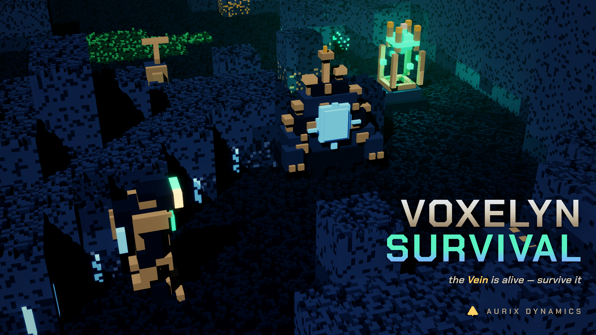

The last zip I handed out was sixteen days old by this morning. Sixteen days is nothing.
Sixteen days is also, apparently, a soundtrack, a boss that eats the room, an ice sheet that
remembers where you walked, and a second game that has nothing to do with mining.

Let me start with the part that is not mine.

## Clevo wrote the music

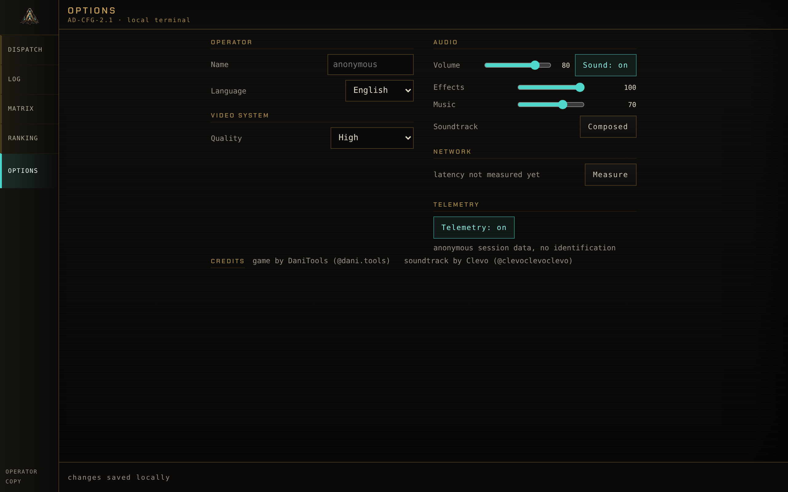

Voxelyn Survival has had procedural music for months. Eight themes, one per stratum,
synthesised at runtime. They were fine. They were exactly as good as free music that a
programmer wrote in a text editor can be, which is to say they filled silence and they never
once made anybody feel anything.

Then **Clevo ([@clevoclevoclevo](https://instagram.com/clevoclevoclevo))** wrote three tracks
for the game, and I have been playing my own build differently ever since.

There is the run theme, which plays in every stratum. There is the title theme, which opens
over the dispatch terminal and goes quiet under the veil when a descent begins. And there is
a third one, written for the Diamandis encounter, which takes over the moment he wakes up and
stands, and hands the run theme back when he falls.

The most interesting thing about the mix is what is missing from it. Clevo wrote these with
the sides of the stereo field occupied and the middle deliberately left empty, because the
middle is where the game speaks: a shot, a footstep, a boss drawing breath before it hits
you. The music is built around the sound design instead of competing with it, and nothing in
the audio path sums it to mono or filters it, because that hole in the centre is the whole
point.

Then I almost threw it away by shipping it far too quiet. I had the track sitting sixteen
decibels under the studio sting and I told myself the mixing was conservative. It was not
conservative, it was inaudible. The masters were fine. My gain chain was strangling them. So
the music came up nine decibels, and the ducking under a boss telegraph went nine decibels
deeper to pay for it. For the forty milliseconds a telegraph is speaking, the mix is exactly
what it always was. Between telegraphs, the music is finally music.

Play this build with headphones. That sentence is in the terminal footer for a reason.

## The key art is made out of the game

The game used to open on a black screen and then the menu, sometime. Now there is a proper
opening: the studio mark with its own sting over it, real loading, and then the terminal with
the title theme already playing.

The key art at the top of this post is also new, and it is rendered from the game's own
systems: the real 96x96 worldgen, the canonical voxel models, the art bible palette. Only the
projection changed. The game camera is a fixed 2:1 isometric, which is right for gameplay and
wrong for a poster, so the splash uses a perspective voxel tracer with real normals, shadows,
ambient occlusion and volumetric scattering. Same matter, different lens.

Not one pixel of it came from image generation. The Vein glows in that picture because the
same functions that light the Vein when an energy shot hits it were called, for real, on that
exact world.

## The ice remembers where you walked

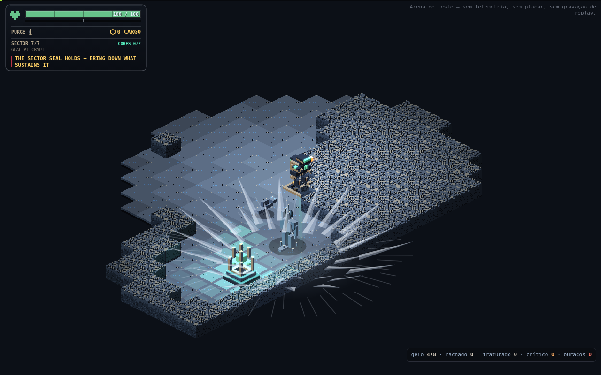

Here is a confession. The Glacial Crypt has had an ice floor since it existed, and that floor
did nothing. Its glide inertia was 0.82, which sounds like a number until you measure it:
letting go of the stick slid you about 0.7 of a cell, less than the width of your own body.
There was an upgrade in the tree that reduced that nothing by a further quarter. The ice was a
floor that changed colour.

Now the floor keeps a record of you.

**Inertia got real.** Glide goes to 0.915, which is about 2.5 tiles of braking. Reversing
crosses zero in roughly 0.4 seconds and completes in 1.7. The gyroscopic stabiliser upgrade
now cuts your slide by 60% instead of turning the lake into dry ground, and it buys you no
protection at all from the thing below.

**The ice cracks in four stages.** Whole, cracked, fractured, critical. Then the hole.

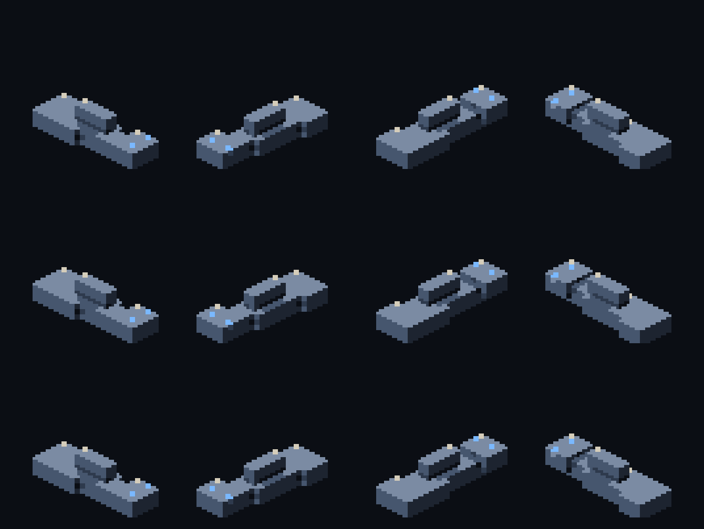

Every crossing takes a cell down one step, and it counts *entering* the cell, so standing
still does not progress it, leaving and coming back does, sliding counts, dodging counts.
Moving fast does not let you skip a step either: every cell you pass through gets its turn.
Walk the same line four times and you have made a hole in the world.

**And the hole kills.** Deep water kills you at full health, through invulnerability frames,
with no body left to revive. It conducts electricity like water. Projectiles pass over it. The
Queen and her Wraiths cross it like it is not there. It refreezes after twelve seconds, so
the map you broke does come back, on its own schedule and not yours.

**The loop closes, which is the part I am proud of.** Heat melts any cracked stage back to
shallow water, and shallow water refreezes as an intact plate, which erases everything you did
to it. The Queen's freeze repairs cracks and seals holes inside her radius, but it preserves
live fire. And her armour counts a cracked plate as ice, so melting the lake is still the only
way through her. The ice is a resource both of you are spending, from opposite directions.

The fall has 820 milliseconds of presentation of its own: the loss of height, the sinking, the
fragments, the ripple. No tombstone, no red ring. The result screen waits for it, because it is
the last thing that happens to you and it should get to finish.

## Frostbite: the cold accumulates, and then you are a statue

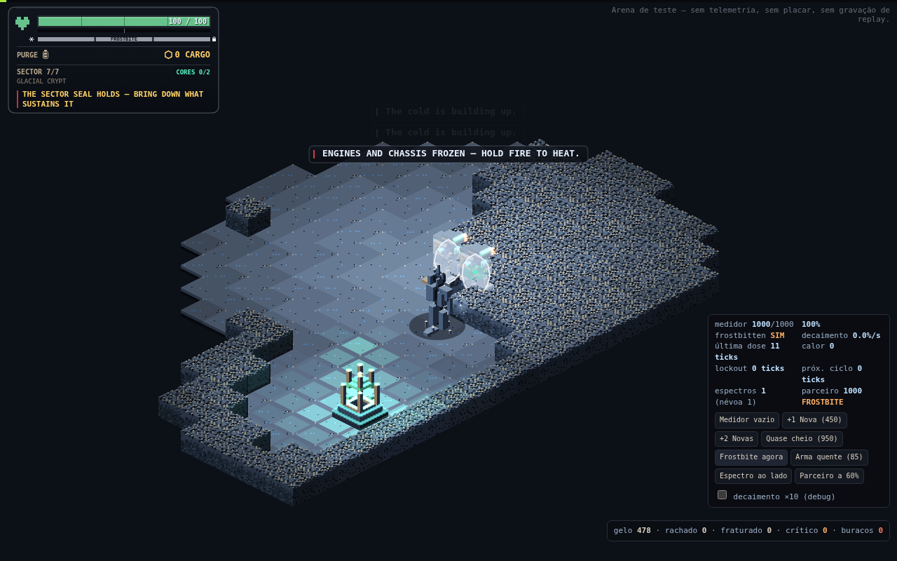

The other half of the ice work is a freeze meter, and it is the mechanic I most want people to
go and get hit by.

The Queen's Nova doses 45% to everyone inside its radius, and dodge frames do not save you from
cold. The Frost Wraith's lunge doses 12% on contact, and that lunge now actually connects,
which it never did before. The meter decays about a point a second after a short grace period,
so three Novas inside fourteen seconds will freeze you even with the decay running between
them.

At full, the chassis locks. No movement, no facing, no dodge, no interact, no ability, no shot.
Damage still lands.

The way out is my favourite bit of design in this build. Your fire button gets intercepted
before any weapon exists and becomes a thermal cycle instead, five per second, identical
whether you are carrying the bolt, the return disc or the Minigun. Those cycles make real heat,
and heat melts the shell in about a second.

So the answer to being frozen is: hold the trigger. Your gun is the heater. And if you walked
into that Nova with an already overheated weapon, you wait, and the Queen gets a free window on
a statue. Which means "keep some heat headroom near her" is now a real thought you have to have
while fighting something else entirely.

## The Frost Wraith is fog until it is not

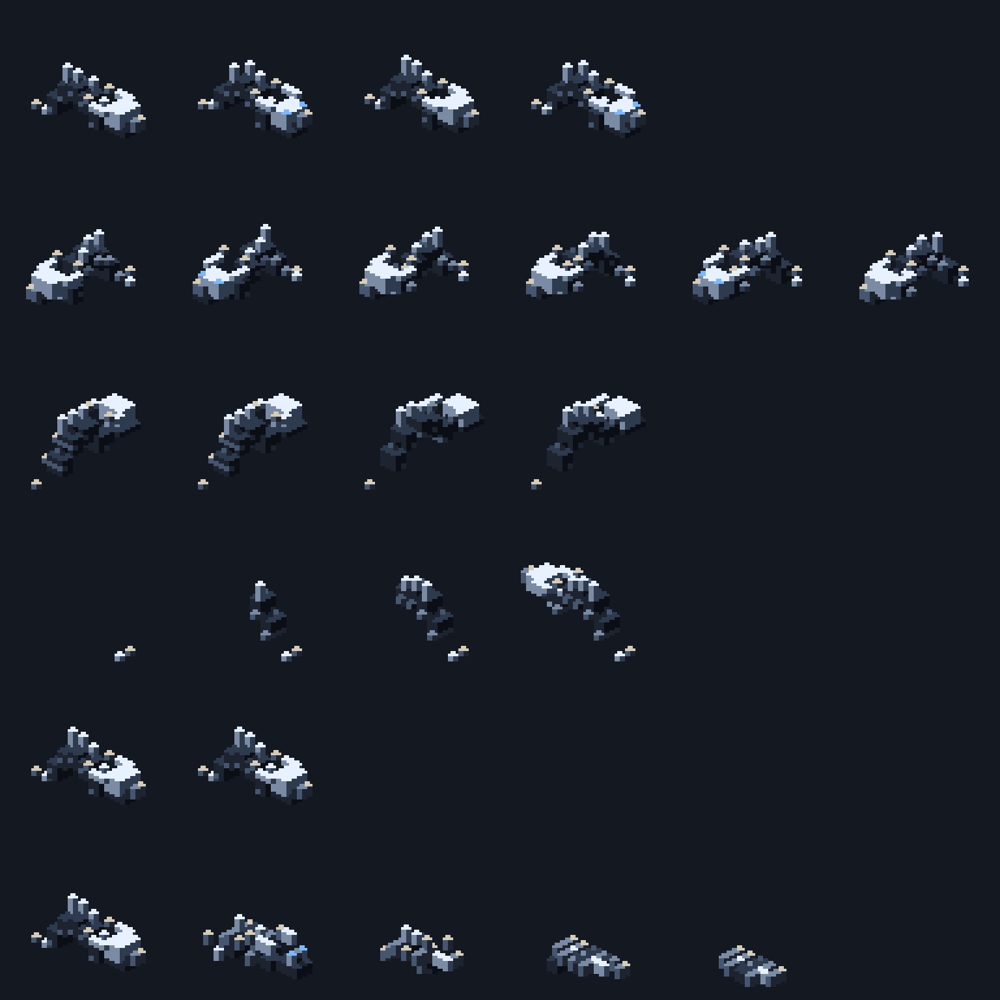

The Wraith got rebuilt as a two state creature. Hidden, it is genuinely fog: lobes, loose
voxels, suspended crystals, a cyan glow, streaks of condensation. Exposed, it is a frost
manawyrm with a materialisation pose of its own, five voices, and a whisper that tracks its
state, so you can hear roughly where it is before you can see anything at all.

## The Frost Queen got a cadence, a crown and a sound

Her freeze used to come every six seconds. Once the floor could crack, that turned out to be
poison: her repair covered a six tile radius, so she erased every route near her before you
could get to the fourth step. The only hole you could ever open was far away from the fight,
which is the least interesting place for a hole to be.

The interval is fourteen seconds now, and that number is not vibes. A tight loop needs about
eleven seconds to open a hole. Natural refreeze takes twelve. Fourteen guarantees you can open
the hole and have at least three seconds of it. It deliberately does not guarantee covering the
loop and the refreeze together, which would need about twenty three. You get the window. You do
not get to keep it.

The crown is white shards standing up and tilting outward, opening in a full circle out to the
ability's real radius, with a frost disc and dust streaks along the floor. It is seeded from the
event, so in co-op both of you see exactly the same fan of ice.

And the sound is a bag of ice emptied onto concrete: the thud, then dozens of cracks thinning
out, with hanging ice bells over the top, pairs of high sines detuned by a few cents,
inharmonic, tails just under a second. She shatters when she dies now, too.

## The White Devourer stopped being a tower and became a mouth

This one is my favourite change in the build.

The Devourer's vulnerable window used to be a stationary, harmless target. He did not move, did
not charge contact, had no sand absorbing shots. Walking up to him was free, and the only real
decision in the encounter, having saved your overheat, happened *before* the window instead of
inside it.

Now that same window is a maw. He still holds still and still drops his armour, so everything
the opening promised is still true. But while it lasts, he swallows the sector into himself.

The suction is gradual on two axes, and that is what makes it a decision instead of a trap. **In
time**, the reach grows from nothing to 7.5 tiles over 4.5 seconds, and since his arc lands aimed
at you, the window always opens with you standing on the centre. The throat does not start
charging you for about a second. **In space**, the pull is 0.7 tiles per second at the rim and
7.6 at the throat, and it crosses your walking speed at 3.47 tiles. That is the point of no
return, and the game draws it on the floor for you.

Three ways out, none of them automatic: walk, if you are outside the line. Dodge, which throws
2.2 tiles in 0.2 seconds and puts you back on it. Or glass, where the suction drops to 45% and
never beats walking. Walls stop the drag too. The throat charges 200, which is double a full
health bar, and it charges the fauna exactly the same way, so dragging a pack in with you solves
two problems at once.

The sand vortex is not decoration. It *is* the drawing of the radius, made out of the stratum's
own matter. The mouth eats the loose silica the reach covers, and the border between sand and
clean floor tells you precisely how far the suction goes at that instant.

I got that vortex wrong twice, in public, and the fix taught me something. A playtester said the
vortex looked bad, that nothing was flying toward the centre, that particles were just circling.
They were right, and it was measurable: the path was fixing two full turns, so between 89% and
96% of every grain's step was orbit. I had calibrated it to read as rotation, which is the wrong
reading, because the mechanic says it *swallows*. The path is a constant pitch spiral now, and
every step is 56% inward and 44% sideways at every radius.

The ring was lying, too. A circle in this isometric becomes an ellipse, and the code was missing
a square root, so the ring was drawn at 71% of the radius that actually grabs you. A ring that
promises a different radius than the one that grabs you is worse than no ring at all.

He has a brood now. The brood dies with the mother.

## The Archcantor sings with four voices

The Archcantor encounter used to start empty. A slow body in the middle of the nave, singing to
crystals that the generator may or may not have put nearby. With map luck the whole Cathedral
answered you. Without it, he was a statue with a health bar.

Now four Resonants orbit him as a Cardinal Choir, and three things close the exits that
playtesting found.

**Replacement costs him the room.** Kill one and the gap is answered a few seconds later by the
crystal nearest the body, which crystallises into a new Resonant and stops being a crystal. He
eats his own nave to hold the chord, innermost layer first. With no crystal in reach, the gap
stays open. So breaking crystal is counterplay twice over: it is his ammunition and it is his
choir.

**A full turn spits out a soloist.** With the chord complete, each turn of his dance crystallises
a voice that does not fit and throws it out on the diagonal. The diagonals used to be the safe
answer to his cross attack. Now they are exactly where the soloist comes from.

**The corridors reverberate.** Twelve tiles long, three wide, and each one charges twice: the
response, then the echo a beat later. Without that echo, the corridor that had just flashed was
the safest place in the room, which is precisely backwards.

## Every boss has a sound signature now

Nine identities: mass, machine, friction, tuned crystal, abyssal whale, breathing, boiler,
tensioned ice, magnetism. Every ability uses its boss's identity to say three separate things:
windup, execution, consequence. That is about sixty five new voices, ordered so a lethal windup
can never be buried under anything, ever.

A playtester asked me to lower the bit rate to make the bosses scarier, and they were onto
something real. Clean recipes sound like a synthesiser, and a synthesiser is not frightening. So
boss voices now run through a crumple: light saturation, eight bit quantisation, a low pass at
5.4 kHz. Only the bosses. The rest of the bank stays clean, because the warning that saves your
life has to stay legible.

And Diamandis speaks. His lines come out as robotic phonemes with a subtitle on the HUD in the
same instant. He no longer gets the generic "the Guardian has awoken" banner, because he
introduces himself.

The boss arena has sound at all now, which is embarrassing to type. It was the one mode running
the real engine in silence.

## The Minigun

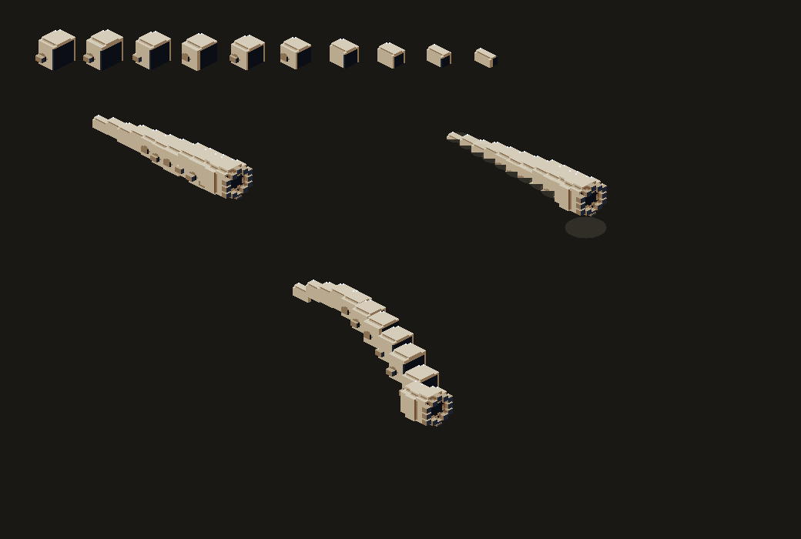

A tier 3 module with 300 rounds that *replaces* your main fire while it has ammunition. Not a
bolt modifier. It spins up, it fires, it spins down, it overheats, and none of that is
negotiable once you have committed.

The compatibility matrix is drawn instead of written. Mount the Minigun and your six coupled
modules physically disappear from the metal. They are still installed with their charges intact,
they just do not apply to her bullets. When round 300 leaves the barrel, the Driver comes back
and all six reappear on their own. The body of the bot tells you the rule without a single line
of HUD.

The audio is three identities and no voice per bullet. The motor is a continuous bed whose pitch
follows the real rotation, so you can hear how spun up you are without looking. The burst is one
voice per window that schedules three transients inside itself, which is five voices a second
instead of sixteen, and reads as a mechanism rather than as three identical clicks. And the burst
is never allowed to reach telegraph priority, because the strongest weapon in the game does not
get to silence the warning that prevents an unfair death.

## You can watch your runs back

Two ways.

Every solo run on the leaderboard now has a play button that opens the run and re-simulates it
tick by tick through the same engine that produced it, with play, pause, scrubbing and restart.
It is not a video. It is the run.

And then the obvious gap: the leaderboard only accepts runs that extracted, so the run where you
*died* went nowhere, and that is exactly the one you want to see again. Those now live on your
device, the last eight of them, and the Log panel has the same play button.

## The ranking is one book per depth

Two changes that are really one change: the leaderboard was comparing things that are not
comparable, and sorting by a grade that is not the score.

**The score is Cores extracted first, then time, and nothing else.** Ore is out. It was a
tiebreak, but a tiebreak is also a criterion, and it was a question the scoreboard was asking
that the briefing never did. Stars stopped ordering anything at all: a two Core run outside the
target time did twice the work of a three star single Core run, and sorting by the grade was
punishing people for going deeper. Stars are still how you read a run. They are just not its
position any more.

**And there is now one book per sector count.** A three sector descent and a seven sector descent
are not the same exam. Put them in the same book and they stop comparing skill and start
comparing authorisation, and authorisation is something you buy.

## The terminal is a form again

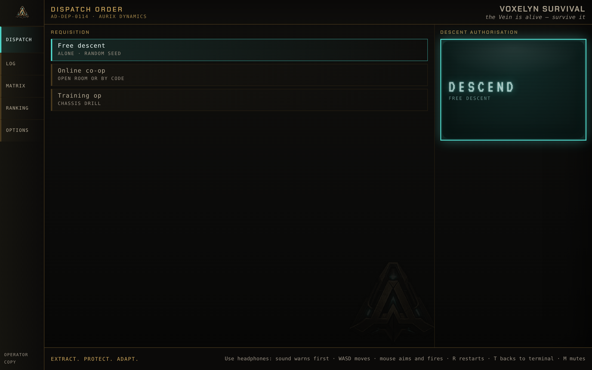

In phone landscape the authorisation column did not fit. DESCEND plus three secondary buttons,
and the Weekly Challenge, the last one and the only one with a deadline, fell off the bottom of
the screen. The fix was not a smaller column. It was a different form.

The requisition is a mode selector now: free descent, online co-op, training op, weekly challenge.
The authorisation column keeps the generation stamp and a single DESCEND, which runs whichever
row is ticked and says which one in its subline. Four descents, one stamp, and the column can
never grow again.

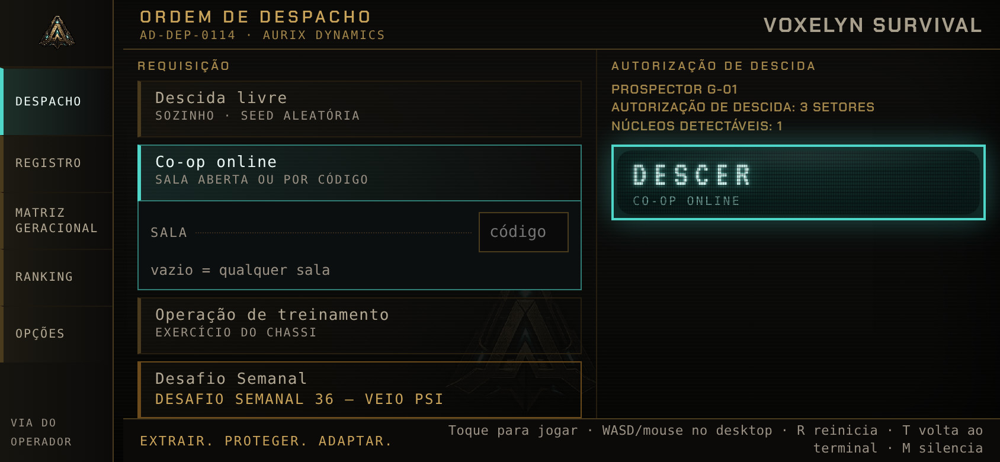

Then I audited all five sheets against a real server at six window sizes, down to 320 pixels
wide, and it was humbling. Five rail labels had been colliding into "DISPATCHLOG". "OPERATOR" and
"CORES" were overlapping until your name became a single letter. The 127 locked Aurix files were
an identical grey wall, and are now grouped by clearance level. In short landscape, the portrait
stack was hiding three of the four mode cards behind the stamp with nothing on screen to suggest
you could scroll.

## The HUD got denser without losing a line

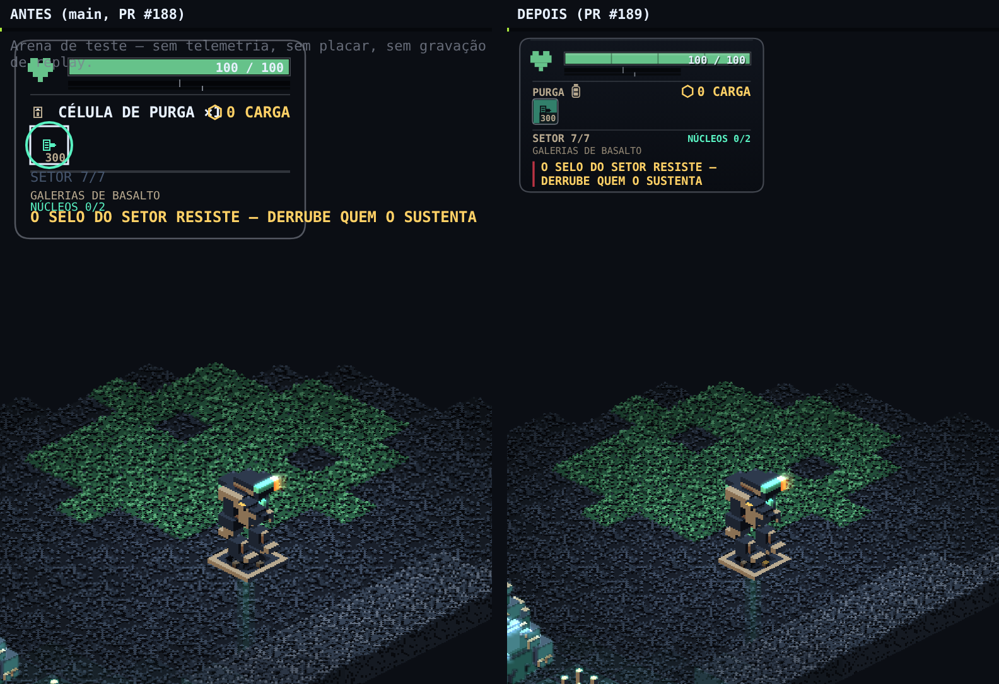

Small screens used to just get the whole panel shrunk, which still left the whole panel sitting
on top of the game. Now they get a tighter rhythm: a shorter health bar, smaller module cards,
less air between sections. Same sections, same order. The rhythm takes the space, never a line of
information.

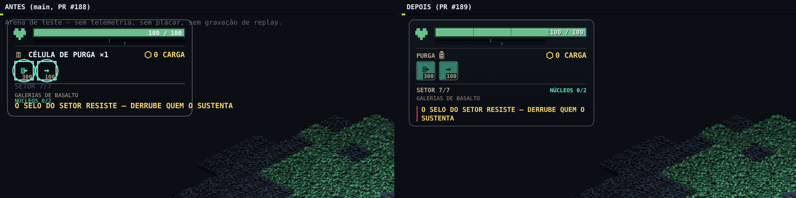

The Purge Cell is a real battery now. The old glyph was a rectangle with a bar in it, which at 13
pixels read like a dimmed letter "i", and a row of them read like a row of nothing.

Co-op got a fix that was overdue: your partner's messages were showing up on your screen. Their
module expiring, the Echo they absorbed, the refusals the shaft gave *them*. None of it changed a
single decision you could make. Notifications are now either yours or the world's, never
somebody else's.

## Latency lives in Options

There is a network reading in Options now, and it is in the same sheet whether you open it from
the menu or from the pause terminal, so you can check it in the middle of a room. Inside a room
it is measured live. Outside one, a button pokes the server, because "can I play co-op right now"
is a question people ask *before* joining.

## The Prospector exists in real life now

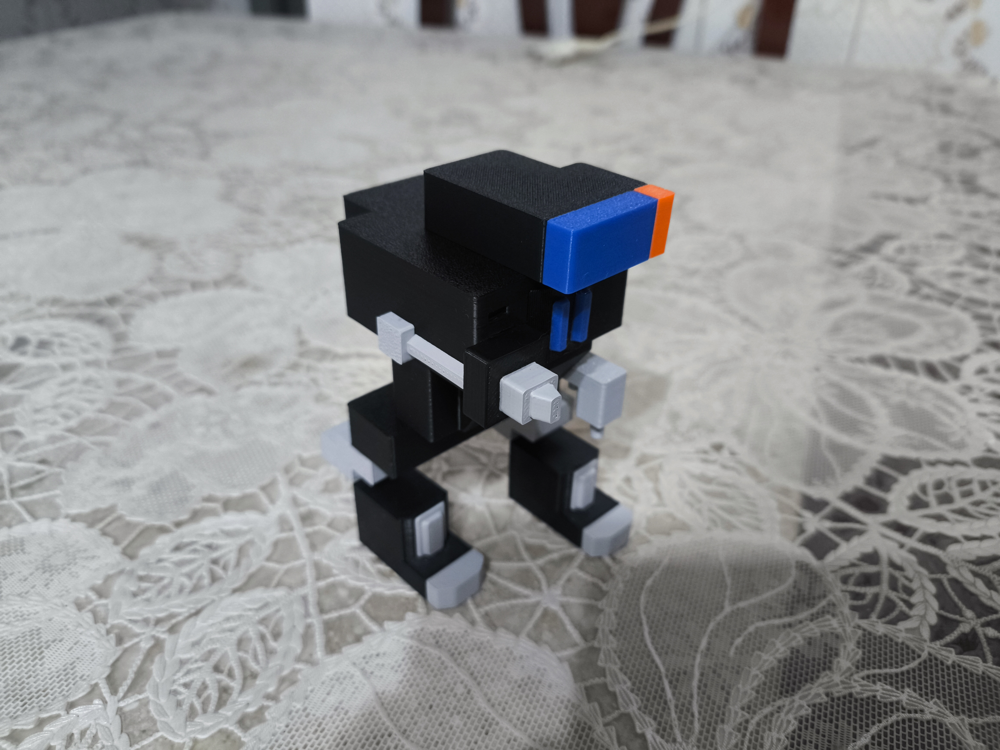

Not a feature. Not in the changelog. Just the best thing that happened during these sixteen days,
and proof that the silhouette reads even when you take the pixels away.

## And there is a second game now

Somewhere in the middle of all this I built **Catathon**, a spin-off in the same repo. The biggest
hackathon in the world, every developer is an extremely cute cat, and everything that can go wrong
will. You do not write code. You carry cats to desks, interpret a vague brief, respect a dependency
graph and survive until the demo.

Four cats, four disciplines, four personalities. Bigode the Siamese backend perfectionist will not
let anything merge without your approval. Cheeto the orange frontend cowboy is 25% faster, ships
without testing, and bites the build cable. Almofada the Maine Coon does devops at half the stress.
Smoking the tuxedo does design and judges you in silence. Bugs are born from stress. Petting is the
release valve.

It has a career mode, a circuit, sprints, sponsors, a persistent rival and alumni. It plays with one
finger on a phone. It is a completely different game and I regret nothing.

## What to actually play in this build

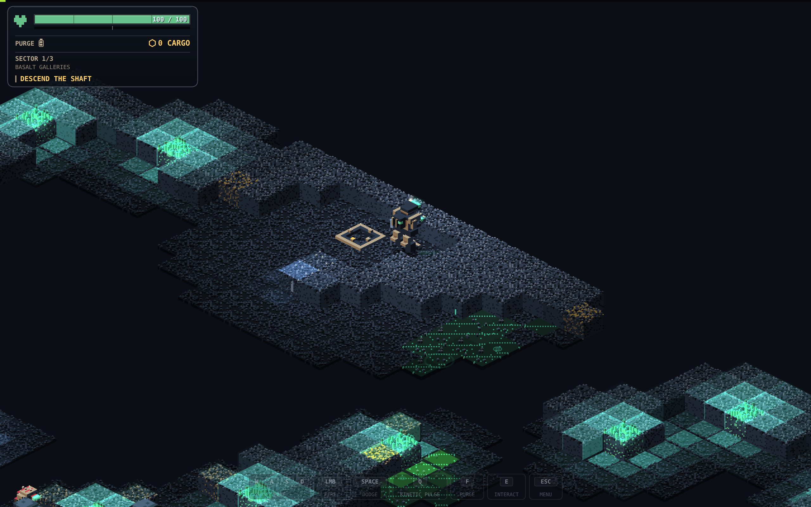

If you are coming back after the last zip, here is the order I would go in:

1. **Put headphones on.** Genuinely. The sound tells you things the screen has not shown you yet,
   and now there is also music worth hearing.
2. **Run the Training Op** if you have never finished a descent. Two to three minutes, fully
   playable, and it is the real game with one sector and one Core rather than a separate tutorial.
3. **Do a free descent** and look at the new HUD, the module cards and the Purge Cell battery.
4. **Get to the Glacial Crypt** and let the Queen freeze you at least once, on purpose. Hold the
   trigger to melt out. Then walk the same line across the lake four times and watch what the floor
   does to you.
5. **Find the White Devourer** and stand inside the maw window instead of running from it. Watch
   where the line on the floor is. Learn where 3.47 tiles is.
6. **Open the ranking** and hit play on somebody's run, including your own.
7. **Open the arena** if you want the bosses without the campaign around them. It has sound now.
8. **The weekly challenge** is the only thing here with a deadline.

## The short version

Sixteen days. Three composed tracks. Around sixty five new boss voices. One ice sheet that keeps a
record of you, one boss that swallows the room, one boss that eats his own cathedral to keep
singing, one minigun, and a scoreboard that finally measures the right thing.

The number I am least sure about is fourteen seconds. The only way to settle it is to watch somebody
who is not me get caught on the far side of the lake when the Queen decides to repair it.

Music by **Clevo ([@clevoclevoclevo](https://instagram.com/clevoclevoclevo))**. Game by **DaniTools
([@dani.tools](https://instagram.com/dani.tools))**. Go break some ice.
