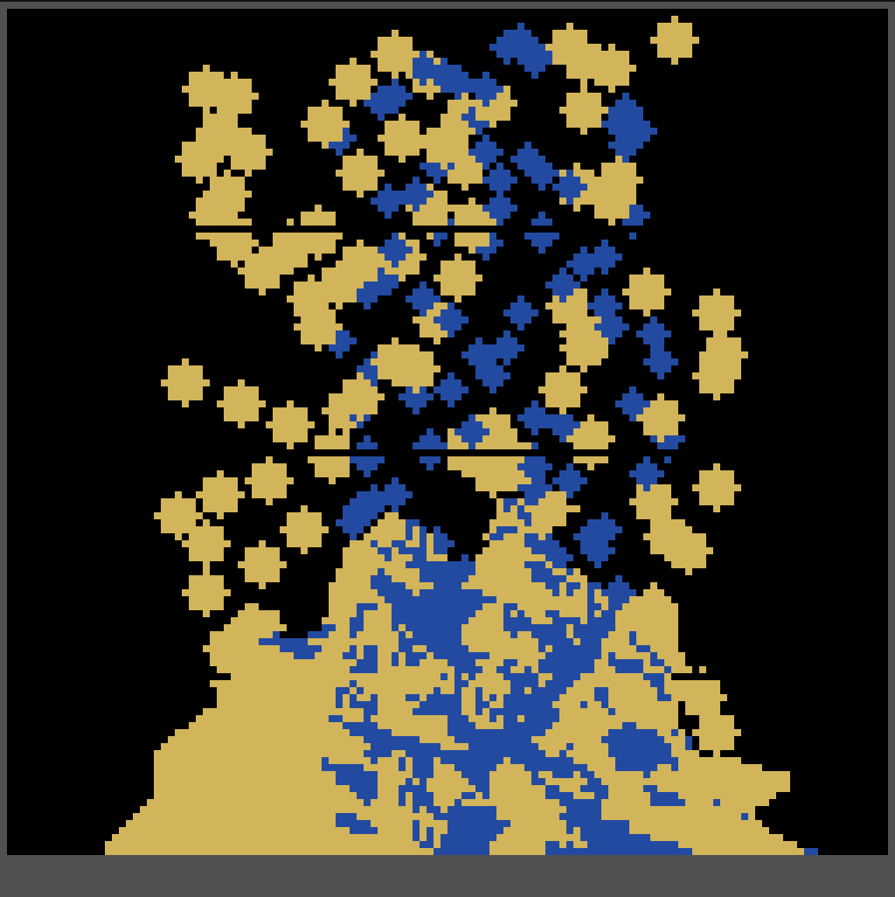
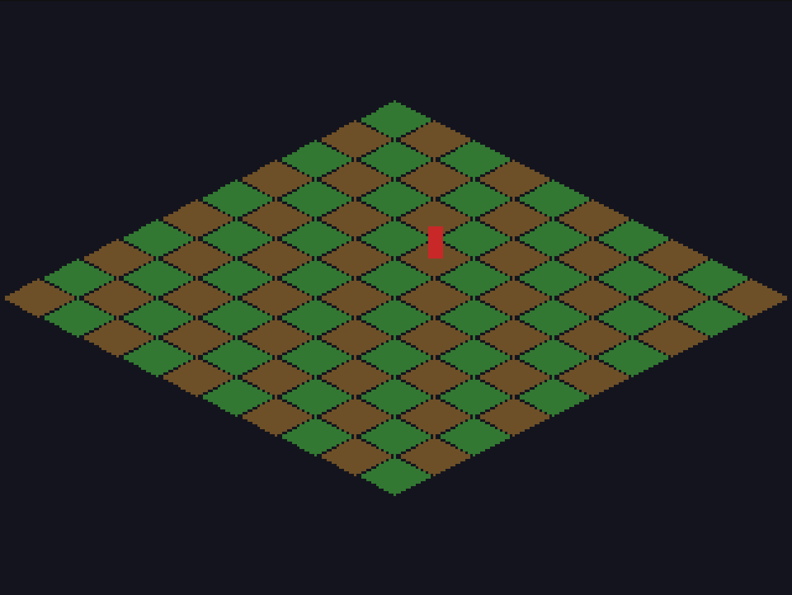

# 001 — Dia 1: uma biblioteca sem tela

**2026-08-11** · commit `aab5fba` · 18 de janeiro de 2026

Vinte e quatro arquivos. Nenhum jogo, nenhuma engine, nenhuma janela.

O Voxelyn começou como uma biblioteca headless de pixels e simulação por célula, e o PRD
daquele primeiro commit é quase todo sobre o que **não** fazer. Os não-objetivos estão
escritos com a mesma clareza dos objetivos: sem janela, sem input, sem áudio, sem engine,
sem física completa, sem ECS, sem UI, sem parser de fórmulas. Só o miolo.

O que tinha:

- **`Surface2D`** — buffer RGBA num `Uint32Array`. Clear, set/get, fillRect. Nada mais.
- **`Grid2D`** — a simulação por célula. Cada célula em 16 bits (material + flags),
  o mundo dividido em chunks, cada chunk com marca de _ativo_ e _sujo_. Só chunk ativo é
  varrido, então mundo parado custa quase nada.
- **`Traversal2D`** — row-major, bottom-up, morton (Z) e `chunkOrder(seed)`.
- **`RNG`** determinístico e **`Palette`**.
- **Extras opt-in**: projeção isométrica, blit de sprite com colorkey, grade de voxels 3D
  densa com render por fatias e um raycast de CPU.
- **Adapters opt-in**: `Surface2D` → `ImageData` no Canvas2D, e upload de textura no WebGL.

## Os dois demos

São a primeira coisa do projeto que teve imagem, e estão nesse mesmo commit inicial.

O **Noita-like** é o `Grid2D` rodando: areia empilhando em talude, água procurando nível,
tudo num grid de 128×128 desenhado a 512×512 com `image-rendering: pixelated`.

O **iso Diablo-like** é mais franco ainda sobre o que era: uma grade isométrica de tiles
verdes e marrons com um retângulo vermelho no meio fazendo de personagem. É feio de
propósito. O que estava sendo testado ali era se a ordem painter (`x+y`) fecha sem furo
entre tiles, não se a cena é bonita.

## As três regras

Estavam escritas no PRD desde o dia 1:

1. TypedArrays sempre.
2. Zero alocação no hot loop.
3. Travessia determinística — porque replay precisa ser replay, e ordem enviesada vira
   simulação enviesada.

Sete meses depois, com um roguelike de mineração inteiro em cima, as três continuam
valendo. É por causa delas que o chão do Veio consegue ser simulado célula a célula
enquanto o jogo roda no celular.

---

_As duas screenshots deste post foram geradas construindo o commit `aab5fba`. É o que
rodava naquele dia — não o build de hoje fingindo ser janeiro._
