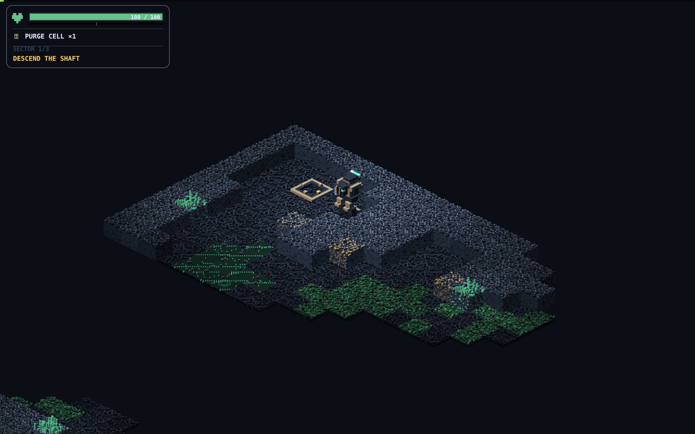

# 001 — O chão parou de ser um bloco só

**2026-08-11** · PR [#86](https://github.com/dmrs07/voxelyn/pull/86) · commit `f846006`

As cinco matérias de chão do Veio — laje, tapete fúngico, poça de biofluido, fogo e
esporos — ainda estavam na densidade antiga. A subdivisão automática pegava cada voxel
autorado e o engordava em 2x2x2 do mesmo material. O resultado era volume sem textura:
o chão tinha mais cubos e continuava parecendo um bloco só.

Agora cada uma é construída **coluna a coluna fina**, 16x16 por tile — a mesma grade em
que o terreno já era feito:

- **Laje**: cascalho de meio voxel, o dobro da frequência. O topo fica na altura autorada,
  então as entidades assentam exatamente onde sempre assentaram.
- **Tapete fúngico** (e o aquecido): musgo de grãos 0.5 com pontos vivos pulsando; as
  falhas do tapete ficam finas em vez de quadradas.
- **Poça de biofluido**: a lâmina virou _filme_ de meio voxel, com reflexo em faixa fina e
  bolhas — pontos de biolum sorteados por coluna fina que acendem dois quadros e estouram,
  no próprio nível da lâmina. O contrato "líquido acha nível único" continua testado e
  valendo.
- **Fogo**: línguas finas de meio voxel, mais numerosas na mesma massa. É o que mais ganha
  com o grão novo.
- **Esporos**: grãos 0.5 recalibrados por medida — módulo 59, contagem medida em [4, 14]
  contra o contrato [3, 16].

## O gotejamento

Parte das células de poça (escolhidas por hash) passou a pingar do teto da caverna: a gota
cai acelerando, o respingo salta e dois anéis concêntricos abrem na lâmina.

O que importa aqui é o que **não** foi construído. Não há sistema de partículas, não há
estado guardado entre quadros: a gota é uma função determinística da célula e do relógio.
E ela entra na fila ordenada por profundidade como qualquer outro corpo, então uma parede
oculta a gota sem que nada precise saber que ela existe.

## A exceção deliberada

O gás ficou de fora da grade fina. O algoritmo de sopros tem contrato de teste na grade
autorada — forma, deriva e cobertura são medidas lá. Mexer na grade quebraria a
coreografia sem melhorar nada que se veja. O que ele ganhou foi só a borda: cada cubo
escolhido virou um aglomerado fino com cerca de 1/5 dos sub-voxels roídos por hash, o que
dá o contorno esfarrapado sem tocar no movimento.

Os testes de contrato que mediam o grão antigo foram ajustados à grade fina (detector de
penacho ≥ 6.5, losango da célula em px finos). `surface-tiles` subiu para v3.
