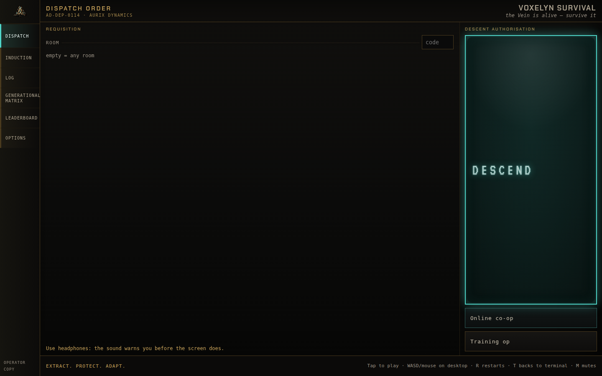
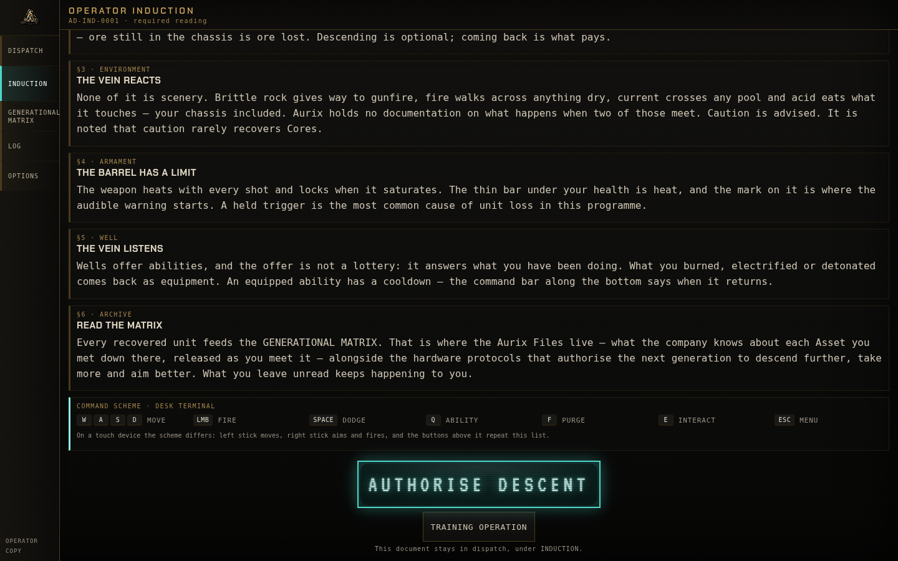
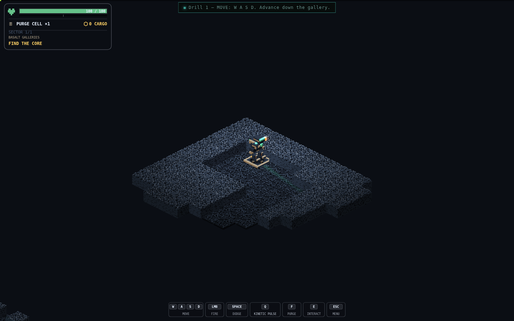
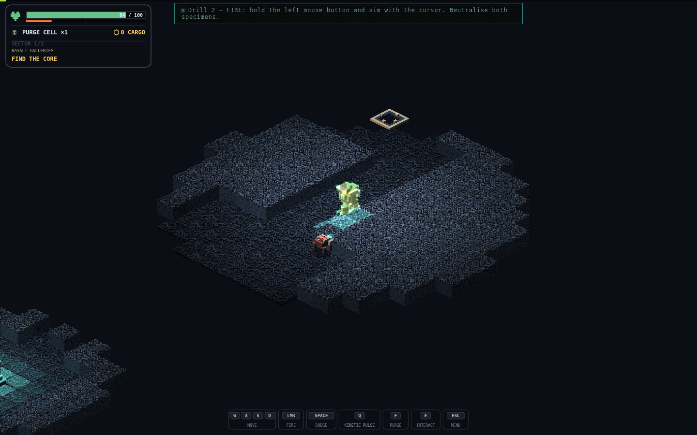
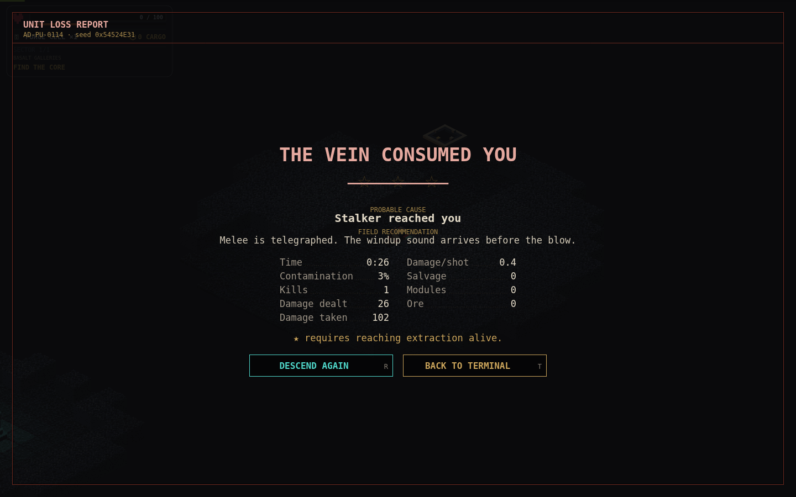
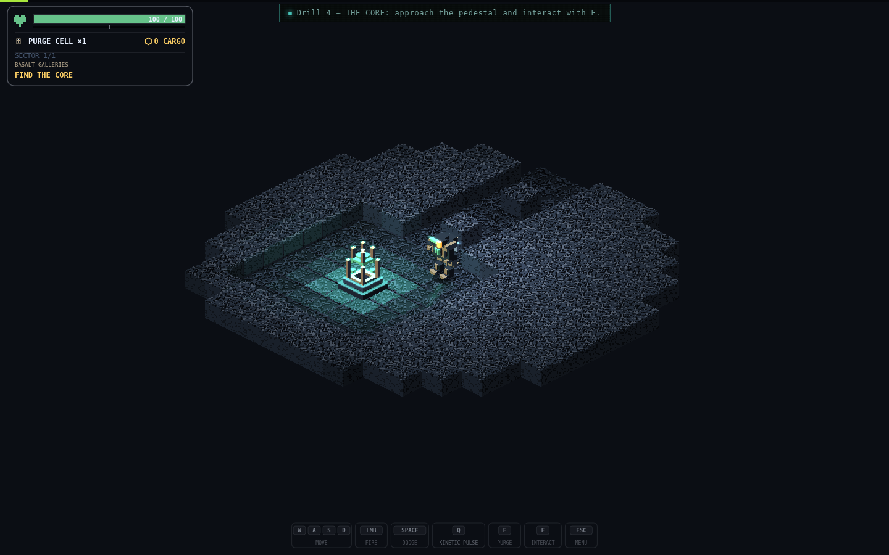
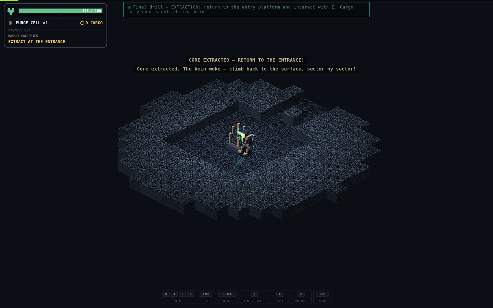
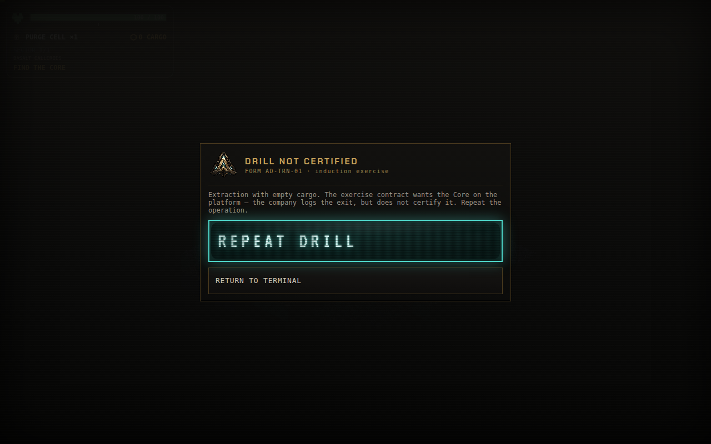

# 113 - The Training Operation

**2026-08-16** · commit `87262b8` · PR #145



Somebody played Voxelyn blind. Three runs, got measurably further each time, no guide, no
questions asked. Then he wrote the single most useful sentence anyone has ever sent me
about this game:

> I didn't exactly know what the exact goal was.

Here is the thing. The goal is written down. It is on a screen he definitely saw, in the
Operator Induction, article two, set in the company's own bold voice: descend, recover,
extract, and cargo only clears when you get back out. We wrote that sentence carefully. We
were proud of that sentence.

He read it. It did not land. That is not a player problem, that is a design problem, and
the fix for "my paragraph did not land" is never "write a longer paragraph".

## The document already knew

The funniest part is that the induction file has been confessing this for weeks. There is
a comment sitting at the top of `induction.ts` that says, in Portuguese, that it is not a
guided tutorial, that it stops exactly where discovery begins, and that its job is to make
the first descent legible rather than to solve it.

It was right about itself. Reading about a dodge has never once taught anybody to dodge.
So instead of rewriting the circular for the fourth time, we built the thing the circular
politely refuses to be.

Meet the Training Operation: a short, in fiction, fully playable drill. Two to three
minutes. Five exercises. Move, fire, dash, take the Core, get back out.



It shows up in two places and it is never mandatory in either of them. There is a
permanent button on the dispatch terminal, and every first read of the induction now ends
with two buttons instead of one. The big glowing stamp still authorises a real descent.
The quiet one under it starts the drill. If you open the briefing from the training button
and then change your mind halfway down the page, the stamp still sends you to the real
Vein, because the stamp means what it says and not what you clicked to get here.

## No second engine, and I am insufferable about it

Zero lines changed in the simulation package. Not one. The drill is the real game with
surgery performed on it before the first tick.

The whole trick is a depth config that already existed:

```ts
{ generation: 'G-00', sectorCount: 1, coreSectors: [1] }
```

Read that as a sentence and it is literally the tutorial: this run is one sector long and
the Core is in it. Two accidents of the existing rules make it work for free.

First, `sectorHoldsBoss` starts with `if (sector <= 1) return false`, so sector one never
gets a boss, which means the pedestal is unlocked from tick zero with nothing to kill for
the privilege. Second, extracting with the Core in sector one produces
`extracted_with_core`, the exact same run phase a real successful expedition produces.

The best part is what that buys in the HUD. The objective line reads FIND THE CORE, and
the moment you lift the Core off the pedestal it flips itself to EXTRACT AT THE ENTRANCE.
That is the real HUD doing the real thing. There is no tutorial HUD, no special overlay,
no tutorial mode branch anywhere in the sim. The player learns the actual instrument panel
because it is the actual instrument panel.

## Carving a course out of a real sector

The map is not authored in an editor, because we do not have one and I did not want one.
It is `createRun` on a fixed seed, followed by cutting into the state before the first
tick. The boss arena playtest tool has been doing exactly this for months, so the pattern
was already sitting there with its receipts.

The course is a straight line, on purpose, because the order of the rooms is the order of
the lessons: entry platform, gallery, firing chamber with two stalkers in it, a corridor
with pillars to dash around, and the pedestal chamber at the end.



Everything not in that course becomes plain rock with its surface wiped. This copies the
arena's closing philosophy rather than the lazy version of it. The lazy version fills the
gaps and stops there, which leaves the sealed rock holding all the ore and crystal the
seed originally put in it. Crystal emits light in the client. You would end up with a
sealed wall quietly glowing blue, advertising a place the drill just declared does not
exist.

Then there was the seed hunt, which went great, thanks for asking. My plan was to find a
seed whose sector entrance sits somewhere roomy so the course fits without touching the
map border. I scanned a few hundred. There is no such seed. Worldgen puts every single
entrance flat against the edge of the map like a fire exit. So the course line steps
inward on its own, and a short vestibule connects the platform to it, and the test asserts
the course was never clipped so that a future worldgen change fails in vitest instead of
failing in some newcomer's first two minutes.

There is also a test for the thing I care most about, which is that nothing exists outside
the course. Every tile that is not part of the carved set has to be plain rock with no
surface. If someone later teaches worldgen to smuggle a leyline or a pipe through, the
suite says so out loud.

## The soft lock that would have been genuinely funny

The instruction layer is a small headless module. It watches the same event queue that
feeds the renderer and the audio, and it hands back descriptive cues (show this banner,
queue that toast) which `main.ts` turns into pixels. It knows nothing about the DOM, so
its tests run in plain node.

The rule inside it took a couple of tries to get right, and it is this: irreversible facts
are checked as facts, repeatable actions are checked as events.

Here is why that matters. The course has no doors. Nothing stops you from ignoring the
dash prompt, strolling into the pedestal chamber, and lifting the Core while the game is
still politely asking you to press space. If the Core step listened only for the pickup
event, that event would arrive during the dash step, get thrown away, and then the drill
would sit there forever waiting for a second Core to be picked up. There is no second
Core. The tutorial becomes unfinishable, which is a spectacular thing for a tutorial to
be.

So dashing is event gated, because you can always dash again, and the Core is a state
fact, because possession does not expire. Sequence breaking now skips ahead instead of
locking up, and there is a test that walks that exact griefing path to prove it.

## Combat, or: how the screenshot bot learned to shoot



To illustrate this post I wrote a script to play the drill. I want to be clear that the
game won the first several rounds.

Round one ended at twenty six seconds with a unit loss report that read "Stalker reached
you", and, underneath it, the field recommendation: melee is telegraphed, the windup sound
arrives before the blow. Being coached by your own death screen is a humbling experience I
recommend to every developer.



Round two I made the bot retreat while shooting, and it survived beautifully for thirty
straight passes without killing anything, which is its own kind of failure.

Then it clicked: aim assist is a purchased upgrade, and the drill deliberately runs the
factory chassis at G-00 with no upgrades at all, because that is what a new player has.
The bot had to actually aim. So it started reading the canvas: find the red pixels, that
is a stalker, put the mouse there. Combat went from "dies" to "cleared in eight to eleven
passes" in one change.

Navigation was the same story twice more. It could not find the pedestal, so it learned to
chase teal pixels. Then it drove face first into a wall in a perfectly straight line
forever, so it learned to sidestep whenever the distance stops dropping.



It picks up the Core reliably now, which is where the album stops. The bot never did
figure out the way home, and every attempt to teach it cost more time than the screenshot
was worth, so the extraction shot is missing and I have made my peace with that. A human
walks it in about fifteen seconds.



## The plumbing nobody will ever see

Training talks to nobody. No expedition ticket, no run recorder, no leaderboard
submission, no death echo pool. It also had to keep syncing the cargo counter by hand,
because the renderer keeps that number as its own state and skipping the sync left the
previous run's ore sitting in the drill's HUD like a haunting.

The one that would have quietly ruined a metric: abandoning a drill was going to fire the
same telemetry event as abandoning a real expedition. Escape, abandon, done, congratulations,
your funnel now says players are bailing out more than ever. A small `activeRunKind` flag
keeps drills out of the numbers.

## What the review caught

The PR picked up two real problems, both of which I would have shipped happily.

The first is my favourite bug of the month. Extracting empty handed certified the drill.
Walk four tiles out, walk four tiles back, press E, and the game hands you DRILL CERTIFIED
for having learned nothing whatsoever. It congratulated you for skipping the entire
curriculum. Now an empty extraction gets its own outcome, in the same company voice, and
the primary button turns into REPEAT DRILL instead of sending you down for real.



The second was a ghost. With the completion form on screen the run had stopped but had
never been settled, so Escape still opened the field menu underneath the form, and the
field menu helpfully took the shared options controls with it, leaving the terminal's
Options screen empty afterwards. The run now settles the instant the form appears rather
than when a button is finally clicked.

## The count

946 tests green, fifteen of them new. Two new client modules, some wiring, a second button
on a briefing, twenty four strings in both languages. The simulation package: untouched.

The part I like most is what the drill refuses to do. It never blocks you, it never
unlocks anything, and it pays exactly nothing, which the completion form says out loud so
the fiction stays honest. Training yields nothing. The Vein below is where the money is.

And when it does teach you, it teaches with the real thing. Same Core, same interact key,
same HUD, same extraction, same state machine that will later decide whether an hour of
your cargo banks or evaporates. Nobody practices on a toy version of the loop and then
gets handed the real one at the worst possible moment.
