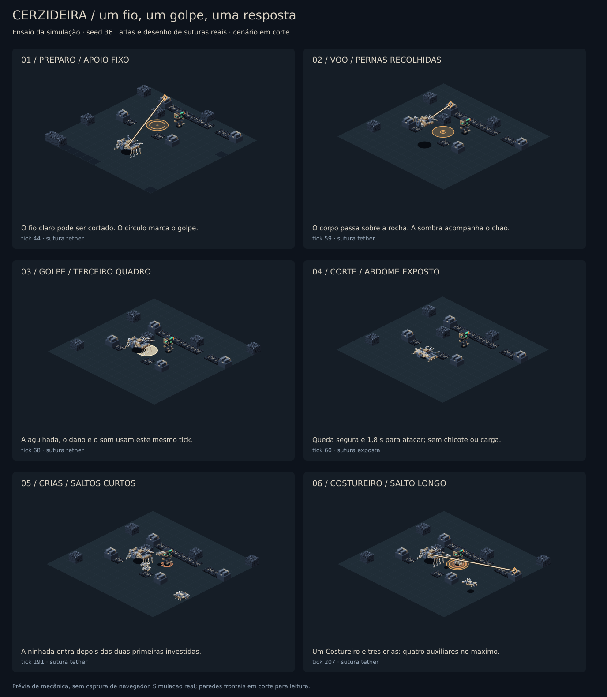
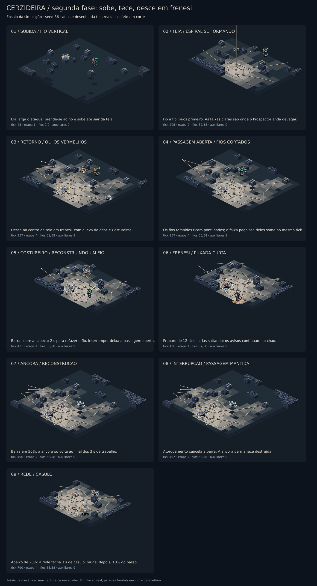

# Cerzideira — rework da luta

A luta passa a ter uma regra central: cortar o único fio ativo derruba a Cerzideira; sair da marca evita a agulhada. As suturas de exploração continuam funcionando fora da câmara.



Esta imagem usa estados da simulação, atlas publicados e a função de desenho dos avisos. As paredes frontais estão em corte para facilitar a leitura. Não é uma captura de navegador.

## O que mudou

- Perseguição no chão a 4 tiles/s e deslocamento suspenso a 12 tiles/s. O voo ultrapassa obstáculos internos; caminhada e pouso verificam o corpo inteiro.
- Âncora, origem, destino, pouso e impacto ficam registrados na ação. O aviso não muda de lugar durante o ataque. Há uma antecipação curta e limitada do movimento do jogador ao escolher o destino.
- Dano, som e efeito da agulhada saem no terceiro quadro de `attack`: quatro ticks depois do pouso. O corpo não causa dano contínuo durante o voo.
- Cortar o fio cancela o golpe, pousa a Cerzideira em espaço livre e abre 36 ticks de vulnerabilidade, com multiplicador de dano de 1,5. Depois ela se reposiciona antes de escolher outro apoio.
- Após duas investidas, a Cerzideira convoca até três crias e um Costureiro. Eles agacham, marcam o pouso, saltam e se recuperam. A morte da matriz encerra os auxiliares e seus ataques.
- Abaixo de metade da vida, ela encadeia duas investidas usando apoios diferentes e repõe auxiliares com maior frequência.
- A câmara não fecha passagens, chicoteia fios nem derruba cargas. Esses comportamentos continuam nas suturas da colônia.
- A geração exige dois apoios utilizáveis na câmara. Tentativas sem eles são refeitas pela sequência determinística existente; isso corrige a câmara sem apoios da seed 66 e a câmara com um único apoio da seed 177, setor 3.
- O atlas da Cerzideira mantém oito direções autoradas, sem espelhamento, e o raster de câmera das diagonais. A cria tem modelo próprio; os três corpos têm pose de voo.

## Segunda fase: sobe, tece, desce em frenesi



Na metade da vida a Cerzideira interrompe o que estiver fazendo, prende-se a um fio vertical e sobe até sair da tela, com aviso sonoro próprio. A câmera fica na arena. Acontece uma vez por encontro.

- **Teia.** Fora de vista ela tece, fio a fio, uma teia de aranha clássica: um raio por rumo, do centro até a parede de fundo em doze rumos (pilares no caminho viram junções; uma parede que divide salas encerra o fio), e anéis concêntricos ligando raio a raio, do primeiro (2,2 tiles) para fora em razão 1,45, com o meio de cada corda puxado para dentro. Um raio curto prende o anel na própria ponta, e é assim que a teia acompanha uma câmara irregular até as paredes. A geração garante âncoras nessas paredes onde a parede permite (a primeira parede de fundo de dezesseis rumos vira âncora; as paredes estruturais da arena ficam como estão e a teia se prende nelas sem âncora). A tecelagem inicial dura 12 s, raios primeiro; cada fio nasce com som. A volta é marcada na subida: cortar fios enquanto ela está fora não a segura lá em cima. Na arena da seed 36: 58 fios, 234 células pegajosas de 401 de chão num raio de 18.
- **Retorno.** Ela desce no centro da teia, olhos vermelhos, e entra em frenesi: perseguição a 5,2 tiles/s, puxadas com preparo de 12 ticks (10 quando encadeadas), e uma leva de até dez auxiliares, com três Costureiros, reposta a cada 4,5 s dentro do teto. As junções inteiras da teia são apoios de puxada: cortar os fios de uma junção enquanto ela está presa ali a derruba. Os avisos no chão continuam os mesmos.
- **A teia a sustenta.** Com a integridade da teia (fios inteiros sobre fios tecidos) a 60% ou mais, ela leva 0,4x de dano, derrubada ou não. É a restrição da durabilidade dela na segunda fase: cortar a teia abre a fraqueza, e os Costureiros refazendo os fios a fecham. O HUD mostra a integridade. Vida 780 → 900.
- **Teia pegajosa.** Sob um fio inteiro (faixa de 1,5 tile para cada lado), o Prospector anda a 0,62 da velocidade; a esquiva continua. Cerzideira, crias e Costureiros andam normalmente. Cada fio é cortado pelas interações existentes (tiro cruzando o fio, fogo), com som de rompimento, e a faixa dele deixa de pegar no mesmo tick. Fios cortados ficam pontilhados no chão.
- **Apoios reforçados.** Âncoras da câmara resistem a seis impactos; junções da teia, a três impactos mirados. As marcas na junção mostram sua resistência restante. Destruir a junção rompe os fios ligados a ela; acertar um apoio ainda resistente não corta também a amarra da Cerzideira naquele ponto. Os trechos de fio entre junções continuam cortáveis com um tiro transversal. As âncoras da colônia mantêm sua regra anterior.
- **Crias e Costureiros.** As crias perseguem a 4,8 tiles/s (mais rápidas que o Prospector) e o salto causa 10 num raio de 0,7. No frenesi, os Costureiros convocados reconstroem apoios destruídos, depois fios cortados e então apoios parcialmente danificados. Cada um reserva um trabalho acessível; os demais escolhem outros reparos. A proximidade do jogador não os distrai. Atacam quando não encontram reparo disponível.
- **Reconstrução visível.** Uma barra âmbar acima da cabeça acompanha a canalização: 2 s por fio e 3 s por âncora ou junção, após chegar ao local. O reparo só se aplica ao completar a barra. Atordoar, matar ou afastar o operário do alvo interrompe o trabalho; a tentativa seguinte começa novamente. Âncoras destruídas permanecem registradas e podem voltar ao mesmo lugar, mas nunca se reconstrói uma parede dentro de um personagem. Os fios da junção são reparados depois do nó.
- **A rede (abaixo de 20%).** Ela carrega a rede com aviso longo (26 ticks, faixa no chão num dos oito rumos autorados) e arremessa um disco de teia a 9 tiles/s, alcance 12. Não fere: quem é acertado fica 3 s encapsulado, imune e parado, e ao sair anda a 10% por 4 s, cheio de fios. Recarga de 12 s. O disco é o atlas `fx-silk-net`, oito rumos, três quadros de giro; o casulo e os fios são desenhados pelo cliente sobre o Prospector, também no parceiro do co-op (`cocoonUntil`/`webbedUntil` viajam no snapshot e entram no hash).
- **Fim.** A morte da Cerzideira encerra os auxiliares e dissolve a teia.

Os fios são suturas `kind: 'web'`: cortes, reparos, hash, snapshot e reconexão reutilizam a infraestrutura das suturas. A decisão que a fase oferece: atacar a Cerzideira exposta, controlar as crias, ou matar os Costureiros para manter a teia aberta e a fraqueza dela à mostra. O estado da fase vive em `silk.stage`, `stageAt` e `returnAt`, no hash e nos snapshots. Fora da tela ela não é alvo de nada. As oito direções autoradas e o raster de câmera das diagonais ficam como estão; os olhos vermelhos são desenhados pelo cliente sobre o sprite, porque o orçamento sob demanda dos atlas não comporta outra animação de oito rumos.

Prancha: `node packages/voxelyn-survival/scripts/preview-seamstress-web.mjs` gera a imagem acima e `second-phase-events.json`, a partir da simulação real (seed 36): subida, teia se formando, retorno com olhos vermelhos, passagem aberta pelo jogador, Costureiro reconstruindo um fio, uma puxada do frenesi, reconstrução de âncora a 50%, cancelamento por atordoamento e a rede fechando o casulo abaixo de 20%. O JSON registra o trabalho e o progresso de cada operário nos quadros capturados.

## Jogar e reproduzir

Baixe [cerzideira-preview.zip](./cerzideira-preview.zip), extraia e abra `index.html`. Selecione **A Cerzideira**. O pacote inclui a arena, a simulação e o renderer do jogo.

WASD move, mouse mira/dispara e Espaço esquiva. Nas ferramentas da arena, o painel de suturas permite pausar, cortar o fio ativo, romper sua âncora, avançar um tick e ativar a segunda fase. O painel mostra os ticks de decolagem, pouso e impacto.

```sh
pnpm build:survival
pnpm test:survival
node packages/voxelyn-survival/scripts/preview-seamstress-rework.mjs
node packages/voxelyn-survival/scripts/preview-seamstress-web.mjs
node packages/voxelyn-survival/scripts/export-costureiros-preview.mjs /tmp/cerzideira-preview
```

## Evidências e limites

`simulation-events.json` registra os eventos que produziram a prancha. `playtest-results.json` registra quatro controladores automáticos na arena de seed 36, setor 7, com 100 HP e módulo perfurante. Eles não usam a habilidade equipada. O cenário de corte injeta um segmento de tiro cruzando cada fio, para testar a interrupção.

Nos ensaios, o limite permaneceu em quatro auxiliares e nenhum tick de caminhada terminou com a Cerzideira dentro de terreno sólido. Ficar parado atirando termina em derrota. Circular atirando continua vencendo sem sofrer dano, mas agora leva mais tempo do que cortar e atacar na janela, e não derruba mais a Cerzideira por acidente. Esses resultados verificam comportamento e regressões, não substituem o ajuste de dificuldade com jogadores.

Os cenários `cut_and_shoot` e `dodge_mark_shoot` medem as duas respostas que a luta promete: cortar o fio e atacar na janela, e sair da marca ao ver o aviso, atirando no resto do tempo. Antes deles, o arquivo media auxiliares e terreno, não a luta.

### Ajustes após a primeira leitura dos ensaios

- O corte do fio ativo só conta para tiros que cruzam o fio com 30° ou mais, a 1,5 tile ou mais do corpo. Ela puxa para um apoio ao lado do jogador, então o fio passava por cima dele e qualquer tiro no corpo já saía encostado no fio: circular atirando a derrubava em 4 de 4 investidas sem ninguém mirar no fio. O trecho protegido é desenhado escuro e o exposto claro, com um nó onde o corte começa a valer.
- A agulhada alcança 1,6 tile e o pouso é escolhido para que ela caia exatamente na marca travada. Antes ela parava na projeção do alvo sobre a linha do fio e aceitava pousos a até 3 tiles, com raio de golpe de 1,1: metade dos golpes errava um alvo parado por 0,5 a 0,7 tile.
- Sem golpe de contato por 24 ticks depois do impacto. Ela pousava ao lado do alvo e emendava a agulhada de contato, e quem saía de todas as marcas terminava com 19 de vida por causa disso.

Build de produção, lint, testes focados e verificações por pacote foram executados. Os testes de mundo e pontaria que excederam o tempo em execução concorrente passaram isolados. O teste preexistente do MCP que cria 500 mundos excedeu seu prazo de 20 segundos neste ambiente; os outros 24 testes do pacote passaram. Ambiente: Node 24.19.0; o projeto declara Node 22.

O navegador remoto bloqueou URLs locais, portanto o pacote jogável não recebeu inspeção interativa nesta sessão. A inspeção visual cobre a prancha da simulação e os atlas; os testes cobrem impacto, interrupções, pouso, auxiliares, hash, apresentação e reconexão durante o voo.

O validador de conteúdo manteve os limites existentes: 159,52 MiB no boot e 46,31 MiB sob demanda, abaixo dos tetos de 160 e 48 MiB. Versões atuais: protocolo 38, simulação 75, conteúdo 38. Cliente e servidor precisam ser atualizados juntos.

### Prioridade de reparo no PR #216

Durabilidade e trabalhos reservados entram no hash e nos snapshots. As cópias de apresentação solo e de rede não compartilham os dados mutáveis da simulação. A reconexão recupera a mesma barra e os mesmos apoios danificados. O preparo da arena remove do cadastro de reparos as âncoras que o recorte converteu em paredes estruturais.

Validação desta alteração: 66 testes de simulação, 66 do cliente (incluindo arena, apresentação e integração com o servidor) e 73 de protocolo; compilação TypeScript da simulação, protocolo, conteúdo, servidor e cliente; lint e formatação dos arquivos alterados. Prancha e ZIP jogável atualizados. Os valores de resistência e tempo de reparo são pontos de partida para o balanceamento com jogadores; não houve playtest interativo no navegador nesta rodada.

### Correção da revisão do PR #215

O traçado agora informa quando encontrou uma parede ou a borda do mapa. O braço termina ali, mesmo quando o trecho restante é curto demais para virar um fio. Isso elimina fios desconectados, faixas pegajosas e reparos indevidos além da parede.

Os cinco testes de regressão falharam antes da correção e passaram depois: paredes internas a quatro distâncias do centro, preservação do trecho visível e continuidade dos braços livres. A validação da correção passou em 44 testes de simulação (teia, Cerzideira e suturas), 73 de protocolo, compilação TypeScript da simulação e do protocolo, lint e formatação dos arquivos alterados.

A prancha, os eventos da segunda fase e o ZIP jogável foram regenerados. O pacote inclui a segunda fase e esta correção; o balanceamento em jogo continua dependendo de playtest com jogadores.
