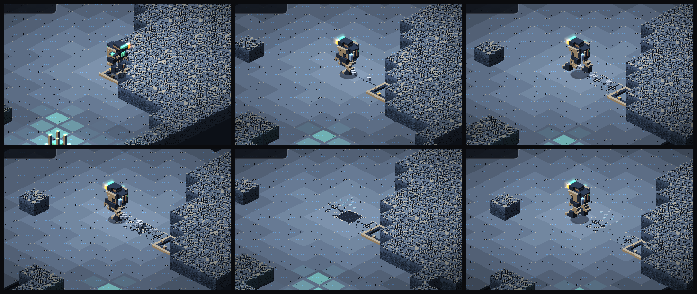
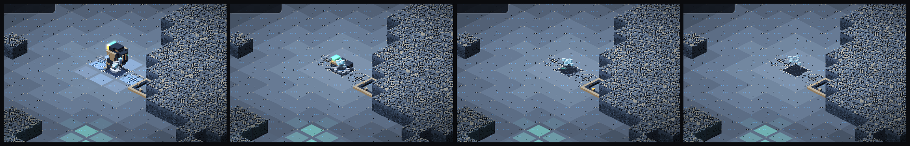

# Voxelyn Survival — Estratos, Ocupações e Linhagens

Data: 2026-08-01
Status: três levas implementadas — estratos/ocupações/linhagens, segunda leva
de estratos, e o bestiário de assinatura. Restam os itens de "trabalho futuro".

## A decisão que rege tudo

O Veio não precisa de "mapas temáticos". Ele precisa de **estratos geológicos,
infestações e cicatrizes industriais** — e da possibilidade de combiná-los.

O exemplo Noita-like do repositório descreve cavern, desert, frozen, volcanic,
fungal, flooded, toxic e surface. Transplantar esses biomas literalmente não
cabe na fantasia do Veio ("deserto" e "superfície" não existem lá embaixo). A
resposta é **reinterpretá-los como interiores subterrâneos** e dividir a
identidade ambiental de cada setor em três camadas:

| Camada   | O que representa                  | Exemplos                                    |
| -------- | --------------------------------- | ------------------------------------------- |
| Estrato  | A formação geológica dominante    | Basalto, cristal, aquífero, enxofre, gelo   |
| Ocupação | O que tomou conta daquele estrato | Micélio, Aurix, contaminação, colapso       |
| Bolso    | Um encontro localizado e autoral  | Terminal, arena do Bispo, colônia, poço     |

Assim não são necessários quinze biomas completos: três estratos e duas
ocupações já produzem sete setores distintos, e cada peça nova multiplica em
vez de somar.

## Tradução dos biomas de referência

| Referência | Versão dentro do Veio                          | Leva    |
| ---------- | ---------------------------------------------- | ------- |
| Cavern     | Galerias de Basalto                            | 1ª ✅   |
| Fungal     | Matriz Micelial (como OCUPAÇÃO)                | 1ª ✅   |
| Flooded    | Aquífero Negro                                 | 1ª ✅   |
| —          | Catedral Prismática (cristal já existente)     | 1ª ✅   |
| —          | Cicatriz Aurix (como OCUPAÇÃO)                 | 1ª ✅ (parcial) |
| Toxic      | Fenda Sulfurosa                                | 2ª ✅   |
| Volcanic   | Fornalha Abissal                               | 2ª ✅   |
| Desert     | Sumidouros de Sílica                           | 2ª ✅   |
| Frozen     | Cripta Glacial                                 | 2ª ✅ (sem inércia) |
| Surface    | Ruptura à Superfície (evento raro, não setor)  | futuro  |

## O que foi implementado

### `strata.ts` (voxelyn-survival-sim)

- `StratumId`: `basalt` | `prismatic` | `aquifer`.
- `OccupationId`: `none` | `mycelial` | `aurix`.
- **Invariante de preservação**: basalto sem ocupação É o bioma original do
  jogo, byte a byte — mesmo perfil, mesma sequência de RNG, em qualquer
  linhagem e setor. Variação de basalto é trabalho das ocupações, nunca do
  estrato limpo (coberto por teste).
- `LineageId`: `hydric` | `mineral` | `industrial` — cada run segue UMA
  linhagem geológica; os três setores contam uma história ambiental contínua:
  - **hídrica**: Galerias de Basalto → Aquífero Negro → Abismo Micelial;
  - **mineral**: Galeria de Quartzo → Catedral Prismática → Coração Ressonante
    (a densidade de cristal cresce com a profundidade);
  - **industrial**: Caverna Escavada → Complexo Aurix → Instalação Alagada.
- **Intrusões**: um setor sem ocupação, do segundo em diante, pode ganhar uma
  colônia micelial (30%) ou uma instalação Aurix (15%), deterministicamente
  por (seed, setor).
- Tudo é **função pura da seed** — nada consome `state.rng`. Reconexão, replay
  e leaderboard derivam o mesmo bioma em qualquer máquina
  (`createRun({ sector: N })` ≡ descida ao vivo; coberto por teste).

### Worldgen parametrizado (`WorldgenProfile`)

O worldgen continua dono da topologia (autômato, alcançabilidade, bandas de
salvage). O perfil muda **matéria**: chances de frágil/minério/cristal,
nervuras de cristal (caminhadas retas que atravessam rocha — a ressonância
viaja por elas), lagos de água, manchas de fungo/biofluido e o teto de Miners.
O perfil default é byte a byte o comportamento histórico: o basalto limpo joga
o mapa de sempre, com a mesma sequência de RNG.

### Água (`SURF_WATER = 8`)

Primeira versão do flooded **sem simulação de fluidos**: superfície estática.

- **Conduz** descarga: `dischargeAt`/Conductive alastram por água e biofluido
  conectados (`isConductiveSurface`).
- **Retarda** (`WATER_SLOW = 0.72`, mais leve que o lodo: água é terreno, não
  armadilha).
- **Apaga fogo** encostado nela (vira cinza — o jogador vê onde apagou).
- **Não acende** nunca; ácido e térmico são inertes nela; cuspe não deixa poça
  sobre ela.
- Crosta própria no atlas (`surface-tiles` v4): lâmina azul da família da
  rocha com reflexos `electric` — o verde continua exclusivo do biofluido.

### Fauna por afinidade, não bestiários

`biomeMix` compõe o setor a partir do estrato: o prismático é mineral
(bruisers/stalkers), o aquífero é anfíbio (spitters/bombers), o micélio troca
músculo por matéria orgânica sem mudar a contagem. A ocupação micelial quase
dobra a chance do Cavalo Fúngico (sempre com UMA tirada de RNG — a ordem dos
sorteios não muda com o bioma). A Cicatriz Aurix sobe o teto de Miners: os
autômatos ainda cumprem a cota.

### Bolso do Bispo

O Bispo continua no setor 2 em **qualquer** estrato: a arena dele ganha um
disco de tapete fungico garantido (a colônia que tomou aquela câmara). A
mecânica de regeneração sobre fungo é preservada sem obrigar o setor inteiro a
ser fúngico.

### Cliente

- Evento `sector_entered` agora carrega `stratum`/`occupation`; a chegada
  anuncia "SETOR 2 — AQUÍFERO NEGRO · MATRIZ MICELIAL".
- HUD mostra o bioma sob o número do setor.
- Água renderiza pela crosta nova, pinga como a poça e tem fallback azul.
- i18n pt-BR/en (`biome.stratum.*`, `biome.occupation.*`,
  `toast.sector.entered`).

## Regras de design preservadas

- **Rota neutra**: nenhum estrato exige módulo específico. A água pune e
  recompensa o Conductive, mas o setor é vencível sem ele; o cristal favorece
  corrente/explosão sem ser obrigatório.
- **Nada de dano sem sinal**: água não causa dano; ela conduz o que o jogador
  ou o inimigo puser nela.
- **Determinismo**: bioma derivado por hash puro; toda variação de RNG mantém
  a contagem de tiradas invariante por bioma.

## Segunda leva (implementada)

Novos estratos com três linhagens novas — **térmica** (Basalto → Fenda
Sulfurosa → Fornalha Abissal), **árida** (Basalto → Sumidouros de Sílica →
Fornalha, a sílica vitrificando rumo ao calor) e **crio** (Basalto → Cripta →
Cripta profunda):

- **Fenda Sulfurosa** (`sulfur`): a identidade é a **ventilação**. 14
  respiradouros (vs 6), e cada fonte alterna janelas ativas/dormentes de 10 s
  (`VENT_CYCLE_TICKS`), com fase pela posição — metade das câmaras respira
  enquanto a outra enche, e a rota muda com o relógio. Paredes corroídas de
  dentro para fora (frágil 0.65). Fora da Fenda, os respiradouros mantêm o
  comportamento histórico.
- **Fornalha Abissal** (`furnace`): calor como **pressão territorial
  localizada**, nunca punição passiva. Fissuras incandescentes (`SURF_EMBER`)
  não causam dano: em cima delas a arma dissipa calor a 35% — a barra do HUD é
  o custo. O chão queimado lá é **carvão**: explosão ou chama o acende em fogo
  persistente (110 ticks), e só lá — em outros estratos cinza segue estéril.
  Não recebe colônia micelial (intrusão vira Aurix: refrigeração abandonada).
- **Sumidouros de Sílica** (`silica`): rocha esbranquiçada que cede — quase
  toda parede fina é frágil (0.78). Atravessar abrindo buracos é a identidade;
  o risco é abrir o flanco errado. Fauna de emboscada (stalkers).
- **Cripta Glacial** (`glacial`): o primeiro corte barato do frozen. Gelo
  (`SURF_ICE`) não conduz nem retarda; **fogo o derrete em água condutiva**
  que **recongela sozinha** (~14 s). O recongelamento é propriedade da água
  derretida, não do estrato — derreter uma ponte abre uma janela, não edita o
  mapa. Fogo que derrete gelo é apagado pela própria água que criou. A
  mudança de inércia sobre gelo ficou de fora de propósito (mexe em controle,
  dodge e determinismo).

## Terceira etapa (implementada): bestiário de assinatura

Um inimigo por estrato, e a regra que rege os cinco: **cada um manipula a
alavanca que o bioma já tem** — nenhum traz mecânica nova. Cada assinatura
ocupa uma vaga comum da contagem do setor (nunca soma), no primeiro terço da
lista de spawns; espreitadores nascem dentro do próprio elemento.

- **Ressonante** (`resonant`, Catedral): não atira. Vibra (telegrafo de 1,2 s)
  e ARMA os cristais num raio — cada um descarrega pelas aberturas coladas
  nele, com dano/stun da regra genérica de descarga. Sala esvaziada de cristal
  = bicho desarmado (e o pulso nem dispara).
- **Lampreia de Lodo** (`mud_lamprey`, Aquífero): submersa enquanto não ataca
  (`mood` viaja no snapshot; o cliente desenha ondulação). Só se move POR
  líquido; bote curto telegrafado é a única saída da água. Eletrificar a poça
  a atordoa — e percorre a poça inteira.
- **Fole** (`bellows`, Fenda): respira em fases de relógio (tick + id, sem
  RNG): inspira gás num raio, expele em linha na direção OPOSTA ao jogador.
  Deixá-lo vivo limpa a passagem desejada; a de trás contamina.
- **Escoriáceo** (`scoriac`, Fornalha): couraça fria corta todo dano a 45%
  (no funil único de dano). Pisar em brasa/fogo abre a couraça por ~8 s:
  vulnerável e 45% mais rápido. `rangedReadyAt` reusado como "quente até".
- **Espectro de Geada** (`frost_wraith`, Cripta): uma **entidade de névoa** que
  navega sobre e sob a lâmina (35% mais rápido) e se **condensa num elemental
  cristalino** — um manawyrm de geada — para o bote telegrafado. Escondido não
  tem corpo: é névoa baixa e irregular com cristais suspensos e riscos de
  condensação marcando a direção; exposto, um corpo serpentino arqueado com
  cabeça cristalina, chifres para trás e núcleo ciano na garganta. O bote que
  **encosta** aplica dano de contato e uma dose pequena de congelamento (ver a
  spec de congelamento). Derreter o lago tira a cobertura: sem gelo debaixo
  dele não há névoa para voltar, e ele fica um corpo lento na água condutiva
  que o jogador acabou de criar.

Basalto e Sílica não têm assinatura por decisão: o basalto é a referência, e a
identidade da Sílica é o próprio terreno que cede.

Conteúdo: 5 atlases voxel novos (idle/walk/attack/hit/die × 4 direções,
materiais existentes da paleta), bestiário corporativo (fichas pt/en),
partículas por matéria, ecos de morte no protocolo.

## Quarta etapa (implementada): leitura de lugar

Feedback direto de playtest ("caí no Aquífero e demorei a perceber — parece o
mesmo lugar, só tem água de diferente"):

- **Véu de paleta por estrato**: uma luz ambiente por bioma (composição
  `overlay`, alfa baixo) sobre mundo e criaturas, sob partículas/HUD — azul
  profundo no Aquífero, quente na Fornalha, gélido na Cripta, violeta na
  Catedral, sulfuroso na Fenda, pálido na Sílica. O **basalto não tem véu**:
  as Galerias são o mapa original, e a ausência é a referência que faz os
  outros lerem como "outro lugar". Custo: um fillRect por quadro.
- **Lampreia como fauna** (`SIGNATURE_PACK`): três por setor de Aquífero,
  espalhadas pela lista de spawns — com uma, o setor tinha um lago perigoso e
  dezenas de lagos que eram só cenário. Continuam ocupando vagas comuns da
  contagem. As demais assinaturas seguem sendo encontro único.

## Quinta etapa (implementada): a rocha e a arquitetura do lugar

- **Paredes por estrato** (terrain-blocks v3): a rocha COMUM ganha seis peles —
  grãos de cristal na Catedral, pedra encharcada com limo no Aquífero, rocha
  esbranquiçada com crosta sulfurosa na Fenda, basalto negro com veios de
  brasa na Fornalha, arenito estratificado na Sílica, capa de gelo na Cripta.
  Frágil, minério e cristal continuam **universais**: são linguagem mecânica
  (o que cede, o que rende, o que conduz) e precisam ler idênticos em todo
  bioma. O basalto usa o índice histórico: o mapa original até no pixel. A
  simulação não sabe disso — `SOLID_ROCK` continua um ID só.
- **Estruturas de salão** (`WorldgenProfile.halls`): carimbadas após o
  autômato e antes das provas de alcançabilidade (toda garantia do gerador
  vale para elas; salão inalcançável é selado pela regra normal de bolsões):
  - `radial` (Catedral): rotunda com corredores em leque e **pilares de
    cristal** — cobertura, luz e munição do Ressonante ao mesmo tempo;
  - `lungs` (Fenda): câmaras bojudas ligadas por gargantas — o lugar que dá
    sentido ao ciclo dos respiradouros;
  - `canyon` (Fornalha): fissuras compridas dividindo as salas;
  - `basins` (Aquífero): bacias largas que **nascem cheias d'água** — a
    geografia e a matéria chegam juntas;
  - `sinkholes` (Sílica): poços circulares com **borda frágil**;
  - `lakes` (Cripta): lagos ovais congelados — o território do Espectro.
  Basalto: `none`, o labirinto orgânico histórico intocado.

## Sexta etapa (implementada): a strata determina a arquitetura

Redefinição formalizada: **a strata determina a arquitetura da caverna; a
ocupação determina o que tomou conta dela.** A regra de qualidade que rege as
gramáticas: *trocar a paleta inteira por cinza não pode apagar a identidade —
a forma dos salões e corredores tem de dizer onde o jogador está.*

Gramáticas espaciais (`WorldgenProfile.halls`), carimbadas após o autômato e
antes das provas de alcançabilidade:

| Strata | Gramática | Salões e corredores |
| --- | --- | --- |
| Basáltica | `columns` | Anfiteatro cercado de colunas, floresta de pilares, fissura entre dois espaços. Pesado e tectônico. |
| Prismática | `radial` | Rotunda com raios e pilares de cristal, **geodo** (casca cristalina voltada pra dentro), **câmara espelhada**, corredores angulares segmentados em 90°. Angular: cresceu, não foi erodida. |
| Cárstica (Aquífero) | `karst` | Cúpula calcária, cisternas que nascem cheias, colunata, túneis **sinuosos** de walker com persistência direcional que alargam e estreitam. Dissolvido pela água — o oposto visual da Catedral. |
| Sedimentar (Sílica) | `terraced` | Galerias estratificadas mais largas que altas, **corredores paralelos separados por parede fina frágil** (o frágil como seam estrutural legível), sumidouros de borda frágil. Horizontal e laminado. |
| Sulfurosa | `lungs` | Pulmões em cadeia, gargantas. |
| Fornalha | `canyon` | Cânions com blocos desabados no leito. |
| Cripta | `lakes` | Lagos ovais congelados + túneis suaves de walker. |

**Mudança de contrato do basalto** (pedido em playtest): a gramática basáltica
também evolui — o basalto ganha salões. O que continua intocável: o autômato
como base e as **matérias** (nada de água/brasa/gelo nele; variação de matéria
segue sendo trabalho das ocupações). O invariante passou de bytes para
identidade; `generateWorld()` sem perfil continua sendo o histórico puro.

Traduções do doc de design: *Estrato Sedimentar* = Sumidouros de Sílica
(a parede em camadas já era arenito); *Cárstico* = Aquífero Negro; *Estrato
Ferrífero* = trabalho futuro (naturalmente pareado com a Cicatriz Aurix).

## Sétima etapa (implementada): props decorativos

A divisão de trabalho do mundo, completa: **a strata define a formação; os
materiais definem o que reage; os props explicam onde o jogador está, o que
aconteceu ali e qual é a escala do Veio.**

Camada `client/decor.ts` + `decor-draw.ts` — puramente visual e DERIVADA:

- Um prop não ocupa célula autoritativa, não bloqueia, não conduz, não morre.
  Não entra em `solid`, `surface`, pathfinding, hash nem snapshot. Qualquer
  cliente reconstrói a mesma decoração de `(seed, setor, strata)` com PRNG
  próprio — o co-op vê o mesmo cenário sem o servidor transmitir um objeto.
- **Zonas proibidas inegociáveis**: raio da entrada, do poço/núcleo, de
  terminais e cofres, dos respiradouros e da posição de chefe. Decoração
  nunca compete com informação.
- **Regras anti-mentira** (testadas): baixo/estreito/quebrado — nunca parece
  bloquear; cristal decorativo usa a família fria (nada do biolum reativo);
  caixa Aurix sem ouro nem halo de coletável; fumarola decorativa apagada;
  nada sobre superfície reativa ou elemento. `propStillValid` re-checa a
  âncora a cada quadro: parede arrancada ou fogo por baixo → o prop some em
  vez de mentir.
- **Kits da primeira entrega** (20 arquétipos × variantes procedurais):
  coluna tombada/entulho/lasca (basalto), leque/estilhaços (Catedral),
  estalagmite/bacia/cascata petrificada (carste), pilha de lâminas/placa
  (sedimentar), cone de fumarola/monte de enxofre (Fenda), escória/cinza
  (Fornalha), agulha de gelo/pedra gelada (Cripta), cogumelo que respira +
  puffball **sobre o tapete** (Micélio), caixa + escora (Aurix).
- Desenho em runtime com o primitivo `drawVoxel` (zero atlas novo); animação
  (respiração do cogumelo) derivada de relógio local + variant, nunca da RNG
  autoritativa. Entram na fila de profundidade do pintor.

## Oitava etapa (implementada): teto e landmarks

A hierarquia de composição da camada de props fechou de ponta a ponta —
landmark → ritmo → micro — e ganhou a dimensão vertical:

- **Props de teto** (`anchor: 'ceiling'`): formações que PENDEM da rocha sobre
  celulas abertas junto a uma parede viva — esporão basáltico, lustre frio da
  Catedral, estalactite, laje sedimentar, escorrimento sulfuroso apagado,
  presa de fuligem, sincelos, véu de esporos (só sobre o tapete da colônia) e
  o cabo Aurix de gancho vazio. Desenhados ERGUIDOS e **translúcidos**
  (alpha 0.58): o contrato de honestidade é que nada pendurado esconde o chão
  que joga — a validade por quadro ignora a superfície de baixo (água/fogo
  continuam visíveis e válidos) mas exige a parede de origem viva.
- **Landmarks monumentais** (`anchor: 'landmark'`): um monumento por estrato
  (monólito, grande prisma frio, estalagnato, arco de estratos, fumarola-mãe
  extinta, ídolo de escória, obelisco gelado), no máximo DOIS por setor, com
  espaçamento mínimo. São os únicos props altos e maciços — e por isso os
  únicos ancorados em célula SÓLIDA: o pedestal bloqueia de verdade, então a
  silhueta imensa nunca mente sobre colisão. Minerar o pedestal derruba o
  monumento (`propStillValid`).
- **`hallCenters` no worldgen**: a gramática espacial registra os centros dos
  salões que já calculava (anfiteatro, rotunda, geodo, cúpula, colunata,
  galerias, câmaras dos pulmões, meio das fissuras, lagos da Cripta). Zero
  tirada de RNG a mais, zero byte de mapa mudado — puro registro, então sem
  bump de `SIMULATION_VERSION`. O campo não entra no hash nem em snapshot; o
  cliente lê do mundo pristino reconstruído e ancora os landmarks ali, em vez
  de num sorteio sem significado. Salão selado pelas provas de alcançabilidade
  simplesmente não oferece pedestal visível e é pulado.

## Nona etapa (implementada): morfologia de borda + composição por sala

- **Morfologia de borda** (`client/edge-detail.ts`): o detalhe que a parede
  faz exatamente onde encontra o vazio — pontas frias no rim da Catedral,
  lábio dissolvido do Aquífero, degraus laminados NA face exposta da Sílica,
  crosta apagada da Fenda, dentes de fuligem da Fornalha, orla de geada da
  Cripta. **Basalto: nada** (a ausência é a régua). Só a rocha comum recebe
  morfologia — frágil/minério/cristal seguem linguagem mecânica universal —
  e só no contorno (parede sem vizinho aberto não ganha detalhe). Voxels
  determinísticos por índice de célula com portão de densidade (~60%),
  cacheados por (estrato, variante, exposição) para não alocar por quadro;
  famílias de cor da decoração (sem biolum/loot); desenhado também no
  fallback sem atlas.
- **Composição por sala** (decor): cada salão registrado em `hallCenters`
  recebe um anel próprio de ritmo (6) e micro (4) num raio de 8 células,
  enquanto o orçamento global de micro encolheu (40→32) — o salão é
  mobiliado (landmark → ritmo → micro) e os corredores continuam rarefeitos.
  Testado por contraste: densidade de props por célula aberta perto dos
  salões > longe deles, em seeds fixas.

## Décima etapa em diante (implementadas): o resto do backlog

- **Kit Aurix de infraestrutura** (10ª): passarela caída com vão, trilho
  sobre dormente, e a **broca-mãe** — landmark da OCUPAÇÃO, erguida num
  salão que os monumentos do estrato deixaram livre, uma por setor.
- **Rastros dedicados** (11ª, `client/lurker-trail.ts`): a Lampreia deixa
  esteira de anéis que se dissolvem; o Espectro deixa rachaduras que não
  desfazem, só perdem contraste (o gelo lembra ~2× o tempo da água).
  Pegadas espaçadas por deslocamento real, zero sorteio, zero byte na rede;
  rastros órfãos desbotam no próprio ritmo.
- **Inércia sobre gelo** (12ª, `SIMULATION_VERSION` 16): sobre `SURF_ICE` o
  movimento do jogador carrega embalo (`ICE_GLIDE` 0,82/tick) — rápido nas
  retas, impreciso nas curvas, deslize ao soltar. Colisão mata o embalo via
  `vx/vy` reais; fora do gelo o passo é byte a byte o histórico. Só o
  jogador: o Espectro tem o próprio contrato com a lâmina.

### O gelo com MEMÓRIA (`SIMULATION_VERSION` 56)

A inércia de 0,82 nunca chegou a cobrar nada: soltar o direcional deslizava
~0,7 célula, menos que a largura do próprio corpo, e a "decisão de rota" que a
12ª etapa prometia não existia na prática. O rework troca o piso decorativo por
um terreno que **guarda por onde alguém passou**.

**Valores escolhidos** (todos em `sim/src/constants.ts`):

| Parâmetro | Valor | O que produz |
| --- | --- | --- |
| `ICE_GLIDE` | 0,915 | ~2,5 tiles de frenagem; inversão cruza o zero em ~0,4 s e completa em ~1,7 s |
| `ICE_GLIDE_STABILISED` | 0,81 | com MV-04: ~0,98 tile (−60%), inversão em ~0,16 s |
| `ICE_MOMENTUM_CAP` | 7,4 tiles/s | teto do embalo que entra na lâmina (~1,6× `PLAYER_SPEED`): a esquiva carrega momento sem virar transporte |
| `ICE_CRACK_CROSSINGS_TO_COLLAPSE` | 4 | a quarta travessia abre o buraco |
| `ICE_HOLE_REFREEZE_TICKS` | 240 (12 s) | o buraco recongela como gelo INTEIRO |
| `ICE_REFREEZE_TICKS` | 280 (14 s) | inalterado: a água derretida volta a ser gelo |

**Os cinco estados**, IDs append-only (nenhum `SURF_*` foi renumerado):

| Estado | ID | Travessias | Inércia | Couraça da Rainha | Calor |
| --- | --- | --- | --- | --- | --- |
| `SURF_ICE` intacto | 10 | — | sim | conta | vira água rasa |
| `SURF_ICE_CRACKED` | 15 | 1ª | sim | conta | vira água rasa |
| `SURF_ICE_FRACTURED` | 16 | 2ª | sim | conta | vira água rasa |
| `SURF_ICE_CRITICAL` | 17 | 3ª | sim | conta | vira água rasa |
| `SURF_DEEP_WATER` | 18 | 4ª (colapso) | — | **não** conta | nada (já é água) |

**A carga** é do Prospector e só dele: a Rainha e os Espectros não racham o
piso (eles *são* a lâmina). Conta ENTRADA na célula — ficar parado nunca
progride, sair e voltar conta de novo, deslizar e esquivar contam. Todas as
células cruzadas pelo segmento de movimento são processadas (`cellsCrossed`,
DDA por eixo com desempate em X), então velocidade alta não pula nada; cada
célula avança no máximo um degrau por Prospector por passo, e o co-op resolve
na ordem autoritativa dos slots.

**O buraco** mata quem entra, independentemente de HP, iframe ou esquiva
(`DamageCause` `deep_water`), sem deixar corpo revivível; conduz eletricidade
como água; projétil passa por cima; a Rainha e os Espectros o atravessam;
inimigo terrestre comum não termina movimento nele. O relógio de cada buraco
vive em `state.iceHoles` e entra no **hash autoritativo** — sem isso, duas
máquinas discordariam de quando uma rota volta a existir.

**O loop**: a Rainha congela e recompõe a arena (restaura rachaduras, fecha
buracos no alcance, preserva fogo vivo) → o Prospector desliza e desenha rotas
→ rotas reutilizadas ficam progressivamente perigosas → ele escolhe entre mudar
o caminho, usar os estabilizadores, ou derreter a célula crítica e aceitar água
condutiva → o buraco altera temporariamente a circulação → o próximo
congelamento recompõe parte do tabuleiro. A cadência que fecha esse loop é de
**14 s** entre congelamentos (`SIMULATION_VERSION` 57): os ~11 s de um laço
apertado até o buraco mais ~3 s de buraco aberto antes de ela poder selá-lo — a
6 s o reparo dela apagava toda rota antes do quarto degrau. Dentro do raio dela o
buraco vive o que restar da janela; o relógio natural de 12 s vale fora dele.

**Subversão da Cripta**: fechar o circuito estabiliza a lâmina INTEIRA — ela
para de derreter, de escorregar e de rachar, nos quatro estágios. Buracos já
abertos continuam fatais e continuam no próprio relógio.

O ciclo, capturado na Arena de Chefes (intacto → rachadura fina → fraturado →
crítico → buraco → recongelado):

E a queda, quadro a quadro (~820 ms: perda de altura, afundamento com a água
comendo o corpo de baixo para cima, e a cauda só de ondulação):

- **Fratura por camada na Sílica** (13ª): quebrar frágil racha os vizinhos
  frágeis da MESMA faixa horizontal para o estágio enfraquecido (avisa, não
  derruba; o vertical não sente). E o minério corre em **seams horizontais**
  no worldgen (`oreSeams`), com a chance pontual reduzida.
- **Sala funcional do poço por estrato** (14ª, `stampCorePedestal`): função
  intacta (disco r4, alcançável, pedestal limpo), moldura com sotaque —
  colunas basálticas, pilares de cristal, fosso raso, borda porosa,
  escombros, anel frágil, lago congelado. Offsets fixos, zero RNG, antes das
  provas de alcançabilidade. E a **Aurix adaptada ao substrato**: isoladores
  no cristal, dutos na Fenda/Fornalha, escoras extra no sedimento,
  passarelas no Aquífero.
- **Estrato Ferrífero** (15ª): a linhagem industrial re-trilhada — Basalto →
  Ferrífero (Cicatriz) → Ferrífero profundo, "o lugar que justificou a
  operação". Minério em seams grossos + **nós** densos (`oreKnots`),
  `minerCap` máximo do Veio, e **condução por parede**: no ferric o
  orçamento do flood de veio triplica (`FERRIC_VEIN_SCALE`) e a descarga
  viaja de sala em sala pelo seam. Pele de rocha própria (bandas de óxido,
  sem ouro — `CONTENT_VERSION` 12, terrain v4), véu de óxido, mix
  bruiser-pesado, kit de decor (magnetita, esporão de veio, núcleo-mãe) e
  morfologia de borda (rebarbas de óxido).
- **Ruptura à Superfície** (16ª, primeiro corte visual): ~1 em 6 setores
  RASOS (1–2) rompe — feixe de luz de dia inclinado sobre um salão da
  gramática, poça clara no chão, raízes da superfície pendendo pela fenda.
  Evento **derivado** (hash de seed+setor+hallCenters), mesma fenda em
  qualquer cliente, zero rede/RNG autoritativa, pura apresentação: nada
  joga diferente debaixo da luz.

Com isso a tabela de mapeamento original está coberta de ponta a ponta:
todos os estratos (incl. Ferrífero), ocupações, assinaturas, gramáticas,
paleta/paredes/contorno/decoração, e a Ruptura em corte visual.

## Décima sétima etapa (implementada): props volumétricos no atlas

Feedback de playtest: cubos de `drawVoxel` empilhados leem como painel de
papelão em qualquer prop com massa (fumarola, broca, monólito). Os 20 kinds
volumétricos — 11 de chão/borda + os 9 landmarks — viraram modelos `box()`
rasterizados pelo pipeline de conteúdo (mesma projeção/âncora de blocos e
criaturas) no atlas `world-props` v3, como kinds estáticos
`decor:<kind>:<variante>` (2 variantes, contra o carimbo). O cliente desenha
do atlas primeiro (`decorAtlasName` + `PropBank`); o desenho de runtime vira
fallback de atlas não carregado e continua sendo o caminho único de
pedrinhas/cacos (onde a silhueta basta) e do teto translúcido.
`CONTENT_VERSION` 13. Lições re-aprendidas no preview: `scorch` é rampa
toda-escura e não pode ser volume (só fresta); chapéu baixo achata o
cogumelo em panqueca na projeção 2:1.

## Décima oitava etapa (implementada): a armadilha de carrinho

Os trilhos deixam de ser só decoração: a operação (Aurix e Ferrífero) deixa
**tramos autoritativos** (`SURF_RAIL` 11 horizontal / `SURF_RAIL_V` 12
vertical — ids próprios só pela crosta orientada; para a física são o mesmo
trilho INERTE: não conduz, não queima, não retarda). Pisar num tramo armado
dispara o telegrafo (`cart_warning`, 1,2 s — a linha inteira pulsa em
laranja de perigo, sobre o véu e sem corte de luz: morte anunciada não
negocia com a escuridão) e então um **carrinho de mineração** desgovernado
atravessa o tramo vindo do lado LONGE de quem pisou. O carrinho é um
projétil hostil comum (`kind: 'cart'`) com duas exceções: não morre ao
atropelar (segue até a parede) e atropela INIMIGO também — física não
escolhe lado, e a armadilha vira ferramenta de quem aprender a posicioná-la.
Depois do disparo o tramo descansa (`CART_COOLDOWN_TICKS`). Crostas no
atlas de superfícies (v6), carrinho desenhado em runtime (orientação vem da
velocidade). Viaja na `SIMULATION_VERSION` 16 e `CONTENT_VERSION` 14.

## Décima nona etapa (implementada): a extração de retorno + canários

Pegar o Núcleo é só metade do contrato. Com ele na mão: o **poço sela**
(descer de novo não existe — `sim.wellSealedReturn`), a **entrada** de um
setor profundo vira o portal de **subida** (`ascend`: o mundo regenera da
mesma seed derivada — mesma geografia, mesmos trilhos — mas a fauna
repovoou, os sites de salvage rearmaram e a ressonância acumulada FICA), e o
grupo emerge no poço do setor de cima, atravessando tudo de novo ao
contrário. A **vitória só fecha na plataforma do setor 1**. A contaminação
não alivia na subida (descer alivia; subir é a conta chegando) e o ritmo
2,2× do Núcleo continua. Sem o Núcleo, abandonar o contrato em qualquer
profundidade segue valendo.

**Gaiolas de canário** (kit Aurix): o medidor VIVO da contaminação — o
canário no poleiro é o único amarelo permitido na decoração (amarelo como
informação, não coletável); quando a contaminação passa de `CANARY_DEAD_AT`
(0,5), todo canário do mundo cala no mesmo tick, lendo o mesmo valor
autoritativo do HUD. Frames vivo/morto no atlas (`decor:canary_cage:0/1` —
o eixo de "variante" aqui é o estado, de propósito).

## Vigésima etapa (implementada): portais por bioma

O transporte entre setores era UM poço genérico (`descent`) em todos os
estratos. Agora cada bioma tem o seu portal no atlas `world-props` (v4),
**dez chaves animadas** `portal:<chave>` — a chave é a ocupação quando há
ocupação (`mycelial`, `aurix`: a operação cava do seu jeito em qualquer
rocha) e o estrato quando não há (as oito rochas). Seis quadros a 170ms,
a mesma cadência do poço original.

**A gramática universal** — o que grita "isto é um portal" em qualquer
dialeto: a **boca escura** (furo opaco 6×6, único centro assim no jogo) e
a **cruz de quatro luzes-guia douradas convergindo** para ela, com a mesma
lei de movimento do `descent` clássico. A regra anti-mentira da decoração
(enfeite nunca usa ouro) existe justamente para esses quatro voxels
continuarem significando "entre". Flavors: escada de colunas basálticas em
espiral, garganta de geodo com reflexos, sumidouro d'água, lábio de osso
com placas de enxofre que respira, entulho com brasa da Fornalha, túnel
escorado da Sílica, furo no gelo rachado, poço do veio com faísca
magnética, íris fúngica que respira, e o elevador de castelete Aurix com
guincho, cabo e cabine descendo.

**O poço selado** (`portal:sealed`, 1 quadro): na subida da extração de
retorno o poço vira tampa de laje com barrotes — sem luzes, sem convite —
e a **luz funcional dele apaga** (`objectiveLightSpec` → null com o Núcleo
na mão). Na volta, a **entrada** dos setores 2+ é desenhada como o portal
do bioma (é funcionalmente a subida); a do setor 1 continua plataforma de
extração. O HUD acompanha: `hud.objective.ascend` ("SUBA PELA ENTRADA — O
POÇO SELOU") substitui o "DESÇA PELO POÇO" que apontava para um poço
recusando interação. O `descent` genérico continua no atlas como fallback
de cache antigo (`objectiveAtlasChain`/`entryAtlasChain` tentam na ordem).

**Co-op**: os relógios dos trilhos (`readyAt`/`firingAt`) viajam nas
`WorldFlags` (`railTimers`, alinhados por índice com a geometria
determinística da seed): o `worldSig` dispara o envio sozinho no tick do
gatilho e o `full_resync` sempre os carrega — join/reconnect no meio do
windup recupera o telegrafo. No espelho, `firingAt` só anda para FRENTE:
a linha de render corre atrás do servidor (quadro bufferizado), e aplicar
o zero do snapshot do disparo apagaria o aviso ~100ms antes de o carrinho
aparecer; deixado quieto, o aviso expira no instante exato em que a linha
de render cruza o `firingAt`. Campo opcional (precedente do `wellOffers`),
sem mudança de protocolo.

## Vigésima primeira etapa (implementada): fauna afinada por bioma

Três correções que vieram do playtest, e as três são sobre a mesma coisa —
o bestiário genérico contradizendo o bioma em que aparece.

**Chefe abatido não repovoa.** A extração de retorno regenera o setor na
subida, e o repovoamento carimbava o Bispo de volta na câmara: quem o matou
para poder descer o encontrava inteiro na volta. Fauna comum repovoar é a
pressão prometida; um chefe repovoar apaga uma conquista. `bossesDown`
(máscara de bits por setor, no estado e no hash autoritativo) marca a
câmara no instante da morte. O **bolso micelial continua plantado**: a
colônia é terreno, e ela não morreu junto com quem reinava sobre ela.

**Bandos de assinatura.** A regra antiga era "uma por setor" — um encontro
autoral — com a Lampreia como exceção. O playtest disse dela o que dizia
dos outros: um bicho por mapa é uma curiosidade, não a fauna do lugar.
Agora cada estrato tem bando (`SIGNATURE_PACK`: Fole 3, Escoriáceo 3,
Coveiro 3, Lampreia 3, Ressonante 2, Espectro 2), e o tamanho é a ameaça.
Continuam ocupando **vagas comuns** do orçamento: a densidade do setor não
muda, muda quem a preenche — onde antes entrava mais um stalker, entra o
bicho que só existe ali.

**Bombardeiro de Enxofre** (`sulfur_bomber`, Fenda e Fornalha). O Spore
Bomber é uma coisa micelial: estoura numa nuvem de esporos orgânicos, e
numa caverna de magma isso não quer dizer nada — não há micélio ali para
produzi-la, e a nuvem verde no meio da brasa era o sinal mais fora de lugar
do jogo. Mesma silhueta (a leitura "encapuzado com pod = corre e estoura"
não pode ser cobrada duas vezes), química do lugar: capuz mineral escuro,
agulhas de enxofre, olho de brasa, e o cadáver larga **gás** no lugar do
esporo. A diferença não é cosmética — gás explode, esporo não: matar um
destes perto de brasa acende a sala.

**Coveiro** (`undertaker`, Ferrífero). Catador de sucata que nunca recebeu
ordem de parar, e faz com o jogador o que fazia com carcaças: **atrai** com
o eletroímã e prensa. É o único corpo do bestiário que tira do jogador a
posição — a variável de que todo o resto do combate depende. Dois
telegrafos e dois contra-jogos: o eletroímã exige **linha de visão** para
engatar (uma quina protege) e carrega por 1,1 s com as bobinas acesas; o
arrasto respeita colisão passo a passo (parede segura); e a prensa vem
depois, com aviso próprio, ainda dando tempo de rolar.

Custo de atlas: o Coveiro nasceu num canvas herdado do Miner (96×120) com
37px de margem morta — apertá-lo ao conteúdo real (72×88) devolveu 2,8 MiB,
mais do que o próprio bicho custa. Só depois disso o teto de RGBA do
validador subiu (96 → 112 MiB), com folga de ~14% sobre o medido.

## Vigésima segunda etapa (implementada): a arena do chefe por estrato

A câmara do chefe era a última sala importante que saía igual em todo bioma.
O poço já tinha pedestal próprio, a parede já tinha pele própria, o corredor
já tinha gramática própria — e aí o jogador chegava na sala em que passa mais
tempo olhando para o chão e encontrava a mesma clareira lisa na Catedral, na
Cripta e na Fornalha. Onde o combate é mais longo, o lugar era mais mudo.

A moldura usa o **vocabulário que o estrato já tem** — nada de material novo,
só o material do lugar posto onde muda a luta:

| Estrato | Moldura | O que muda no combate |
| --- | --- | --- |
| Basalto (`columns`) | pilares de rocha nas diagonais | anfiteatro: quinas para cortar linha de tiro |
| Prismático (`radial`) | pilares de **cristal** nas diagonais e nos eixos | cobertura que também é munição: quebrar um no meio da luta descarrega a cadeia |
| Aquífero (`karst`) | orla de **água** | numa arena fechada a água é chão que CONDUZ: a descarga volta para quem a soltou |
| Sulfuroso (`lungs`) | parede **porosa** nos eixos e diagonais | abre com um tiro — e o que era cobertura vira passagem nos dois sentidos |
| Fornalha/Ferrífero (`canyon`) | escombros + orla de **brasa** | o calor abre a couraça do Escoriáceo e cobra do jogador a mesma barra que a arma dele já cobra |
| Sílica (`terraced`) | anel **frágil** nos eixos | a camada cede em faixa: a cobertura desta arena some mais depressa do que parece |
| Glacial (`lakes`) | orla de **gelo** | a arena escorrega: esquivar do chefe vira problema de embalo, não de reflexo |

**Geometria.** Sólidos no anel de Chebyshev 4, superfícies nos anéis 5–6 em
passo 2 (esparsa o bastante para ler como orla). O carimbo pula tudo dentro
de Chebyshev 2 do chefe e do poço — o Guardião ocupa quase 1,5 tile e
precisa do 3×3 dele, e o pedestal precisa do dele. A orla fica **fora** do
raio do bolso do Bispo (4), então no setor 2 a colônia micelial e a orla do
estrato coexistem em vez de brigar pelo mesmo chão.

**A ordem é o detalhe caro.** Diferente do pedestal do poço, esta arena é
carimbada *depois* de o ponto do chefe ser escolhido (ele depende do
terreno), ou seja, depois das provas de alcançabilidade da geração. Então
ela paga a própria: refaz o flood da entrada e, se isolou o poço ou o chefe,
**se desfaz por inteiro**. Desfazer tudo — e não a célula culpada — é
deliberado: meia moldura é um acento que ninguém sabe ler. Um acento de
bioma nunca vale uma run impossível.

O desfazer leva **as duas camadas**. O `canyon` é o único ramo que levanta
escombro *e* pinta brasa, e restaurar só o sólido deixava a orla incandescente
de pé — justo quando a prova decidiu que a moldura inteira não podia existir.
Meia moldura já seria ilegível; meia moldura que ainda queima é pior.

Nas 800 gerações medidas o desfazer nunca disparou (as câmaras que a geração
abre são largas demais para um anel esparso de 8 células fechar). Uma rede de
segurança que nunca é exercitada não é uma rede: `stampBossArena` é exportada
e o teste arma o caso à mão — câmara ligada ao mundo por um corredor de uma
faixa que passa exatamente pela célula de eixo do anel — mais o controle de
duas faixas, em que o pilar fica. Sem o par, um carimbo que não escrevesse
nada passaria no primeiro teste sem fazer nada.

### Dois defeitos que a moldura desenterrou

**O mundo medido deixou de existir.** `openCells` e `distFromEntry` são
montados no começo da geração, e nenhum consumidor deles reconfere o terreno —
`blobSurface`, `pickOpenFar`, `chooseBandCell` e os trilhos sorteiam direto
dali. O pedestal do poço não sofre disso porque é carimbado *antes* dos dois; a
arena não tem essa sorte, porque depende do ponto do chefe, que depende do
terreno. Três sintomas, todos do mesmo defeito:

- **Bicho emparedado**: seed 205, setor 3 — um cuspidor nascia dentro de um
  pilar de cristal, invisível, inalcançável, e ainda ocupando uma vaga do
  orçamento do setor. Aparecia em 1 de 13 mil posições.
- **Chão órfão**: seed 141, setor 3 — um pilar isolava um pedaço de chão que
  continuava em `openCells` sem pertencer ao flood final (célula 8251).
- **Banda de site rasa**: seed 210, setor 2 — o pilar alongava a rota, e o site
  opcional de tier 3 caía em 135 quando a banda de 82% do novo máximo (165)
  pedia 136. Foi escolhido com a distância de um mundo que deixou de existir.

A primeira correção só **podava** as células viradas pilar, o que resolve o
primeiro sintoma e nenhum dos outros dois: um pilar não só ocupa chão, ele
também *corta caminho*. Agora a moldura **refaz** o re-flood e o BFS depois de
carimbar — as duas estruturas que o pedestal já goza por ordem de execução.
Refazê-las é mais barato do que auditar cada consumidor, e não depende de
adivinhar quais deles se importam.

**Porta franca no cerco do Guardião.** `closeArena` nunca emparedou ninguém —
mas *pular* a célula ocupada deixava um vão **aberto e permanente**: o corpo
saía de cima dela e sobrava uma saída que nem custa tiro, ao contrário das
frágeis. O cerco é a promessa da segunda fase, e uma porta de graça a
desmancha. Agora o corpo é **empurrado uma casa para dentro** (onde a luta é)
e a parede fecha atrás dele; só quando nem isso dá certo é que o vão sobra,
porque emparedar alguém é pior do que um cerco furado. Poço e entrada
continuam podendo furar o anel — são os objetivos da run.

"Nem isso dá certo" inclui **casa de dentro ocupada**, e são dois casos: o
óbvio (já tem alguém lá) e um que só a geometria do anel produz — duas
células vizinhas de um lado reto compartilham o mesmo destino, porque `(r,0)`
e `(r,1)` apontam ambas para `(r-1,0)`. Quem é empurrado passa a constar no
mapa de corpos, então o segundo enxerga o primeiro. Sem isso o corpo pousava
nas coordenadas *exatas* do ocupante: um inimigo escondido em cima do
jogador, com o dano de contato dos dois no mesmo ponto.

E há um terceiro: **dois corpos já na mesma célula do anel**. A simulação não
aplica colisão entre entidades no movimento, então dois bichos dividem uma
célula com coordenadas diferentes — mandar os dois para o centro da casa de
dentro os sobreporia *perfeitamente*, que é exatamente o que o empurrão existe
para evitar. Nesse caso o vão sobra.

Nenhum dos dois é da arena por estrato: são anteriores a ela, e a mudança de
terreno só re-sorteou qual seed os exibia. O primeiro era latente desde que a
geração passou a carimbar terreno depois de montar `openCells`; o segundo,
desde que o cerco existe.

### Fixtures que fingiam medir

Mudar terreno semeado expôs uma família de testes que dependia da sorte do
mapa sem dizer. Todos foram reescritos para **procurar** a condição em vez de
fixá-la, ou para abrir o próprio espaço:

- **Morte ociosa** (`death-echoes`) e **extração do bot** (`leaderboard-http`)
  fixavam uma seed em que a condição acontecia. Já tinham sido re-semeados à
  mão antes, e o sintoma era sempre enganoso — `fixture nao morreu` parece
  defeito da morte, e a falha da extração aparecia numa asserção de
  `duplicate`, como se o servidor tivesse duplicado a entrada. Agora procuram.
- **Prensa do Coveiro em ângulo oblíquo**: o alvo a 60° e 90° nascia *fora* da
  faixa que o helper limpava, então o que segurava o arrasto era o terreno que
  a seed calhou de gerar. Agora o teste abre a própria caixa.
- **Aposentadoria de slot** (três testes de servidor): atravessam 45 s de
  graça com os avatares parados — comida de espreitador. Quando a run morria
  no meio, o servidor parava de processar a aposentadoria e o teste falhava
  por outro motivo. Agora a sala é esvaziada de fauna antes da espera.
- **"Ninguém nasce dentro da moldura"**: usava alcançabilidade a pé, e passava
  por sorte. Bolsão fechado é feição normal de caverna — a broca abre parede,
  então bicho atrás de rocha é conteúdo, não defeito. O critério certo é estar
  *dentro da pedra*, que é o que de fato é impossível.

**A decoração não re-sorteia a moldura.** O passo 4 da geração converte rocha
adjacente a chão aberto em frágil, minério ou cristal — e um pilar isolado é
parede *fina nos dois eixos*, o caso de maior chance de virar frágil. Na
Fornalha da seed 7 os quatro escombros saíam `[minério, minério, frágil,
rocha]`: como rocha é o único material que não cede a tiro nenhum, três dos
quatro pilares iam embora a tiro e levavam junto a cobertura que a arena
promete. As células do carimbo agora saem da decoração — o material da moldura
é escolha do estrato, não sorteio.

A proteção é **uniforme**, e não só na passada que hoje alcança a moldura. São
quatro passadas que convertem rocha depois do carimbo (decoração pontual,
nervuras de cristal, seams e nós de minério), e saber quais podem tocá-la exige
cruzar estrato com `halls`: o Ferrífero carimba rocha *e* roda nós de minério,
o Prismático carimba cristal *e* roda nervuras de cristal. Esse raciocínio
quebra em silêncio quando alguém acrescenta um estrato — e quebrou na primeira
tentativa, que só cobriu a decoração pontual e deixou os nós do Ferrífero
comendo um pilar (seed 168, setor 2).

`arenaCells` entra em `GeneratedWorld` por causa disso, e também para o teste
conseguir distinguir um pilar da arena de uma rocha comum que por acaso caiu
na mesma diagonal. Sem a distinção o teste cobraria da moldura um minério que
nunca foi dela — foi o que a primeira versão dele fez.

**Fica pendente, e não é destes:** na seed 71 um perseguidor *invocado* nasce
dentro da coluna de borda do mapa — o invocar do Guardião não confere solidez
ao posicionar. É de outro sistema e merece correção própria.

`SIMULATION_VERSION` 17 → 18: o terreno semeado de todo setor de chefe muda.

## Vigésima terceira etapa (implementada): o terreno derivado deixa de vencer

Esta etapa não acrescenta nada que o jogador veja. Ela existe porque a etapa
anterior custou **seis rodadas de revisão, e nenhuma delas foi sobre a
moldura** — as ~70 linhas de geometria da arena nunca tiveram um defeito
apontado. Todos vieram do mesmo lugar, e é esse lugar que muda aqui.

**O defeito, dito uma vez.** `openCells` e `distFromEntry` eram calculados num
ponto da geração e consumidos muito depois, por `blobSurface`, `pickOpenFar`,
`chooseBandCell` e os trilhos — nenhum deles reconfere o terreno. Quem
carimbasse chão no meio do caminho tinha de lembrar de reparar as duas à mão.
`stampCorePedestal` escapava por **acidente de ordenação** (é carimbado antes
do cálculo), não por garantia. A arena do chefe não podia seguir essa ordem —
depende do ponto do chefe, que depende do terreno — e não lembrou:

| Sintoma | Evidência |
| --- | --- |
| bicho nascendo dentro de um pilar | seed 205 s3 |
| chão órfão continuando em `openCells` | seed 141 s3, célula 8251 |
| site de tier 3 medido num mundo extinto | seed 210 s2: 135 quando a banda pedia 136 |

Os três são o **mesmo defeito**. Foram achados um a um, cada um depois de uma
correção que parecia completa — porque cada correção raciocinava sobre *quais
consumidores se importam*, e essa lista sempre estava incompleta.

**`TerrainDraft`.** O terreno em construção passa a carregar as estruturas que
derivam dele. Escrita que muda a *abertura* de uma célula invalida o derivado;
`derived()` recalcula quando alguém pede. Quem carimbar terreno no futuro não
precisa saber que essas estruturas existem — e o bloco de reparo manual que a
arena carregava **desapareceu**.

Duas decisões que valem registro:

- **Leitura continua crua.** `solid` e `surface` são lidos milhares de vezes
  por geração (o autômato, `countWallNeighbors`, `isOpen`); por um acessor
  custariam caro sem comprar nada, porque leitura não invalida. Só a escrita
  passa pela barreira.
- **Não há fronteira.** A primeira versão isentava o que roda antes de `entry`
  existir, com o argumento de que ali não há o que invalidar. É verdade — mas a
  isenção tornava a garantia dependente da **ordem**: bastaria alguém ler
  `derived()` mais cedo, ou um perfil com `halls: 'none'` (que não carimba
  pedestal nem arena, e portanto nunca invalida depois), para o derivado
  devolver topologia vencida. Uma regra que só vale enquanto ninguém reordena
  nada não é estrutural, e reordenar foi exatamente o que quebrou a arena.
  Toda escrita em `solid` passa pela barreira, inclusive as que hoje não
  poderiam causar dano.

**A garantia é cobrada pelo resultado, não pela disciplina.**
`tests/terreno-derivado.test.ts` refaz o flood e o BFS do zero sobre o terreno
final de 120 seeds × 3 setores e cobra igualdade. Não audita consumidor nenhum
— auditar foi o que falhou, duas vezes. Recriando a estrutura antiga (derivar
cedo, carimbar depois, sem reparo) ele falha **na primeira seed**; os mesmos
três defeitos precisaram de seis rodadas de revisão para aparecer.

**A geração saiu byte a byte idêntica** — nenhum bump de `SIMULATION_VERSION`.
Isso é verificado, não afirmado: `tests/impressao-digital-geracao.test.ts` fixa
um hash FNV-1a de tudo o que a geração decide (terreno, superfície, entrada,
poço, chefe, sites, respiradouros, spawns, trilhos, moldura, **cada célula**
de `openCells` e os centros de salão) em 64 seeds × 3 setores, e o número foi
conferido nos **dois lados** do refactor: `origin/main` e esta branch produzem
`1444846605`.

A primeira versão do hash tinha dois furos que valem registro, porque eram
furos na própria prova: misturava só o *tamanho* de `openCells` — então uma
regressão que trocasse **quais** células estão abertas sem mexer na contagem
passaria verde — e omitia `hallCenters`, que não é apresentação: é onde
`client/decor.ts` ancora os landmarks e **sorteia a Ruptura à Superfície**. Esse teste é o segundo produto da etapa, e vale sozinho: até aqui,
mudar o worldgen e esquecer o bump só aparecia como fixture semeada quebrando
em *outro pacote*, com sintoma que não aponta para a causa. Isso custou duas
rodadas de investigação nesta série.

De brinde, a geração ficou **~16% mais rápida** (192 mundos: 3,35 s → 2,81 s):
o cálculo pré-arena existia para ser jogado fora e refeito, e com derivação
preguiçosa ele simplesmente não acontece mais.

## Trabalho futuro

- **Roteamento de energia Aurix**: cabos ligando portas/bombas/defesas;
  drenar uma região e inundar outra no Aquífero. (Sistema de gameplay novo —
  pede doc de design próprio antes de implementar.)
- **Mecânica da Ruptura** (chuva que molha, raízes escaláveis, luz que cura
  contaminação?): o corte atual é visual de propósito — o que ela FAZ
  merece decisão de design, não improviso.
- **Nós magnéticos ativos** no Ferrífero (desvio de projéteis): a versão
  atual dos nós é geológica (concentração de veio); a versão ativa mexe em
  balística e merece playtest próprio.

## Ressonância favorecida por bioma (referência de tuning)

| Bioma      | Ressonâncias favorecidas          |
| ---------- | --------------------------------- |
| Basalto    | Cinética e explosão               |
| Prismático | Corrente, explosão e ricochete    |
| Aquífero   | Corrente e cinética               |
| Micelial   | Fogo e explosão                   |
| Sulfuroso  | Fogo, explosão e cinética         |
| Fornalha   | Fogo e explosão                   |
| Sílica     | Cinética e explosão               |
| Glacial    | Fogo, corrente e cinética         |
